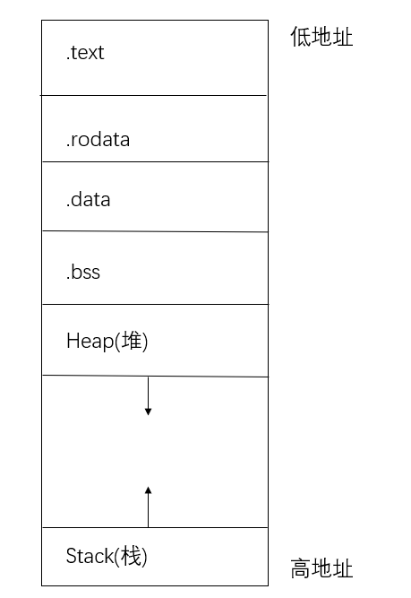
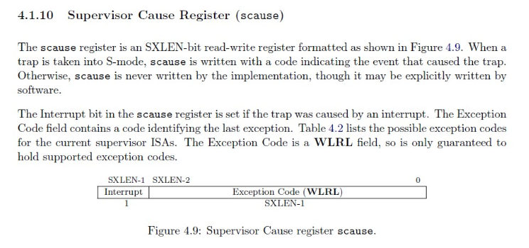
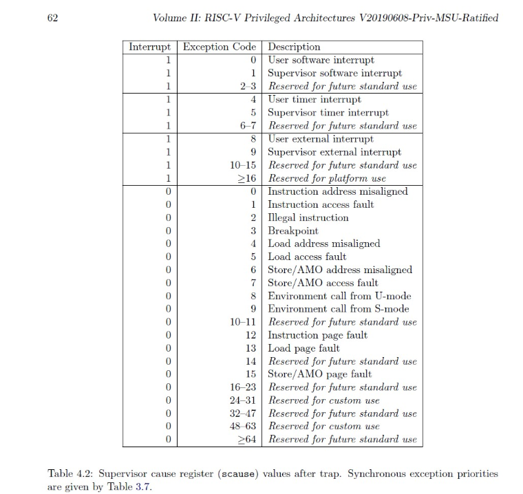

# 欢迎来到ucore step-by-step的世界

*step by step, to the light of u* ----[《Good Night》](https://music.163.com/#/song?id=1421195795)

你好，冒险者。让我们一起进入ucore的内部，一步一步构建自己的操作系统！

# lab0：预备起

*step by step, to the light of you(u)*

1. 溯源: ucore的历史
2. 概览: ucore step by step 指导书的架构
3. 开搞: 工作环境的搭建

## 溯源: ucore的历史

2006年, MIT的Frans Kaashoek等人参考PDP-11上的UNIX Version 6写了一个可在x86指令集架构上运行的操作系统xv6（基于MIT License)。（cited from [classical ucore](https://chyyuu.gitbooks.io/ucore_os_docs/content/lab0/lab0_2_1_about_labs.html)）

2010年, 清华大学操作系统教学团队参考MIT的教学操作系统xv6, 开发了在x86指令集架构上运行的操作系统ucore, 多年来作为操作系统课程的实验框架使用, 已经成为了大家口中的"祖传实验".

ucore麻雀虽小，五脏俱全。在不超过5k的代码量中包含虚拟内存管理、进程管理、处理器调度、同步互斥、进程间通信、文件系统等主要内核功能，充分体现了“小而全”的指导思想。

到了如今，x86指令集架构的问题渐渐开始暴露出来。 虽然在PC平台上占据绝对主流，但出于兼容性考虑x86架构仍然保留了许多的历史包袱，用于教学的时候总有些累赘。另一方面，为了更好的和计算机组成原理课程衔接，将ucore移植到RISC-V架构势在必行。

> **趣闻**
>
> Intel曾经在1989到2000年之间开发过一种[Itanium](https://en.wikipedia.org/wiki/Itanium)处理器，它基于全新的IA-64架构, 但这个指令集/处理器产品线以失败告终。其中一个失败原因就是向后兼容性太差，2001年有人测试在Itanium处理器上运行原先的x86软件时，性能仅为同时代x86奔腾处理器的十分之一。

由图灵奖得主设计的年轻的精简指令集架构RISC-V(reduced instruction set computer V)具有诸多优势，特别是在教学方面。其设计优雅，开源共享，没有x86指令集那样的历史包袱，学起来更加轻松，为计算机组成原理和操作系统课程的教学提供了一种新思路。

> **趣闻**
>
> RISCV在嵌入式领域异军突起。嵌入式领域的巨头ARM公司受到威胁后，上线了一个网站riscv-basics.com，把RISC-V批判了一番，批判的方面包括：成本、生态系统、碎片化风险、安全性问题、设计验证。但最终迫于业界舆论恶评，ARM关闭了该网站。（cited from [Wikipedia: RISCV](https://zh.wikipedia.org/wiki/RISC-V#%E5%8E%86%E5%8F%B2)）

我们将ucore的代码移植到64位的RISC-V指令集架构，并借鉴[rcore tutorial](https://rcore-os.github.io/rCore_tutorial_doc/)的做法，改进实验指导书。通过本教程，你可以一步一步，一个模块一个模块地从零开始搭建出一个可以运行简单命令行的操作系统。由于使用了step by step的组织方式，每一章都假设你已经完成了前一章的内容阅读和实践，所以建议完成了前一章的实验学习再进入下一章。

那么还等什么，我们现在开始吧！

step by step, to the light of ucore!

## 概览: 指导书的结构

我们沿用ucore原先的设计,将代码模块化, 并归到8个lab中。 还有一个额外的lab0, 就是你现在正在阅读的部分, 帮助你熟悉ucore实验，完成实验环境的搭建。

从lab1到lab8, 每个lab都会解决一个问题。

* lab1：操作系统怎样处理 **中断** ?
* lab2：操作系统怎样分配 **物理内存** ？
* lab3：操作系统怎样使用**页表**抽象出**虚拟内存**空间？
* lab4：操作系统怎样将计算资源和计算任务抽象为” **线程** “？
* lab5：操作系统怎样创建和管理 **用户态的线程** /进程？
* lab6：操作系统怎样通过 **调度算法** ，让众多线程共享一个CPU？
* lab7：操作系统怎样管理**并发**带来的风险？
* lab8：操作系统怎样将存储资源（如”磁盘上的数据“）抽象为” **文件** “？

当你解决了这8个问题，恭喜你，你在操作系统方面已经有了一个不错的基础。

每个lab的实验指导书都按下面的结构编写：

1. 概览。介绍这个lab的目标，代码结构，主要原理。
2. 详细梳理代码，但略过繁琐并且和操作系统核心功能无关的部分。可以跟着指导“抄”出一个你自己的ucore。
3. 练习题。ucore实验的成绩作为操作系统课程成绩的一部分，而考核的依据就是同学们对练习题的完成情况（包括代码和实验报告）。

在主要文本之外，我们会在指导书里加入一些“趣闻”，“须知”和“扩展”。

“趣闻”是为了帮助同学们开阔视野，也让同学们在学习过程中更加轻松。

“须知 ”是对做实验有帮助的知识，供不熟悉的同学参考。如果熟悉，可以跳过不看。

“扩展”是较为深入的相关知识，供感兴趣的同学进一步了解。

## Linux安装与熟悉

### 安装使用Linux实验环境

这里我们主要以Ubuntu Linux （14.04及其以后版本）（64 bit）作为整个实验的系统软件环境。

### **使用Linux**

在实验过程中，我们需要了解基于命令行方式的编译、调试、运行操作系统的实验方法。为此，需要了解基本的Linux命令行使用。

***命令模式的基本结构和概念*** Ubuntu是图形界面友好和易操作的linux发行版，但有时只需执行几条简单的指令就可以完成繁琐的鼠标点击才能完成的操作。linux的命令行操作模式功能可以实现你需要的所有操作。简单的说，命令行就是基于字符命令的用户界面，也被称为文本操作模式。绝大多数情况下， 用户通过输入一行或多行命令直接与计算机互动，来实现对计算机的操作。

***如何进入命令模式*** 假设使用默认的图形界面为GNOME的任意版本Ubuntu Linux。点击GNOME菜单->附件->终端，就可以启动名为gnome-terminal程序，从而可以在此软件界面中进行命令行操作。 打开gnome-terminal程序后你首先可能会注意到类似下面的界面：

```
luciferlaker@luciferlaker-VirtualBox:~$
```

你所看到的这些被称为命令终端提示符，它表示计算机已就绪，正在等待着用户输入操作指令。以我的屏幕画面为例，“luciferlaker"是当前所登录的用户名，“VirtualBox”是这台计算机的主机名，“~”表示当前目录。此时输入任何指令按回车之后该指令将会提交到计算机运行，比如你可以输入命令：ls 再按下回车：

```
ls [ENTER]
```

 *注意* ：[ENTER]是指输入完ls后按下回车键，而不是叫你输入这个单词，ls这个命令将会列出你当前所在目录里的所有文件和子目录列表。

下面介绍bash shell程序的基本使用方法，它是ubuntu缺省的外壳程序。

***常用指令***

(1) 查询文件列表：(ls)

```
luciferlaker@luciferlaker-VirtualBox:~$ ls
file1.txt  file2.txt file3.txt tools
```

ls命令默认状态下将按首字母升序列出你当前文件夹下面的所有内容，但这样直接运行所得到的信息也是比较少的，通常它可以结合以下这些参数运行以查询更多的信息：

```
ls /        # 将列出根目录'/'下的文件清单.如果给定一个参数，则命令行会把该参数当作命令行的工作目录。换句话说，命令行不再以当前目录为工作目录。 
ls -l         # 将给你列出一个更详细的文件清单. 
ls -a        # 将列出包括隐藏文件(以.开头的文件)在内的所有文
```

件. ]ls -h # 将以KB/MB/GB的形式给出文件大小,而不是以纯粹的Bytes.

(2) 查询当前所在目录：(pwd)

```
luciferlaker@luciferlaker-VirtualBox:~$ pwd
/home/luciferlaker
```

(3) 进入其他目录：(cd)

```
luciferlaker@luciferlaker-VirtualBox:~$ pwd
/home/luciferlaker
luciferlaker@luciferlaker-VirtualBox:~$ cd /home
luciferlaker@luciferlaker-VirtualBox:/home$ pwd
/home
```

上面例子中，当前目录原来是/home/luciferlaker,执行cd /home之后再运行pwd可以发现，当前目录已经改为/home了。

(4) 在屏幕上输出字符： (echo)

```
luciferlaker@luciferlaker-VirtualBox:/home$ echo "Hello World"
Hello World
```

这是一个很有用的命令，它可以在屏幕上输入你指定的参数(""号中的内容)，当然这里举的这个例子中它没有多大的实际意义，但随着你对LINUX指令的不断深入，就会发现它的价值所在。

(5) 显示文件内容：cat

```
luciferlaker@luciferlaker-VirtualBox:~$ cat file1.txt
Roses are red.
Violets are blue,
and you have the bird-flue!
```

也可以使用less或more来显示比较大的文本文件内容。

(6) 复制文件： cp

```
luciferlaker@luciferlaker-VirtualBox:~$ cp file1.txt file1_copy.txt
luciferlaker@luciferlaker-VirtualBox:~$ cat file1_copy.txt
Roses are red.
Violets are blue,
and you have the bird-flue!
```

(7) 移动文件：mv

```
luciferlaker@luciferlaker-VirtualBox:~$ ls
file1.txt
file2.txt
luciferlaker@luciferlaker-VirtualBox:~$ mv file1.txt new_file.txt
luciferlaker@luciferlaker-VirtualBox:~$ ls
file2.txt
new_file.txt
```

 *注意* ：在命令操作时系统基本上不会给你什么提示，当然，绝大多数的命令可以通过加上一个参数-v来要求系统给出执行命令的反馈信息；

```
luciferlaker@luciferlaker-VirtualBox:~$ mv -v file1.txt new_file.txt
`file1.txt' -> `new_file.txt'
```

(8) 建立一个空文本文件：touch

```
luciferlaker@luciferlaker-VirtualBox:~$ ls
file1.txt
luciferlaker@luciferlaker-VirtualBox:~$ touch tempfile.txt
luciferlaker@luciferlaker-VirtualBox:~$ ls
file1.txt
tempfile.txt
```

(9) 建立一个目录：mkdir

```
luciferlaker@luciferlaker-VirtualBox:~$ ls
file1.txt
tempfile.txt
luciferlaker@luciferlaker-VirtualBox:~$ mkdir test_dir
luciferlaker@luciferlaker-VirtualBox:~$ ls
file1.txt
tempfile.txt
test_dir
```

(10) 删除文件/目录：rm

```
luciferlaker@luciferlaker-VirtualBox:~$ ls -p
file1.txt
tempfile.txt
test_dir/
luciferlaker@luciferlaker-VirtualBox:~$ rm -i tempfile.txt
rm: remove regular empty file `test.txt'? y
luciferlaker@luciferlaker-VirtualBox:~$ ls -p
file1.txt
test_dir/
luciferlaker@luciferlaker-VirtualBox:~$ rm test_dir
rm: cannot remove `test_dir': Is a directory
luciferlaker@luciferlaker-VirtualBox:~$ rm -R test_dir
luciferlaker@luciferlaker-VirtualBox:~$ ls -p
file1.txt
```

在上面的操作：首先我们通过ls命令查询可知当前目下有两个文件和一个文件夹；

```
[1] 你可以用参数 -p来让系统显示某一项的类型，比如是文件/文件夹/快捷链接等等；
[2] 接下来我们用rm -i尝试删除文件，-i参数是让系统在执行删除操作前输出一条确认提示；i(interactive)也就是交互性的意思； 
[3] 当我们尝试用上面的命令去删除一个文件夹时会得到错误的提示，因为删除文件夹必须使用-R(recursive,循环）参数
```

特别提示：在使用命令操作时，系统假设你很明确自己在做什么，它不会给你太多的提示，比如你执行rm -Rf /，它将会删除你硬盘上所有的东西，并且不会给你任何提示，所以，尽量在使用命令时加上-i的参数，以让系统在执行前进行一次确认，防止你干一些蠢事。如 果你觉得每次都要输入-i太麻烦，你可以执行以下的命令，让－i成为默认参数：

```
alias rm='rm -i'
```

(11) 查询当前进程：ps

```
luciferlaker@luciferlaker-VirtualBox:~$ ps
PID TTY          TIME CMD
21071 pts/1    00:00:00 bash
22378 pts/1    00:00:00 ps
```

这条命令会例出你所启动的所有进程；

```
ps -a        #可以例出系统当前运行的所有进程，包括由其他用户启动的进程； 
ps auxww    #是一条相当人性化的命令，它会例出除一些很特殊进程以外的所有进程，并会以一个高可读的形式显示结果，每一个进程都会有较为详细的解释；
```

基本命令的介绍就到此为止，你可以访问网络得到更加详细的Linux命令介绍。

***控制流程*** (1) 输入/输出

input用来读取你通过键盘（或其他标准输入设备）输入的信息，output用于在屏幕（或其他标准输出设备）上输出你指定的输出内容.另外还有一些标准的出错提示也是通过这个命令来实现的。通常在遇到操作错误时，系统会自动调用这个命令来输出标准错误提示；

我们能重定向命令中产生的输入和输出流的位置。

(2) 重定向

如果你想把命令产生的输出流指向一个文件而不是（默认的）终端，你可以使用如下的语句：

```
luciferlaker@luciferlaker-VirtualBox:~$ ls >file4.txt
luciferlaker@luciferlaker-VirtualBox:~$ cat file4.txt
file1.txt  file2.txt file3.txt
```

以上例子将创建文件file4.txt如果file4.txt不存在的话。注意：如果file4.txt已经存在，那么上面的命令将复盖文件的内容。如果你想将内容添加到已存在的文件内容的最后，那你可以用下面这个语句：

```
command >> filename 
```

示例:

```
luciferlaker@luciferlaker-VirtualBox:~$ ls >> file4.txt
luciferlaker@luciferlaker-VirtualBox:~$ cat file4.txt
file1.txt  file2.txt file3.txt
file1.txt  file2.txt file3.txt file4.txt
```

在这个例子中，你会发现原有的文件中添加了新的内容。接下来我们会见到另一种重定向方式：我们将把一个文件的内容作为将要执行的命令的输入。以下是这个语句：

```
command < filename 
```

示例:

```
luciferlaker@luciferlaker-VirtualBox:~$ cat > file5.txt
a3.txt
a2.txt
file2.txt
file1.txt
<Ctrl-D>  # 这表示敲入Ctrl+D键
luciferlaker@luciferlaker-VirtualBox:~$ sort < file5.txt
a2.txt
a3.txt
file1.txt
file2.txt
```

(3) 管道

Linux的强大之处在于它能把几个简单的命令联合成为复杂的功能，通过键盘上的管道符号'|' 完成。现在，我们来排序上面的"grep"命令：

```
grep -i command < myfile | sort > result.text
```

搜索 myfile 中的命令，将输出分类并写入分类文件到 result.text 。 有时候用ls列出很多命令的时候很不方便 这时“｜”就充分利用到了 ls -l | less 慢慢看吧.

(4) 后台进程

CLI 不是系统的串行接口。您可以在执行其他命令时给出系统命令。要启动一个进程到后台，追加一个“&”到命令后面。

```
sleep 60 &
ls
```

睡眠命令在后台运行，您依然可以与计算机交互。除了不同步启动命令以外，最好把 '&' 理解成 ';'。

如果您有一个命令将占用很多时间，您想把它放入后台运行，也很简单。只要在命令运行时按下ctrl-z，它就会停止。然后键入 bg使其转入后台。fg 命令可使其转回前台。

```
sleep 60
<ctrl-z> # 这表示敲入Ctrl+Z键
bg
fg
```

最后，您可以使用 ctrl-c 来杀死一个前台进程。

***环境变量***

特殊变量。PATH, PS1, ...

(1) 不显示中文

可通过执行如下命令避免显示乱码中文。在一个shell中，执行：

```
export LANG=””
```

这样在这个shell中，output信息缺省时英文。

***获得软件包***

(1) 命令行获取软件包

Ubuntu 下可以使用 apt-get 命令，apt-get 是一条 Linux 命令行命令，适用于 deb 包管理式的操作系统，主要用于自动从互联网软件库中搜索、安装、升级以及卸载软件或者操作系统。一般需要 root 执行权限，所以一般跟随 sudo 命令，如：

```
sudo apt-get install gcc [ENTER]
```

常见的以及常用的 apt 命令有：

```
apt-get install <package>
    下载 <package> 以及所依赖的软件包，同时进行软件包的安装或者升级。
apt-get remove <package>
    移除 <package> 以及所有依赖的软件包。
apt-cache search <pattern>
    搜索满足 <pattern> 的软件包。
apt-cache show/showpkg <package>
    显示软件包 <package> 的完整描述。
```

例如：

```
luciferlaker@luciferlaker-VirtualBox:~$apt-cache search gcc
gcc-4.8 - The GNU C compiler
gcc-4.8-base - The GNU Compiler Collection (base package)
gcc-4.8-doc - Documentation for the GNU compilers (gcc, gobjc, g++)
gcc-4.8-multilib - The GNU C compiler (multilib files)
gcc-4.8-source - Source of the GNU Compiler Collection
gcc-4.8-locales - The GNU C compiler (native language support files)
chy@chyhome-PC:~$
```

(2) 图形界面软件包获取 新立得软件包管理器，是 Ubuntu 下面管理软件包得图形界面程序，相当于命令行中得 apt 命令。进入方法可以是

```
菜单栏 > 系统管理 > 新立得软件包管理器
(System > Administration > Synaptic Package Manager)
```

使用更新管理器可以通过标记选择适当的软件包进行更新操作。

(3) 配置升级源

Ubuntu的软件包获取依赖升级源，可以通过修改 “/etc/apt/sources.list” 文件来修改升级源（需要 root 权限）；或者修改新立得软件包管理器中 “设置 > 软件库”。

***查找帮助文件*** Ubuntu 下提供 man 命令以完成帮助手册得查询。man 是 manual 的缩写，通过 man 命令可以对 Linux 下常用命令、安装软件、以及C语言常用函数等进行查询，获得相关帮助。

例如：

```
luciferlaker@luciferlaker-VirtualBox:~$man printf
PRINTF(1)                 BSD General Commands Manual                    PRINTF(1)

NAME
     printf -- formatted output

SYNOPSIS
     printf format [arguments ...]

DESCRIPTION
     The printf utility formats and prints its arguments, after the first, under control of the format. The format is a character string which contains three types of objects: plain characters, which are simply copied to standard output, character escape sequences which are converted and copied to the standard output, and format specifications, each of which causes ...
           ...
     The characters and their meanings are as follows:
           \e      Write an <escape> character.
           \a      Write a <bell> character.
           ...
```

通常可能会用到的帮助文件例如：

```
gcc-doc cpp-doc glibc-doc
```

上述帮助文件可以通过 apt-get 命令或者软件包管理器获得。获得以后可以通过 man 命令进行命令或者参数查询。

### 实验中可能使用的软件

#### ***编辑器***

(1) Ubuntu 下自带的编辑器可以作为代码编辑的工具。例如 gedit 是 gnome 桌面环境下兼容UTF-8的文本编辑器。它十分的简单易用，有良好的语法高亮，对中文支持很好。通常可以通过双击或者命令行打开目标文件进行编辑。

(2) Vim 编辑器：Vim是一款极方便的文本编辑软件，是UNIX下的同类型软件VI的改进版本。Vim经常被看作是“专门为程序员打造的文本编辑器”，功能强大且方便使用，便于进行程序开发。 Ubuntu 下默认安装的 vi 版本较低，功能较弱，建议在系统内安装或者升级到最新版本的 Vim。

[1]关于Vim的常用命令以及使用，可以通过网络进行查找。

[2]配置文件：Vim 的使用需要配置文件进行设置，例如：

```
set nocompatible
set encoding=utf-8
set fileencodings=utf-8,chinese
set tabstop=4
set cindent shiftwidth=4
set backspace=indent,eol,start
autocmd Filetype c set omnifunc=ccomplete#Complete
autocmd Filetype cpp set omnifunc=cppcomplete#Complete
set incsearch
set number
set display=lastline
set ignorecase
syntax on
set nobackup
set ruler
set showcmd
set smartindent
set hlsearch
set cmdheight=1
set laststatus=2
set shortmess=atI
set formatoptions=tcrqn
set autoindent  
```

可以将上述配置文件保存到：

```
~/.vimrc
```

注意：.vimrc 默认情况下隐藏不可见，可以在命令行中通过 “ls -a” 命令进行查看。如果 '~' 目录下不存在该文件，可以手动创建。修改该文件以后，重启 Vim 可以使配置生效。

#### ***exuberant-ctags***

exuberant-ctags 可以为程序语言对象生成索引，其结果能够被一个文本编辑器或者其他工具简捷迅速的定位。支持的编辑器有 Vim、Emacs 等。 实验中，可以使用命令：

```
ctags -h=.h.c.S -R
```

默认的生成文件为 tags (可以通过 -f 来指定)，在相同路径下使用 Vim 可以使用改索引文件，例如:

```
使用 “ctrl + ]” 可以跳转到相应的声明或者定义处，使用 “ctrl + t” 返回（查询堆栈）等。
```

提示：习惯GUI方式的同学，可采用图形界面的understand、source insight等软件。

#### ***diff & patch***

diff 为 Linux 命令，用于比较文本或者文件夹差异，可以通过 man 来查询其功能以及参数的使用。使用 patch 命令可以对文件或者文件夹应用修改。

例如实验中可能会在 proj_b 中应用前一个实验proj_a 中对文件进行的修改，可以使用如下命令：

```
diff -r -u -P proj_a_original proj_a_mine > diff.patch
cd proj_b
patch -p1 -u < ../diff.patch
```

注意：proj_a_original 指 proj_a 的源文件，即未经修改的源码包，proj_a_mine 是修改后的代码包。第一条命令是递归的比较文件夹差异，并将结果重定向输出到 diff.patch 文件中；第三条命令是将 proj_a 的修改应用到 proj_b 文件夹中的代码中。

提示：习惯GUI方式的同学，可采用图形界面的meld、kdiff3、UltraCompare等软件。

### 开搞：搭建实验环境

说了这么多，现在该动手了。Make your hands dirty!

方便起见，可以先在终端里设置一个叫做**RISCV**的环境变量(在bash命令里可以通过**$RISCV**使用)，作为你安装所有和riscv有关的软件的路径。在 `/etc/profile`里面写一行 `export RISCV=/your/path/to/riscv`之类的东西就行。后面安装的各个项目最好也放在上面的的路径里面。

最小的软件开发环境需要：能够编译程序，能够运行程序。开发操作系统这样的系统软件也不例外。

#### 编译器

问题在于：我们使用的计算机都是基于x86架构的。如何把程序编译到riscv64架构的汇编？这需要我们使用“目标语言为riscv64机器码的编译器”，在我们的电脑上进行 **交叉编译** 。

放心，这里不需要你自己写编译器。我们使用现有的riscv-gcc编译器即可。从[https://github.com/riscv/riscv-gcc](https://github.com/riscv/riscv-gcc) clone下来，然后在x86架构上编译riscv-gcc编译器为可执行的x86程序，就可以运行它，来把你的程序源代码编译成riscv架构的可执行文件了。这有点像绕口令，但只要有一点编译原理的基础就可以理解。不过，这个riscv-gcc仓库很大，而且自己编译工具链总是一件麻烦的事。

其实，没必要那么麻烦，我们大可以使用别人已经编译好的编译器的可执行文件，也就是所谓的 **预编译（prebuilt）** 工具链，下载下来，放在你喜欢的地方（比如之前定义的 **$RISCV** ），配好路径（把编译器的位置加到系统的**PATH**环境变量里），就能在终端使用了。我们推荐使用sifive公司提供的预编译工具链，进入[https://d2pn104n81t9m2.cloudfront.net/products/tools/](https://d2pn104n81t9m2.cloudfront.net/products/tools/) ，找到 “Prebuilt RISC‑V GCC Toolchain and Emulator”，下载“GNU Embedded Toolchain ”中适合你的操作系统的版本即可。(注意，如果你是wsl, 需要下载适合ubuntu版本的编译器) 将 RISCV/bin 添加到 bashrc当中，首先利用vim进入~/.bashrc文档，摁住ctrl+g，直接跳到最后一行，摁一下i键，进入插入模式，现在可以编辑文档了

```
vim ~/.bashrc
```

我们在bashrc的最后添加路径

```
export RISCV=PATH_TO_INSTALL（你RISCV预编译链下载的路径）
export PATH=$RISCV/bin:$PATH
```

路径添加好了，该关闭~/.bashrc了，摁一下esc键，退出插入模式； 输入冒号:wq，关闭bashrc；这时候还没有生效!需要source一下，source命令的含义的博客：

```
source ~/.bashrc
```

配置好后，在终端输入 `riscv64-unknown-elf-gcc -v`查看安装的gcc版本, 如果输出一大堆东西且最后一行有 `gcc version 某个数字.某个数字.某个数字`，说明gcc配置成功，否则需要检查一下哪里做错了，比如环境变量**PATH**配置是否正确。一般需要把一个形如 `..../bin`的目录加到**PATH**里。

#### 模拟器

如何运行riscv64的代码？我们当然可以给大家每个人发一块riscv64架构处理器的开发板，再给大家一人一根JTAG线，让大家把程序烧写到上面去跑，然后各凭本事debug（手动狗头），但还是使用 **模拟器（emulator）** 更方便一些。模拟器也就是在x86架构的计算机上，通过软件模拟一个riscv64架构的硬件平台，从而能够运行riscv64的目标代码。

我们选择的是QEMU模拟器。它的优点在于，内置了一套OpenSBI固件的实现，可以简化我们的代码，也为了和rcore tutorial保持一致。

下面我们从[rCore tutorial](https://rcore-os.github.io/rCore_tutorial_doc/chapter2/part5.html)抄写了一段qemu安装的教程。

##### 安装模拟器 Qemu

如果你在使用 Linux (Ubuntu) ，需要到 Qemu 官方网站下载源码并自行编译，因为 Ubuntu 自带的软件包管理器 `apt` 中的 Qemu 的版本过低无法使用。参考命令如下：

```
$ wget https://download.qemu.org/qemu-4.1.1.tar.xz
$ tar xvJf qemu-4.1.1.tar.xz
$ cd qemu-4.1.1
$ ./configure --target-list=riscv32-softmmu,riscv64-softmmu
$ make -j
$ sudo make install
```

可查看[更详细的安装和使用命令](https://github.com/riscv/riscv-qemu/wiki)。

如果你在使用 macOS，只需要 Homebrew 一个命令即可：

```
$ brew install qemu
```

最后确认一下 Qemu 已经安装好，且版本在 4.1.0 以上：

```
$ qemu-system-riscv64 --version
QEMU emulator version 4.1.1
Copyright (c) 2003-2019 Fabrice Bellard and the QEMU Project developers
```

##### 使用 OpenSBI

新版 Qemu 中内置了 [OpenSBI](https://github.com/riscv/opensbi) 固件（firmware），它主要负责在操作系统运行前的硬件初始化和加载操作系统的功能。我们使用以下命令尝试运行一下：

```
$ qemu-system-riscv64 \
  --machine virt \
  --nographic \
  --bios default

OpenSBI v0.4 (Jul  2 2019 11:53:53)
   ____                    _____ ____ _____
  / __ \                  / ____|  _ \_   _|
 | |  | |_ __   ___ _ __ | (___ | |_) || |
 | |  | | '_ \ / _ \ '_ \ \___ \|  _ < | |
 | |__| | |_) |  __/ | | |____) | |_) || |_
  \____/| .__/ \___|_| |_|_____/|____/_____|
        | |
        |_|

Platform Name          : QEMU Virt Machine
Platform HART Features : RV64ACDFIMSU
Platform Max HARTs     : 8
Current Hart           : 0
Firmware Base          : 0x80000000
Firmware Size          : 112 KB
Runtime SBI Version    : 0.1

PMP0: 0x0000000080000000-0x000000008001ffff (A)
PMP1: 0x0000000000000000-0xffffffffffffffff (A,R,W,X)
```

可以看到我们已经在 `qemu-system-riscv64` 模拟的 `virt machine` 硬件上将 `OpenSBI` 这个固件 跑起来了。Qemu 可以使用 `Ctrl+a` 再按下 `x` 退出（注意要松开 `Ctrl`再单独按 `x`）。

如果无法正常使用 Qemu，可以尝试下面这个命令。

```
$ sudo sysctl vm.overcommit_memory=1
```

> **扩展**
>
> 如果对 `OpenSBI` 的内部实现感兴趣，可以看看[RISCV OpenSBI Deep_Dive 介绍文档](https://content.riscv.org/wp-content/uploads/2019/06/13.30-RISCV_OpenSBI_Deep_Dive_v5.pdf)。

### 调试工具介绍

#### gdb使用

gdb 是功能强大的调试程序，可完成如下的调试任务：

* 设置断点
* 监视程序变量的值
* 程序的单步(step in/step over)执行
* 显示/修改变量的值
* 显示/修改寄存器
* 查看程序的堆栈情况
* 远程调试
* 调试线程

在可以使用 gdb 调试程序之前，必须使用 -g 或 –ggdb编译选项编译源文件。运行 gdb 调试程序时通常使用如下的命令：

```
gdb progname
```

在 gdb 提示符处键入help，将列出命令的分类，主要的分类有：

* aliases：命令别名
* breakpoints：断点定义；
* data：数据查看；
* files：指定并查看文件；
* internals：维护命令；
* running：程序执行；
* stack：调用栈查看；
* status：状态查看；
* tracepoints：跟踪程序执行。

键入 help 后跟命令的分类名，可获得该类命令的详细清单。gdb的常用命令如下表所示。

表 gdb 的常用命令

| break FILENAME:NUM | 在特定源文件特定行上设置断点                            |
| ------------------ | ------------------------------------------------------- |
| clear FILENAME:NUM | 删除设置在特定源文件特定行上的断点                      |
| run                | 运行调试程序                                            |
| step               | 单步执行调试程序，不会直接执行函数                      |
| next               | 单步执行调试程序，会直接执行函数                        |
| backtrace          | 显示所有的调用栈帧。该命令可用来显示函数的调用顺序      |
| where continue     | 继续执行正在调试的程序                                  |
| display EXPR       | 每次程序停止后显示表达式的值,表达式由程序定义的变量组成 |
| file FILENAME      | 装载指定的可执行文件进行调试                            |
| help CMDNAME       | 显示指定调试命令的帮助信息                              |
| info break         | 显示当前断点列表，包括到达断点处的次数等                |
| info files         | 显示被调试文件的详细信息                                |
| info func          | 显示被调试程序的所有函数名称                            |
| info prog          | 显示被调试程序的执行状态                                |
| info local         | 显示被调试程序当前函数中的局部变量信息                  |
| info var           | 显示被调试程序的所有全局和静态变量名称                  |
| kill               | 终止正在被调试的程序                                    |
| list               | 显示被调试程序的源代码                                  |
| quit               | 退出 gdb                                                |

用gdb查看源代码可以用list命令，但是这个不够灵活。可以使用"layout src"命令，或者按Ctrl-X再按A，就会出现一个窗口可以查看源代码。也可以用使用-tui参数，这样进入gdb里面后就能直接打开代码查看窗口。其他代码窗口相关命令：

| info win                         | 显示窗口的大小             |
| -------------------------------- | -------------------------- |
| layout next                      | 切换到下一个布局模式       |
| layout prev                      | 切换到上一个布局模式       |
| layout src                       | 只显示源代码               |
| layout asm                       | 只显示汇编代码             |
| layout split                     | 显示源代码和汇编代码       |
| layout regs                      | 增加寄存器内容显示         |
| focus cmd/src/asm/regs/next/prev | 切换当前窗口               |
| refresh                          | 刷新所有窗口               |
| tui reg next                     | 显示下一组寄存器           |
| tui reg system                   | 显示系统寄存器             |
| update                           | 更新源代码窗口和当前执行点 |
| winheight name +/- line          | 调整name窗口的高度         |
| tabset nchar                     | 设置tab为nchar个字符       |

#### 结合gdb和qemu源码级调试ucore

##### 编译可调试的目标文件

为了使得编译出来的代码是能够被gdb这样的调试器调试，我们需要在使用gcc编译源文件的时候添加参数："-g"。这样编译出来的目标文件中才会包含可以用于调试器进行调试的相关符号信息。

##### 使用远程调试

为了与qemu配合进行源代码级别的调试，需要先让qemu进入等待gdb调试器的接入并且还不能让qemu中的CPU执行，因此启动qemu的时候，我们需要使用参数-S –s这两个参数来做到这一点。-s 可以使 Qemu 监听本地 TCP 端口 1234 等待 GDB 客户端连接，而 -S 可以使 Qemu 在收到 GDB 的请求后再开始运行。因此，Qemu 暂时没有任何输出。(下面两段命令是makefile中的部分命令，无需在命令行中运行该代码。)

```
    $qemu-system-riscv64 \
        -machine virt \
        -nographic \
        -bios default \
        -device loader,file=$(UCOREIMG),addr=0x80200000\
        -s -S
```

在使用了前面提到的参数启动qemu之后，qemu中的CPU并不会马上开始执行，这时我们启动gdb，然后在gdb命令行界面下，使用下面的命令连接到qemu：

```
    riscv64-unknown-elf-gdb \
    -ex 'file bin/kernel' \
    -ex 'set arch riscv:rv64' \
    -ex 'target remote localhost:1234'
```

riscv64-unknown-elf-gdb: 这是 GDB 调试器的可执行文件名。它用于启动 GDB 调试器。

-ex 'file bin/kernel': 这个选项告诉 GDB 加载名为 bin/kernel 的目标文件。目标文件通常是编译后的可执行文件或库文件，这里指定的是一个名为 kernel 的文件。

-ex 'set arch riscv:rv64': 这个选项设置 GDB 的目标体系结构为 RISC-V 的 64 位版本（rv64）。这样，GDB 将使用 RISC-V 体系结构的调试器特性。

-ex 'target remote localhost:1234': 这个选项告诉 GDB 连接到本地主机的端口 1234，GDB 将尝试通过与本地主机的端口 1234 建立连接来远程调试该目标文件。

# lab0.5：比麻雀更小的麻雀（最小可执行内核）

*放了一把火, 烧得只剩个架架*

相对于上百万行的现代操作系统(linux, windows), 几千行的ucore是一只"麻雀"。但这只麻雀依然是一只胖麻雀，我们一眼看不过来几千行的代码。所以，我们要再做简化，先用好刀法，片掉麻雀的血肉, 搞出一个"麻雀骨架"，看得通透，再像组装哪吒一样，把血肉安回去，变成一个活生生的麻雀。这就是我们的ucore step-by-step tutorial的思路。

lab0.5是lab1的预备，我们构建一个最小的可执行内核（”麻雀骨架“），它能够进行格式化的输出，然后进入死循环。

下面我们就开始解剖麻雀。

## 实验目的：

实验0.5主要讲解最小可执行内核和启动流程。我们的内核主要在 Qemu 模拟器上运行，它可以模拟一台 64 位 RISC-V 计算机。为了让我们的内核能够正确对接到 Qemu 模拟器上，需要了解 Qemu 模拟器的启动流程，还需要一些程序内存布局和编译流程（特别是链接）相关知识。

本章你将学到：

* 使用 链接脚本 描述内存布局
* 进行 交叉编译 生成可执行文件，进而生成内核镜像
* 使用 OpenSBI 作为 bootloader 加载内核镜像，并使用 Qemu 进行模拟
* 使用 OpenSBI 提供的服务，在屏幕上格式化打印字符串用于以后调试

## 实验内容：

实验0.5主要讲解最小可执行内核和启动流程。我们的内核主要在 Qemu 模拟器上运行，它可以模拟一台 64 位 RISC-V 计算机。为了让我们的内核能够正确对接到 Qemu 模拟器上，需要了解 Qemu 模拟器的启动流程，还需要一些程序内存布局和编译流程（特别是链接）相关知识,以及通过opensbi固件来通过服务。

### 练习

对实验报告的要求：

* 基于markdown格式来完成，以文本方式为主
* 填写各个基本练习中要求完成的报告内容
* 列出你认为本实验中重要的知识点，以及与对应的OS原理中的知识点，并简要说明你对二者的含义，关系，差异等方面的理解（也可能出现实验中的知识点没有对应的原理知识点）
* 列出你认为OS原理中很重要，但在实验中没有对应上的知识点

#### 练习1: 使用GDB验证启动流程

为了熟悉使用qemu和gdb进行调试工作,使用gdb调试QEMU模拟的RISC-V计算机加电开始运行到执行应用程序的第一条指令（即跳转到0x80200000）这个阶段的执行过程，说明RISC-V硬件加电后的几条指令在哪里？完成了哪些功能？要求在报告中简要写出练习过程和回答。

**tips:**

* 可以使用示例代码 Makefile 中的 make debug和make gdb 指令。
* 一些可能用到的 gdb 指令：
  * x/10i 0x80000000 : 显示 0x80000000 处的10条汇编指令。
  * x/10i $pc : 显示即将执行的10条汇编指令。
  * x/10xw 0x80000000 : 显示 0x80000000 处的10条数据，格式为16进制32bit。
  * info register: 显示当前所有寄存器信息。
  * info r t0: 显示 t0 寄存器的值。
  * break funcname: 在目标函数第一条指令处设置断点。
  * break *0x80200000: 在 0x80200000 处设置断点。
  * continue: 执行直到碰到断点。
  * si: 单步执行一条汇编指令。

### lab0 项目组成和执行流

#### lab0的项目组成如下:

```
── Makefile 
├── kern
│   ├── debug
│   │   ├── assert.h
│   │   ├── kdebug.c
│   │   ├── kdebug.h
│   │   ├── kmonitor.c
│   │   ├── kmonitor.h
│   │   ├── panic.c
│   │   └── stab.h
│   ├── driver
│   │   ├── clock.c
│   │   ├── clock.h
│   │   ├── console.c
│   │   ├── console.h
│   │   ├── intr.c
│   │   ├── intr.h
│   │   ├── kbdreg.h
│   │   ├── picirq.c
│   │   └── picirq.h
│   ├── init
│   │   ├── entry.S
│   │   └── init.c
│   ├── libs
│   │   ├── readline.c
│   │   └── stdio.c
│   ├── mm
│   │   ├── memlayout.h
│   │   ├── mmu.h
│   │   ├── pmm.c
│   │   └── pmm.h
│   └── trap
│       ├── trap.c
│       ├── trap.h
│       └── trapentry.S
├── libs
│   ├── defs.h
│   ├── elf.h
│   ├── error.h
│   ├── printfmt.c
│   ├── riscv.h
│   ├── sbi.c
│   ├── sbi.h
│   ├── stdarg.h
│   ├── stdio.h
│   ├── string.c
│   └── string.h
└── tools
    ├── function.mk
    ├── kernel.ld
```

##### 内核启动

`kern/init/entry.S`: OpenSBI启动之后将要跳转到的一段汇编代码。在这里进行内核栈的分配，然后转入C语言编写的内核初始化函数。

`kern/init/init.c`： C语言编写的内核入口点。主要包含 `kern_init()`函数，从 `kern/entry.S`跳转过来完成其他初始化工作。

##### 设备驱动

`kern/driver/console.c(h)`: 在QEMU上模拟的时候，唯一的“设备”是虚拟的控制台，通过OpenSBI接口使用。简单封装了OpenSBI的字符读写接口，向上提供给输入输出库。

**库文件**

`libs/riscv.h`: 以宏的方式，定义了riscv指令集的寄存器和指令。如果在C语言里使用riscv指令，需要通过内联汇编和寄存器的编号。这个头文件把寄存器编号和内联汇编都封装成宏，使得我们可以用类似函数的方式在C语言里执行一句riscv指令。

`libs/sbi.c(h)`: 封装OpenSBI接口为函数。如果想在C语言里使用OpenSBI提供的接口，需要使用内联汇编。这个头文件把OpenSBI的内联汇编调用封装为函数。

`libs/defs.h`: 定义了一些常用的类型和宏。 例如bool 类型（C语言不自带，这里 `typedef int bool`)。

`libs/string.c(h)`: 一些对字符数组进行操作的函数，如 `memset(),memcpy()`等，类似C语言的 `string.h`。

`kern/libs/stdio.c`, `libs/readline.c`, `libs/printfmt.c`: 实现了一套标准输入输出，功能类似于C语言的 `printf()` 和 `getchar()`。需要内核为输入输出函数提供两个桩函数（stub): 输出一个字符的函数，输入一个字符的函数。在这里，是 `cons_getc()`和 `cons_putc()`。

`kern/errors.h`: 定义了一些内核错误类型的宏。

##### 编译、链接脚本

`tools/kernel.ld`: ucore的链接脚本(link script), 告诉链接器如何将目标文件的section组合为可执行文件。

`tools/function.mk`: 定义Makefile中使用的一些函数

`Makefile`: GNU make编译脚本

#### 执行流

最小可执行内核的执行流为:

加电 -> OpenSBI启动 -> 跳转到 0x80200000 (`kern/init/entry.S`）->进入 `kern_init()`函数（`kern/init/init.c`) ->调用 `cprintf()`输出一行信息->结束

`cprintf()`函数的执行流为:

接受一个格式化字符串和若干个需要输出的变量作为参数 -> 解析格式化的字符串，把需要输出的各种变量转化为一串字符 -> 调用 `console.c`提供的字符输出接口依次输出所有字符（实际上 `console.c`又封装了 `sbi.c`向上提供的OpenSBI接口)

## 从机器启动到操作系统运行的过程

### OpenSBI, bin, elf

最小可执行内核里, 我们主要完成两件事:

1. 内核的内存布局和入口点设置
2. 通过sbi封装好输入输出函数

首先我们回顾计算机的组成:

CPU, 存储设备（粗略地说，包括断电后遗失的内存，和断电后不遗失的硬盘），输入输出设备，总线。

QEMU会帮助我们模拟一块riscv64的CPU，一块物理内存，还会借助你的电脑的键盘和显示屏来模拟命令行的输入和输出。虽然QEMU不会真正模拟一堆线缆，但是总线的通信功能也在QEMU内部实现了。

还差什么呢？硬盘。

我们需要硬盘上的程序和数据。比如崭新的windows电脑里C盘已经被占据的二三十GB空间，除去预装的应用软件，还有一部分是windows操作系统的内核。在插上电源开机之后，就需要运行操作系统的内核，然后由操作系统来管理计算机。

问题在于，操作系统作为一个程序，必须加载到内存里才能执行。而“把操作系统加载到内存里”这件事情，不是操作系统自己能做到的，就好像你不能拽着头发把自己拽离地面。

因此我们可以想象，在操作系统执行之前，必然有一个其他程序执行，他作为“先锋队”，完成“把操作系统加载到内存“这个工作，然后他功成身退，把CPU的控制权交给操作系统。

这个“其他程序”，我们一般称之为bootloader. 很好理解：他负责boot(开机)，还负责load(加载OS到内存里)，所以叫bootloader.

> **简单说明**
>
> 对于有**复杂的读写时序要求**的设备，比如硬盘、U盘等，CPU是无法直接读取的，需要借助驱动程序来告知CPU如何与设备进行通信从而读到数据。
>
> 而这些驱动程序，就需要存储在一个不需要驱动程序，CPU就可以直接读取的地方，即一块像Memory一样，可以直接使用load/store命令可以访问，又不会担心数据会丢失的区域
>
> 在现代计算机中，有一些设备具备这样的特性，如早期的ROM芯片，以及后期相对普及的NOR Flash芯片
>
> 这些芯片与CPU连接之前，首先会进行初始化，在其中预置好对CPU的初始程序，即bootloader，然后再焊接至电路板上
>
> 在CPU启动时，会首先运行这些代码，用这些代码实现对硬盘、内存和其他复杂设备的读取

在QEMU模拟的riscv计算机里，我们使用QEMU自带的bootloader: OpenSBI固件，那么在 Qemu 开始执行任何指令之前，首先两个文件将被加载到 Qemu 的物理内存中：即作为 bootloader 的 OpenSBI.bin 被加载到物理内存以物理地址 0x80000000 开头的区域上，同时内核镜像 os.bin 被加载到以物理地址 0x80200000 开头的区域上

> **须知**
>
> 在计算机中， **固件(firmware)** 是一种特定的计算机软件，它为设备的特定硬件提供低级控制，也可以进一步加载其他软件。固件可以为设备更复杂的软件（如操作系统）提供标准化的操作环境。对于不太复杂的设备，固件可以直接充当设备的完整操作系统，执行所有控制、监视和数据操作功能。 在基于 x86 的计算机系统中, BIOS 或 UEFI 是固件；在基于 riscv 的计算机系统中，OpenSBI 是固件。OpenSBI运行在 **M态（M-mode）** ，因为固件需要直接访问硬件。
>
> RISCV有四种 **特权级（privilege level）** 。
>
> | Level | Encoding | 全称                       | 简称 |
> | ----- | -------- | -------------------------- | ---- |
> | 0     | 00       | User/Application           | U    |
> | 1     | 01       | Supervisor                 | S    |
> | 2     | 10       | Reserved(目前未使用，保留) |      |
> | 3     | 11       | Machine                    | M    |
>
> 粗略的分类：
>
> U-mode是用户程序、应用程序的特权级，S-mode是操作系统内核的特权级，M-mode是固件的特权级。

关于这个地址的选择，其实有软件工的工作，也有硬件人的工作。

> **实现细节**
>
> 需要解释一下的是，QEMU模拟的这款riscv处理器的**复位地址**是0x1000，而不是0x80000000
>
> 所谓 **复位地址** ，指的是CPU在上电的时候，或者按下复位键的时候，PC被赋的初始值
>
> 这个值的选择会因为厂商的不同而发生变化，例如，80386的复位地址是0xFFF0（因为复位时是16位模式，写成32位时也作0xFFFFFFF0），MIPS的复位地址是0x00000000
>
> RISCV的设计标准相对灵活，它允许芯片的实现者自主选择复位地址，因此不同的芯片会有一些差异。QEMU-4.1.1是选择了一种实现方式进行模拟
>
> 在QEMU模拟的这款riscv处理器中，将复位向量地址初始化为0x1000，再将PC初始化为该复位地址，因此处理器将从此处开始执行复位代码，复位代码主要是将计算机系统的各个组件（包括处理器、内存、设备等）置于初始状态，并且会启动Bootloader，在这里QEMU的复位代码指定加载Bootloader的位置为0x80000000，Bootloader将加载操作系统内核并启动操作系统的执行。

我们可以想象这样的过程：操作系统的二进制可执行文件被OpenSBI加载到内存中，然后OpenSBI会把CPU的"当前指令指针"(pc, program counter)跳转到内存里的一个位置，开始执行内存中那个位置的指令。

OpenSBI怎样知道把操作系统加载到内存的什么位置？总不能随便选个位置。也许你会觉得可以把操作系统的代码总是加载到固定的位置，比如总是加载到内存地址最高的地方。

问题在于，之后OpenSBI还要把CPU的program counter跳转到一个位置,开始操作系统的执行。如果加载操作系统到内存里的时候随便加载，那么OpenSBI怎么知道把program counter跳转到哪里去呢？难道操作系统的二进制可执行文件需要提供“program counter跳转到哪里"这样的信息？

实际上，我们有两种不同的可执行文件格式：`elf`(e是executable的意思， l是linkable的意思，f是format的意思)和 `bin`(binary)，为了正确地和上一阶段的 OpenSBI 对接，我们需要保证内核的第一条指令位于物理地址 0x80200000 处，因为这里的代码是地址相关的，这个地址是由处理器，即Qemu指定的。为此，我们需要将内核镜像预先加载到 Qemu 物理内存以地址 0x80200000 开头的区域上。一旦 CPU 开始执行内核的第一条指令，证明计算机的控制权已经被移交给我们的内核。

> **代码的地址相关性**
>
> 这里我们需要解释一个小问题，为什么内核一定要被加载到0x80200000的位置开始呢？加载到别的位置行不行呢？
>
> 这要从高级语言被编译成为汇编和机器指令的过程说起了
>
> 以一行C语言代码为例，`int sum = 0;`，这句的意义是，在内存中分配一份可以容纳一个整数的空间，将其初始化为0。
>
> 那么，什么时候才会确定sum 被分配的空间的具体地址呢？在编译和链接的时候就会分配，假设这个地址是 `pa_sum`
>
> 接下来，当出现类似 `sum +=5;`这样的语句时，相应的机器指令是，将 `pa_sum`位置的值加载入寄存器，完成加法计算，再将这个值写回内存中对应的 `pa_sum`处
>
> 而此时生成的指令，会将 `pa_sum`的值（假设为0x55aa55aa），直接写入到指令的编码中，如 `load r1 0x55aa55aa`
>
> 如此一来，则这一段代码就成了 **地址相关代码** ，即指令中的访存信息在编译完成后即已成为绝对地址，那么在运行之前，自然需要将所需要的代码加载到指定的位置
>
> 与之相对的，自然会产生**地址无关代码**的技术需求，即在加载前才代码确定好被加载的位置，然后代码就可以在被加载处运行，这需要编译和加载时做一些处理工作，同学们可以思考一下这个技术需求的实现思路

`elf`文件([wikipedia: elf](https://en.wikipedia.org/wiki/Executable_and_Linkable_Format))比较复杂，包含一个文件头(ELF header), 包含冗余的调试信息，指定程序每个section的内存布局，需要解析program header才能知道各段(section)的信息。如果我们已经有一个完整的操作系统来解析elf文件，那么elf文件可以直接执行。但是对于OpenSBI来说，elf格式还是太复杂了。

`bin`文件就比较简单了，简单地在文件头之后解释自己应该被加载到什么起始位置。

我们举一个例子解释elf和bin文件的区别：初始化为零的一个大数组，在elf文件里是bss数据段的一部分，只需要记住这个数组的起点和终点就可以了，等到加载到内存里的时候分配那一段内存。但是在bin文件里，那个数组有多大，有多少个字节的0，bin文件就要对应有多少个零。所以如果一个程序里声明了一个大全局数组（默认初始化为0），那么可能编译出来的elf文件只有几KB, 而生成bin文件之后却有几MB, 这是很正常的。实际上，可以认为bin文件会把elf文件指定的每段的内存布局都映射到一块线性的数据里，这块线性的数据（或者说程序）加载到内存里就符合elf文件之前指定的布局。

那么我们的任务就明确了：得到内存布局合适的elf文件，然后把它转化成bin文件（这一步通过objcopy实现），然后加载到QEMU里运行（QEMU自带的OpenSBI会干这个活）。下面我们来看如何设置elf文件的内存布局。

### 内存布局，链接脚本，入口点

一般来说，一个程序按照功能不同会分为下面这些段：

.text 段，即代码段，存放汇编代码； .rodata 段，即只读数据段，顾名思义里面存放只读数据，通常是程序中的常量； .data 段，存放被初始化的可读写数据，通常保存程序中的全局变量； .bss 段，存放被初始化为 00 的可读写数据，与 .data 段的不同之处在于我们知道它要被初始化为 00 ，因此在可执行文件中只需记录这个段的大小以及所在位置即可，而不用记录里面的数据。 stack ，即栈，用来存储程序运行过程中的局部变量，以及负责函数调用时的各种机制。它从高地址向低地址增长； heap ，即堆，用来支持程序运行过程中内存的动态分配，比如说你要读进来一个字符串，在你写程序的时候你也不知道它的长度究竟为多少，于是你只能在运行过程中，知道了字符串的长度之后，再在堆中给这个字符串分配内存。 内存布局，也就是指这些段各自所放的位置。一种典型的内存布局如下：



gnu工具链中，包含一个链接器 `ld`

如果你很好奇，可以看[linker script的详细语法](http://www.scoberlin.de/content/media/http/informatik/gcc_docs/ld_3.html)

链接器的作用是把输入文件(往往是 .o文件)链接成输出文件(往往是elf文件)。一般来说，输入文件和输出文件都有很多section, 链接脚本(linker script)的作用，就是描述怎样把输入文件的section映射到输出文件的section, 同时规定这些section的内存布局。

如果你不提供链接脚本，ld会使用默认的一个链接脚本，这个默认的链接脚本适合链接出一个能在现有操作系统下运行的应用程序，但是并不适合链接一个操作系统内核。你可以通过 `ld --verbose`来查看默认的链接脚本。

下面给出我们使用的链接脚本

```
/* tools/kernel.ld */

OUTPUT_ARCH(riscv) /* 指定输出文件的指令集架构, 在riscv平台上运行 */
ENTRY(kern_entry)  /* 指定程序的入口点, 是一个叫做kern_entry的符号。我们之后会在汇编代码里定义它*/

BASE_ADDRESS = 0x80200000;/*定义了一个变量BASE_ADDRESS并初始化 */

/*链接脚本剩余的部分是一整条SECTIONS指令，用来指定输出文件的所有SECTION
 "." 是SECTIONS指令内的一个特殊变量/计数器，对应内存里的一个地址。*/
SECTIONS
{
    /* Load the kernel at this address: "." means the current address */
    . = BASE_ADDRESS;/*对 "."进行赋值*/
    /* 下面一句的意思是：从.的当前值（当前地址）开始放置一个叫做text的section. 
     花括号内部的*(.text.kern_entry .text .stub .text.* .gnu.linkonce.t.*)是正则表达式
     如果输入文件中有一个section的名称符合花括号内部的格式
     那么这个section就被加到输出文件的text这个section里
     输入文件中section的名称,有些是编译器自动生成的,有些是我们自己定义的*/
    .text : {
        *(.text.kern_entry) /*把输入中kern_entry这一段放到输出中text的开头*/
        *(.text .stub .text.* .gnu.linkonce.t.*)
    }

    PROVIDE(etext = .); /* Define the 'etext' symbol to this value */
    /*read only data, 只读数据，如程序里的常量*/
    .rodata : {
        *(.rodata .rodata.* .gnu.linkonce.r.*)
    }

    /* 进行地址对齐，将 "."增加到 2的0x1000次方的整数倍，也就是下一个内存页的起始处 */
    . = ALIGN(0x1000);


    .data : {
        *(.data)
        *(.data.*)
    }
    /* small data section, 存储字节数小于某个标准的变量，一般是char, short等类型的 */
    .sdata : {
        *(.sdata)
        *(.sdata.*)
    }

    PROVIDE(edata = .);
    /* 初始化为零的数据 */
    .bss : {
        *(.bss)
        *(.bss.*)
        *(.sbss*)
    }

    PROVIDE(end = .);
    /* /DISCARD/表示忽略，输入文件里 *(.eh_frame .note.GNU-stack)这些section都被忽略，不会加入到输出文件中 */
    /DISCARD/ : {
        *(.eh_frame .note.GNU-stack)
    }
}
```

> 趣闻
>
> 为什么把初始化为0（或者说，无需初始化）的数据段称作bss?
>
> CSAPP 7.4 Relocatable Object files
>
> Aside Why is uninitialized data called .bss? The use of the term .bss to denote uninitialized data is universal. It was originally an acronym for the “block started by symbol” directive from the IBM 704 assembly language (circa 1957) and the acronym has stuck. A simple way to remember the difference between the .data and .bss sections is to think of “bss” as an abbreviation for “Better Save Space!”

我们在链接脚本里把程序的入口点定义为 `kern_entry`, 那么我们的程序里需要有一个名称为 `kern_entry`的符号。我们在 `kern/init/entry.S`编写一段汇编代码, 作为整个内核的入口点。

```
# kern/init/entry.S
#include <mmu.h>
#include <memlayout.h>

# The ,"ax",@progbits tells the assembler that the section is allocatable ("a"), executable ("x") and contains data ("@progbits").
# 从这里开始.text 这个section, "ax" 和 %progbits描述这个section的特征
# https://www.nongnu.org/avr-libc/user-manual/mem_sections.html
.section .text,"ax",%progbits 
    .globl kern_entry # 使得ld能够看到kern_entry这个符号所在的位置, globl和global同义
    # https://sourceware.org/binutils/docs/as/Global.html#Global
kern_entry: 
    la sp, bootstacktop 
    tail kern_init 
#开始data section
.section .data
    .align PGSHIFT #按照2^PGSHIFT进行地址对齐, 也就是对齐到下一页 PGSHIFT在 mmu.h定义
    .global bootstack #内核栈
bootstack:
    .space KSTACKSIZE #留出KSTACKSIZE这么多个字节的内存
    .global bootstacktop #之后内核栈将要从高地址向低地址增长, 初始时的内核栈为空
bootstacktop:
```

现在这个入口点，作用就是分配好内核栈，然后跳转到 `kern_init`, 看来这个 `kern_init`才是我们真正的入口点。下面我们就来看看它。

### "真正的"入口点

我们在 `kern/init/init.c`编写函数 `kern_init`, 作为“真正的”内核入口点。为了让我们能看到一些效果，我们希望它能在命令行进行格式化输出。

如果我们在linux下运行一个C程序，需要格式化输出，那么大一学生都知道我们应该 `#include<span class="token tag"><span class="token tag"><span class="token punctuation"><</span>stdio.h</span><span class="token punctuation">></span></span>`。于是我们在 `kern/init/init.c`也这么写一句。且慢！linux下，当我们调用C语言标准库的函数时，实际上依赖于 `glibc`提供的运行时环境，也就是一定程度上依赖于操作系统提供的支持。可是我们并没有把 `glibc`移植到ucore里！

怎么办呢？只能自己动手，丰衣足食。QEMU里的OpenSBI固件提供了输入一个字符和输出一个字符的接口，我们一会把这个接口一层层封装起来，提供 `stdio.h`里的格式化输出函数 `cprintf()`来使用。这里格式化输出函数的名字不使用原先的 `printf()`，强调这是我们在ucore里重新实现的函数。

```
// kern/init/init.c
#include <stdio.h>
#include <string.h>
//这里include的头文件， 并不是C语言的标准库，而是我们自己编写的！

//noreturn 告诉编译器这个函数不会返回
int kern_init(void) __attribute__((noreturn));

int kern_init(void) {
    extern char edata[], end[]; 
    //这里声明的两个符号，实际上由链接器ld在链接过程中定义, 所以加了extern关键字
    memset(edata, 0, end - edata); 
    //内核运行的时候并没有c标准库可以使用，memset函数是我们自己在string.h定义的

    const char *message = "(THU.CST) os is loading ...\n";
    cprintf("%s\n\n", message); //cprintf是我们自己定义的格式化输出函数
       while (1)
        ;
}
```

接下来就去看看，我们是怎么从OpenSBI的接口一层层封装到格式化输入输出函数的。

### 从SBI到stdio

OpenSBI作为运行在M态的软件（或者说固件）, 提供了一些接口供我们编写内核的时候使用。

我们可以通过 `ecall`指令(environment call)调用OpenSBI。通过寄存器传递给OpenSBI一个”调用编号“，如果编号在 `0-8` 之间，则由OpenSBI进行处理，否则交由我们自己的中断处理程序处理（暂未实现）。有时OpenSBI调用需要像函数调用一样传递参数，这里传递参数的方式也和函数调用一样，按照riscv的函数调用约定(calling convention)把参数放到寄存器里。可以阅读[SBI的详细文档](https://github.com/riscv/riscv-sbi-doc/blob/master/riscv-sbi.adoc)。

> 须知 ecall
>
> **ecall** (environment call)，当我们在 S 态执行这条指令时，会触发一个 ecall-from-s-mode-exception，从而进入 M 模式中的中断处理流程（如设置定时器等）；当我们在 U 态执行这条指令时，会触发一个 ecall-from-u-mode-exception，从而进入 S 模式中的中断处理流程（常用来进行系统调用）。

C语言并不能直接调用 `ecall`, 需要通过内联汇编来实现。

```
// libs/sbi.c
#include <sbi.h>
#include <defs.h>

//SBI编号和函数的对应
uint64_t SBI_SET_TIMER = 0;
uint64_t SBI_CONSOLE_PUTCHAR = 1;
uint64_t SBI_CONSOLE_GETCHAR = 2;
uint64_t SBI_CLEAR_IPI = 3;
uint64_t SBI_SEND_IPI = 4;
uint64_t SBI_REMOTE_FENCE_I = 5;
uint64_t SBI_REMOTE_SFENCE_VMA = 6;
uint64_t SBI_REMOTE_SFENCE_VMA_ASID = 7;
uint64_t SBI_SHUTDOWN = 8;
//sbi_call函数是我们关注的核心
uint64_t sbi_call(uint64_t sbi_type, uint64_t arg0, uint64_t arg1, uint64_t arg2) {
    uint64_t ret_val;
    __asm__ volatile (
        "mv x17, %[sbi_type]\n"
        "mv x10, %[arg0]\n"
        "mv x11, %[arg1]\n"
        "mv x12, %[arg2]\n"   //mv操作把参数的数值放到寄存器里
        "ecall\n"    //参数放好之后，通过ecall, 交给OpenSBI来执行
        "mv %[ret_val], x10"  
        //OpenSBI按照riscv的calling convention,把返回值放到x10寄存器里
        //我们还需要自己通过内联汇编把返回值拿到我们的变量里
        : [ret_val] "=r" (ret_val)
        : [sbi_type] "r" (sbi_type), [arg0] "r" (arg0), [arg1] "r" (arg1), [arg2] "r" (arg2)
        : "memory"
    );
    return ret_val;
}

void sbi_console_putchar(unsigned char ch) {
    sbi_call(SBI_CONSOLE_PUTCHAR, ch, 0, 0); //注意这里ch隐式类型转换为int64_t
}

void sbi_set_timer(unsigned long long stime_value) {
    sbi_call(SBI_SET_TIMER, stime_value, 0, 0);
}
```

> 须知 函数调用与calling convention
>
> 我们知道，编译器将高级语言源代码翻译成汇编代码。对于汇编语言而言，在最简单的编程模型中，所能够利用的只有指令集中提供的指令、各通用寄存器、 CPU 的状态、内存资源。那么，在高级语言中，我们进行一次函数调用，编译器要做哪些工作利用汇编语言来实现这一功能呢？
>
> 显然并不是仅用一条指令跳转到被调用函数开头地址就行了。我们还需要考虑：
>
> * 如何传递参数？
> * 如何传递返回值？
> * 如何保证函数返回后能从我们期望的位置继续执行？
>
> 等更多事项。通常编译器按照某种规范去翻译所有的函数调用，这种规范被称为 [calling convention](https://en.wikipedia.org/wiki/Calling_convention) 。值得一提的是，为了实现函数调用，我们需要预先分配一块内存作为 **调用栈** ，后面会看到调用栈在函数调用过程中极其重要。你也可以理解为什么第一章刚开始我们就要分配栈了。
>
> 可以参考[riscv calling convention](https://riscv.org/wp-content/uploads/2015/01/riscv-calling.pdf)

这样我们就可以通过 `sbi_console_putchar()`来输出一个字符。接下来我们要做的事情就像月饼包装，把它封了一层又一层。

`console.c`只是简单地封装一下

```
// kern/driver/console.c
#include <sbi.h>
#include <console.h>

void cons_putc(int c) { sbi_console_putchar((unsigned char)c); }
```

`stdio.c`里面实现了一些函数，注意我们已经实现了ucore版本的puts函数: `cputs()`

```
// kern/libs/stdio.c
#include <console.h>
#include <defs.h>
#include <stdio.h>

/* HIGH level console I/O */

/* *
 * cputch - writes a single character @c to stdout, and it will
 * increace the value of counter pointed by @cnt.
 * */
static void cputch(int c, int *cnt) {
    cons_putc(c);
    (*cnt)++;
}
/* cputchar - writes a single character to stdout */
void cputchar(int c) { cons_putc(c); }

int cputs(const char *str) {
    int cnt = 0;
    char c;
    while ((c = *str++) != '\0') {
        cputch(c, &cnt);
    }
    cputch('\n', &cnt);
    return cnt;
}
```

我们还在 `libs/printfmt.c`实现了一些复杂的格式化输入输出函数。最后得到的 `cprintf()`函数仍在 `kern/libs/stdio.c`定义，功能和C标准库的 `printf()`基本相同。

可能你注意到我们用到一个头文件 `defs.h`, 我们在里面定义了一些有用的宏和类型

```
// libs/defs.h
#ifndef __LIBS_DEFS_H__
#define __LIBS_DEFS_H__
...
/* Represents true-or-false values */
typedef int bool;
/* Explicitly-sized versions of integer types */
typedef char int8_t;
typedef unsigned char uint8_t;
typedef short int16_t;
typedef unsigned short uint16_t;
typedef int int32_t;
typedef unsigned int uint32_t;
typedef long long int64_t;
typedef unsigned long long uint64_t;
...
/* *
 * Rounding operations (efficient when n is a power of 2)
 * Round down to the nearest multiple of n
 * */
#define ROUNDDOWN(a, n) ({                                          \
            size_t __a = (size_t)(a);                               \
            (typeof(a))(__a - __a % (n));                           \
        })
...
#endif
```

`printfmt.c`还依赖一个头文件 `riscv.h`,这个头文件主要定义了若干和riscv架构相关的宏，尤其是将一些内联汇编的代码封装成宏，使得我们更方便地使用内联汇编来读写寄存器。当然这里我们还没有用到它的强大功能。

```
// libs/riscv.h
...
#define read_csr(reg) ({ unsigned long __tmp; \
  asm volatile ("csrr %0, " #reg : "=r"(__tmp)); \
  __tmp; })
//通过内联汇编包装了 csrr 指令为 read_csr() 宏
#define write_csr(reg, val) ({ \
  if (__builtin_constant_p(val) && (unsigned long)(val) < 32) \
    asm volatile ("csrw " #reg ", %0" :: "i"(val)); \
  else \
    asm volatile ("csrw " #reg ", %0" :: "r"(val)); })
...
```

到现在，我们已经看过了一个最小化的内核的各个部分，虽然一些部分没有逐行细读，但我们也知道它在做什么。但一直到现在我们还没进行过编译。下面就把它编译一下跑起来。

### Just make it

我们需要：编译所有的源代码，把目标文件链接起来，生成elf文件，生成bin硬盘镜像，用qemu跑起来

这一系列复杂的命令，我们不想每次用到的时候都敲一遍，所以我们使用~*魔改的*~~祖传~ `Makefile`。

#### make 和 Makefile

GNU make(简称make)是一种代码维护工具，在大中型项目中，它将根据程序各个模块的更新情况，自动的维护和生成目标代码。

make命令执行时，需要一个 makefile （或Makefile）文件，以告诉make命令需要怎么样的去编译和链接程序

我们的 `Makefile`还依赖 `tools/function.mk`。只要我们的makefile写得够好，所有的这一切，我们只用一个make命令就可以完成，make命令会自动智能地根据当前的文件修改的情况来确定哪些文件需要重编译，从而自己编译所需要的文件和链接目标程序。

##### makefile的基本规则简介

在使用这个makefile之前，还是让我们先来粗略地看一看makefile的规则。

```
target ... : prerequisites ...
    command
    ...
    ...
```

target也就是一个目标文件，可以是object file，也可以是执行文件。还可以是一个标签（label）。prerequisites就是，要生成那个target所需要的文件或是目标。command也就是make需要执行的命令（任意的shell命令）。 这是一个文件的依赖关系，也就是说，target这一个或多个的目标文件依赖于prerequisites中的文件，其生成规则定义在 command中。如果prerequisites中有一个以上的文件比target文件要新，那么command所定义的命令就会被执行。这就是makefile的规则。也就是makefile中最核心的内容

#### Runing ucore

在源代码的根目录下 `make qemu`, 在makefile中运行的代码为

```
.PHONY: qemu 
qemu: $(UCOREIMG) $(SWAPIMG) $(SFSIMG)
#    $(V)$(QEMU) -kernel $(UCOREIMG) -nographic
    $(V)$(QEMU) \
        -machine virt \
        -nographic \
        -bios default \
        -device loader,file=$(UCOREIMG),addr=0x80200000
```

这段代码就是我们启动qemu的命令，这段代码首先通过宏定义$(UCOREIMG) $(SWAPIMG) $(SFSIMG)的函数进行目标文件的构建，然后使用qemu语句进行qemu启动加载内核。,我们就把ucore跑起来了，运行结果如下。

```
+ cc kern/init/init.c
+ cc libs/sbi.c
+ ld bin/kernel
riscv64-unknown-elf-objcopy bin/kernel --strip-all -O binary bin/ucore.img

OpenSBI v0.6
   ____                    _____ ____ _____
  / __ \                  / ____|  _ \_   _|
 | |  | |_ __   ___ _ __ | (___ | |_) || |
 | |  | | '_ \ / _ \ '_ \ \___ \|  _ < | |
 | |__| | |_) |  __/ | | |____) | |_) || |_
  \____/| .__/ \___|_| |_|_____/|____/_____|
        | |
        |_|

Platform Name          : QEMU Virt Machine
Platform HART Features : RV64ACDFIMSU
Platform Max HARTs     : 8
Current Hart           : 0
Firmware Base          : 0x80000000
Firmware Size          : 120 KB
Runtime SBI Version    : 0.2

MIDELEG : 0x0000000000000222
MEDELEG : 0x000000000000b109
PMP0    : 0x0000000080000000-0x000000008001ffff (A)
PMP1    : 0x0000000000000000-0xffffffffffffffff (A,R,W,X)
(THU.CST) os is loading ...
```

它输出一行 `(THU.CST) os is loading`, 然后进入死循环。

**tips:**

* 关于Makefile的语法, 如果不熟悉, 可以查看GNU手册, 或者这份中文教程: [https://seisman.github.io/how-to-write-makefile/overview.html](https://seisman.github.io/how-to-write-makefile/overview.html)
* 对实验中Makefile感兴趣的同学可以阅读附录中的[Makefile](http://oslab.mobisys.cc/lab2023/_book/appendix/1_makefile.html)

## 实验报告要求

从oslab网站上取得实验代码后，进入目录labcodes/lab0，完成实验要求的各个练习。lab0.5和lab1合并到一个实验报告中即可。

# lab1：断,都可以断

*弱水汩其为难兮，路中断而不通。*

现在我们要在最小可执行内核的基础上, 支持中断机制, 并且用时钟中断来检验我们的中断处理系统。

## 实验目的：

实验1主要讲解的是中断处理机制。操作系统是计算机系统的监管者，必须能对计算机系统状态的突发变化做出反应，这些系统状态可能是程序执行出现异常，或者是突发的外设请求。当计算机系统遇到突发情况时，不得不停止当前的正常工作，应急响应一下，这是需要操作系统来接管，并跳转到对应处理函数进行处理，处理结束后再回到原来的地方继续执行指令。这个过程就是中断处理过程。

本章你将学到：

* riscv 的中断相关知识
* 中断前后如何进行上下文环境的保存与恢复
* 处理最简单的断点中断和时钟中断

## 实验内容：

实验1主要讲解的是中断处理机制。通过本章的学习，我们了解了 riscv 的中断处理机制、相关寄存器与指令。我们知道在中断前后需要恢复上下文环境，用 一个名为中断帧（TrapFrame）的结构体存储了要保存的各寄存器，并用了很大篇幅解释如何通过精巧的汇编代码实现上下文环境保存与恢复机制。最终，我们通过处理断点和时钟中断验证了我们正确实现了中断机制。

### 练习

对实验报告的要求：

* 基于markdown格式来完成，以文本方式为主
* 填写各个基本练习中要求完成的报告内容
* 列出你认为本实验中重要的知识点，以及与对应的OS原理中的知识点，并简要说明你对二者的含义，关系，差异等方面的理解（也可能出现实验中的知识点没有对应的原理知识点）
* 列出你认为OS原理中很重要，但在实验中没有对应上的知识点

#### 练习1：理解内核启动中的程序入口操作

阅读 kern/init/entry.S内容代码，结合操作系统内核启动流程，说明指令 la sp, bootstacktop 完成了什么操作，目的是什么？ tail kern_init 完成了什么操作，目的是什么？

#### 练习2：完善中断处理 （需要编程）

请编程完善trap.c中的中断处理函数trap，在对时钟中断进行处理的部分填写kern/trap/trap.c函数中处理时钟中断的部分，使操作系统每遇到100次时钟中断后，调用print_ticks子程序，向屏幕上打印一行文字”100 ticks”，在打印完10行后调用sbi.h中的shut_down()函数关机。

要求完成问题1提出的相关函数实现，提交改进后的源代码包（可以编译执行），并在实验报告中简要说明实现过程和定时器中断中断处理的流程。实现要求的部分代码后，运行整个系统，大约每1秒会输出一次”100 ticks”，输出10行。

#### 扩展练习 Challenge1：描述与理解中断流程

回答：描述ucore中处理中断异常的流程（从异常的产生开始），其中mov a0，sp的目的是什么？SAVE_ALL中寄寄存器保存在栈中的位置是什么确定的？对于任何中断，__alltraps 中都需要保存所有寄存器吗？请说明理由。

#### 扩增练习 Challenge2：理解上下文切换机制

回答：在trapentry.S中汇编代码 csrw sscratch, sp；csrrw s0, sscratch, x0实现了什么操作，目的是什么？save all里面保存了stval scause这些csr，而在restore all里面却不还原它们？那这样store的意义何在呢？

#### 扩展练习Challenge3：完善异常中断

编程完善在触发一条非法指令异常 mret和，在 kern/trap/trap.c的异常处理函数中捕获，并对其进行处理，简单输出异常类型和异常指令触发地址，即“Illegal instruction caught at 0x(地址)”，“ebreak caught at 0x（地址）”与“Exception type:Illegal instruction"，“Exception type: breakpoint”。（

**tips：**

* 参考资料
  * [RV 硬件简要手册-中文](http://staff.ustc.edu.cn/~llxx/cod/reference_books/RISC-V-Reader-Chinese-v2p12017.pdf) ：重点第 10 章
* 非法指令可以加在任意位置，比如在通过内联汇编加入，也可以直接修改汇编。但是要注意，什么时候时候异常触发了才会被处理？
* 查阅参考资料，判断自己触发的异常属于什么类型的，在相应的情况下进行代码修改。

### 项目组成和执行流

#### Lab1项目组成

```
lab1
├── Makefile
├── kern
│   ├── debug
│   │   ├── assert.h
│   │   ├── kdebug.c
│   │   ├── kdebug.h
│   │   ├── kmonitor.c
│   │   ├── kmonitor.h
│   │   ├── panic.c
│   │   └── stab.h
│   ├── driver
│   │   ├── clock.c
│   │   ├── clock.h
│   │   ├── console.c
│   │   ├── console.h
│   │   ├── intr.c
│   │   └── intr.h
│   ├── init
│   │   ├── entry.S
│   │   └── init.c
│   ├── libs
│   │   └── stdio.c
│   ├── mm
│   │   ├── memlayout.h
│   │   ├── mmu.h
│   │   ├── pmm.c
│   │   └── pmm.h
│   └── trap
│       ├── trap.c
│       ├── trap.h
│       └── trapentry.S
├── lab1.md
├── libs
│   ├── defs.h
│   ├── error.h
│   ├── printfmt.c
│   ├── readline.c
│   ├── riscv.h
│   ├── sbi.c
│   ├── sbi.h
│   ├── stdarg.h
│   ├── stdio.h
│   ├── string.c
│   └── string.h
├── readme.md
└── tools
    ├── function.mk
    ├── gdbinit
    ├── grade.sh
    ├── kernel.ld
    ├── sign.c
    └── vector.c

9 directories, 43 files
```

只介绍新增的或变动较大的文件。

##### 硬件驱动层

`kern/driver/clock.c(h)`: 通过 `OpenSBI`的接口, 可以读取当前时间(rdtime), 设置时钟事件(sbi_set_timer)，是时钟中断必需的硬件支持。

`kern/driver/intr.c(h)`: 中断也需要CPU的硬件支持，这里提供了设置中断使能位的接口（其实只封装了一句riscv指令）。

##### 初始化

`kern/init/init.c`: 需要调用中断机制的初始化函数。

##### 中断处理

`kern/trap/trapentry.S`: 我们把中断入口点设置为这段汇编代码。这段汇编代码把寄存器的数据挪来挪去，进行上下文切换。

`kern/trap/trap.c(h)`: 分发不同类型的中断给不同的handler, 完成上下文切换之后对中断的具体处理，例如外设中断要处理外设发来的信息，时钟中断要触发特定的事件。中断处理初始化的函数也在这里，主要是把中断向量表(stvec)设置成所有中断都要跳到 `trapentry.S`进行处理。

#### 执行流

内核初始化函数 `kern_init()`的执行流：(从 `kern/init/entry.S`进入) -> 输出一些信息说明正在初始化 -> 设置中断向量表(stvec）跳转到的地方为 `kern/trap/trapentry.S`里的一个标记 ->在 `kern/driver/clock.c`设置第一个时钟事件，使能时钟中断->设置全局的S mode中断使能位-> 现在开始不断地触发时钟中断

产生一次时钟中断的执行流：set_sbi_timer()通过OpenSBI的时钟事件触发一个中断，跳转到 `kern/trap/trapentry.S`的 `__alltraps`标记 -> 保存当前执行流的上下文，并通过函数调用，切换为 `kern/trap/trap.c`的中断处理函数 `trap()`的上下文，进入 `trap()`的执行流。切换前的上下文作为一个结构体，传递给 `trap()`作为函数参数 -> `kern/trap/trap.c`按照中断类型进行分发(`trap_dispatch(), interrupt_handler()`)->执行时钟中断对应的处理语句，累加计数器，设置下一次时钟中断->完成处理，返回到 `kern/trap/trapentry.S`->恢复原先的上下文，中断处理结束。

## 中断与中断处理流程

### riscv64 中断介绍

#### 中断概念

##### 中断机制

 **中断** （interrupt）机制，就是不管CPU现在手里在干啥活，收到“中断”的时候，都先放下来去处理其他事情，处理完其他事情可能再回来干手头的活。

例如，CPU要向磁盘发一个读取数据的请求，由于磁盘速度相对CPU较慢，在“发出请求”到“收到磁盘数据"之间会经过很多时间周期，如果CPU干等着磁盘干活就相当于CPU在磨洋工。因此我们可以让CPU发出读数据的请求后立刻开始干另一件事情。但是，等一段时间之后，磁盘的数据取到了，而CPU在干其他的事情，我们怎么办才能让CPU知道之前发出的磁盘请求已经完成了呢？我们可以让磁盘给CPU一个“中断”，让CPU放下手里的事情来接受磁盘的数据。

再比如，为了保证CPU正在执行的程序不会永远运行下去，我们需要定时检查一下它是否已经运行“超时”。想象有一个程序由于bug进入了死循环，如果CPU一直运行这个程序，那么其他的所有程序都会因为等待CPU资源而无法运行，造成严重的资源浪费。但是检查是否超时，需要CPU执行一段代码，也就是让CPU暂停当前执行的程序。我们不能假设当前执行的程序会主动地定时让出CPU，那么就需要CPU定时“打断”当前程序的执行，去进行一些处理，这通过时钟中断来实现。

从这些描述我们可以看出，中断机制需要软件硬件一起来支持。硬件进行中断和异常的发现，然后交给软件来进行处理。回忆一下组成原理课程中学到的各个控制寄存器以及他们的用途（下一小节会进行简单回顾），这些寄存器构成了重要的 **硬件/软件接口** 。由此，我们也可以得到在一般OS中进行中断处理支持的方法：

* 编写相应的中断处理代码
* 在启动中正确设置控制寄存器
* CPU捕获异常
* 控制转交给相应中断处理代码进行处理
* 返回正在运行的程序

##### **中断分类**

异常(Exception)，指在执行一条指令的过程中发生了错误，此时我们通过中断来处理错误。最常见的异常包括：访问无效内存地址、执行非法指令(除零)、发生缺页等。他们有的可以恢复(如缺页)，有的不可恢复(如除零)，只能终止程序执行。

陷入(Trap)，指我们主动通过一条指令停下来，并跳转到处理函数。常见的形式有通过ecall进行系统调用(syscall)，或通过ebreak进入断点(breakpoint)。

外部中断(Interrupt)，简称中断，指的是 CPU 的执行过程被外设发来的信号打断，此时我们必须先停下来对该外设进行处理。典型的有定时器倒计时结束、串口收到数据等。

外部中断是异步(asynchronous)的，CPU 并不知道外部中断将何时发生。CPU 也并不需要一直在原地等着外部中断的发生，而是执行代码，有了外部中断才去处理。我们知道，CPU 的主频远高于 I/O 设备，这样避免了 CPU 资源的浪费。

由于中断处理需要进行较高权限的操作，中断处理程序一般处于 **内核态** ，或者说，处于“比被打断的程序更高的特权级”。注意，在RISCV里，中断(interrupt)和异常(exception)统称为"trap"。

> 扩展
>
> The RISC-V Instruction Set Manual Volume I: Unprivileged ISA （Document Version 20191213）
>
> 1.6
>
> We use the term **exception** to refer to an unusual condition occurring at run time associated with an instruction in the current RISC-V hart.
>
> We use the term **interrupt** to refer to an external asynchronous event that may cause a RISC-V hart to experience an unexpected transfer of control. We use the term **trap** to refer to the transfer of control to a trap handler caused by either an exception or an interrupt.

#### riscv64 权限模式

##### riscv64 的 M Mode

M-mode(机器模式，缩写为 M 模式)是 RISC-V 中 hart(hardware thread,硬件线程)可以执行的最高权限模式。在 M 模式下运行的 hart 对内存,I/O 和一些对于启动和配置系统来说必要的底层功能有着完全的使用权。默认情况下,发生所有异常(不论在什么权限模式下)的时候,控制权都会被移交到 M 模式的异常处理程序。它是唯一所有标准 RISC-V 处理器都必须实现的权限模式。

##### riscv64 的 S Mode

S-mode(监管者模式，缩写为 S 模式)是支持现代类 Unix 操作系统的权限模式，支持基于页面的虚拟内存机制是其核心。 Unix 系统中的大多数exception都应该进行 S 模式下的系统调用。M 模式的异常处理程序可以将异常重新导向 S 模式，也支持通过异常委托机制（Machine Interrupt Delegation,机器中断委托）选择性地将中断和同步异常直接交给 S 模式处理,而完全绕过 M 模式。

#### 寄存器

除了32个通用寄存器之外，RISCV架构还有大量的 **控制状态寄存器**  **Control and Status Registers** (CSRs)。其中有几个重要的寄存器和中断机制有关。

有些时候，禁止CPU产生中断很有用。（就像你在做重要的事情，如操作系统lab的时候，并不想被打断）。所以，`sstatus`寄存器(Supervisor Status Register)里面有一个二进制位 `SIE`(supervisor interrupt enable，在RISCV标准里是2^1 对应的二进制位)，数值为0的时候，如果当程序在S态运行，将禁用全部中断。（对于在U态运行的程序，SIE这个二进制位的数值没有任何意义），`sstatus`还有一个二进制位 `UIE`(user interrupt enable)可以在置零的时候禁止用户态程序产生中断。

在中断产生后，应该有个**中断处理程序**来处理中断。CPU怎么知道中断处理程序在哪？实际上，RISCV架构有个CSR叫做 `stvec`(Supervisor Trap Vector Base Address Register)，即所谓的”中断向量表基址”。中断向量表的作用就是把不同种类的中断映射到对应的中断处理程序。如果只有一个中断处理程序，那么可以让 `stvec`直接指向那个中断处理程序的地址。

对于RISCV架构，`stvec`会把最低位的两个二进制位用来编码一个“模式”，如果是“00”就说明更高的SXLEN-2个二进制位存储的是唯一的中断处理程序的地址(SXLEN是 `stval`寄存器的位数)，如果是“01”说明更高的SXLEN-2个二进制位存储的是中断向量表基址，通过不同的异常原因来索引中断向量表。但是怎样用62个二进制位编码一个64位的地址？RISCV架构要求这个地址是四字节对齐的，总是在较高的62位后补两个0。

> 扩展
>
> 在旧版本的RISCV privileged ISA标准中（1.9.1及以前），RISCV不支持中断向量表，用最后两位数编码一个模式是1.10版本加入的。可以思考一下这个改动如何保证了后向兼容。[历史版本的ISA手册](https://github.com/riscv/riscv-isa-manual/releases/tag/archive)
>
> 1.9.1版本的RISCV privileged architecture手册：
>
> 4.1.3 Supervisor Trap Vector Base Address Register (stvec) The stvec register is an XLEN-bit read/write register that holds the base address of the S-mode trap vector. When an exception occurs, the pc is set to stvec. The stvec register is always aligned to a 4-byte boundary

当我们触发中断进入 S 态进行处理时，以下寄存器会被硬件自动设置，将一些信息提供给中断处理程序：

 **sepc** (supervisor exception program counter)，它会记录触发中断的那条指令的地址；

 **scause** ，它会记录中断发生的原因，还会记录该中断是不是一个外部中断；

 **stval** ，它会记录一些中断处理所需要的辅助信息，比如指令获取(instruction fetch)、访存、缺页异常，它会把发生问题的目标地址或者出错的指令记录下来，这样我们在中断处理程序中就知道处理目标了。

> 扩展
>
> The RISC-V Instruction Set Manual Volume II: Privileged Architecture
>
> （Document Version 20190608-Priv-MSU-Ratified）
>
> 4.1.1 Supervisor Status Register (sstatus)
>
> The SIE bit enables or disables all interrupts in supervisor mode. When SIE is clear, interrupts are not taken while in supervisor mode. When the hart is running in user-mode, the value in SIE is ignored, and supervisor-level interrupts are enabled. The supervisor can disable individual interrupt sources using the sie CSR. The SPIE bit indicates whether supervisor interrupts were enabled prior to trapping into supervisor mode. When a trap is taken into supervisor mode, SPIE is set to SIE, and SIE is set to 0. When an SRET instruction is executed, SIE is set to SPIE, then SPIE is set to 1. The UIE bit enables or disables user-mode interrupts. User-level interrupts are enabled only if UIE is set and the hart is running in user-mode. The UPIE bit indicates whether user-level interrupts were enabled prior to taking a user-level trap. When a URET instruction is executed, UIE is set to UPIE, and UPIE is set to 1. User-level interrupts are optional. If omitted, the UIE and UPIE bits are hardwired to zero.
>
> 4.1.9 Supervisor Exception Program Counter (sepc)
>
> When a trap is taken into S-mode, sepc is written with the virtual address of the instruction that was interrupted or that encountered the exception. Otherwise, sepc is never written by the implementation, though it may be explicitly written by software.
>
> 4.1.10 Supervisor Cause Register (scause)
>
> When a trap is taken into S-mode, scause is written with a code indicating the event that caused the trap. Otherwise, scause is never written by the implementation, though it may be explicitly written by software.
>
> 4.1.11 Supervisor Trap Value (stval) Register
>
> When a trap is taken into S-mode, stval is written with exception-specific information to assist software in handling the trap. Otherwise, stval is never written by the implementation, though it may be explicitly written by software. The hardware platform will specify which exceptions must set stval informatively and which may unconditionally set it to zero. When a hardware breakpoint is triggered, or an instruction-fetch, load, or store address-misaligned, access, or page-fault exception occurs, stval is written with the faulting virtual address. On an illegal instruction trap, stval may be written with the first XLEN or ILEN bits of the faulting instruction as described below. For other exceptions, stval is set to zero, but a future standard may redefine stval’s setting for other exceptions.

#### 特权指令

RISCV支持以下和中断相关的特权指令：

 **ecall** (environment call)，当我们在 S 态执行这条指令时，会触发一个 ecall-from-s-mode-exception，从而进入 M 模式中的中断处理流程（如设置定时器等）；当我们在 U 态执行这条指令时，会触发一个 ecall-from-u-mode-exception，从而进入 S 模式中的中断处理流程（常用来进行系统调用）。

 **sret** ，用于 S 态中断返回到 U 态，实际作用为pc←sepc，回顾**sepc**定义，返回到通过中断进入 S 态之前的地址。

 **ebreak** (environment break)，执行这条指令会触发一个断点中断从而进入中断处理流程。

 **mret** ，用于 M 态中断返回到 S 态或 U 态，实际作用为pc←mepc，回顾**sepc**定义，返回到通过中断进入 M 态之前的地址。（一般不用涉及）

### 掉进兔子洞(中断入口点)

我们已经知道,在发生中断的时候, CPU会跳到 `stvec`.我们准备采用 `Direct`模式,也就是只有一个中断处理程序, `stvec`直接跳到中断处理程序的入口点,那么需要我们对 `stvec`寄存器做初始化.

中断的处理需要“放下当前的事情但之后还能回来接着之前往下做”，对于CPU来说，实际上只需要把原先的寄存器保存下来，做完其他事情把寄存器恢复回来就可以了。这些寄存器也被叫做CPU的 **context(上下文，情境)** 。我们要用汇编实现上下文切换(context switch)机制，这包含两步：

* 保存CPU的寄存器（上下文）到内存中（栈上）
* 从内存中（栈上）恢复CPU的寄存器

为了方便我们组织上下文的数据（几十个寄存器），我们定义一个结构体。

`sscratch`寄存器在处理用户态程序的中断时才起作用。在目前其实用处不大。

> 须知 RISCV汇编的通用寄存器别名和含义
>
> The RISC-V Instruction Set Manual Volume I: Unprivileged ISA Document Version 20191213
>
> Chapter 25 RISC-V Assembly Programmer’s Handbook
>
> | Register | ABI Name | Description                       | Saver  |
> | -------- | -------- | --------------------------------- | ------ |
> | x0       | zero     | Hard-wired zero                   | —     |
> | x1       | ra       | Return address                    | Caller |
> | x2       | sp       | Stack pointer                     | Callee |
> | x3       | gp       | Global pointer                    | —     |
> | x4       | tp       | Thread pointer                    | —     |
> | x5       | t0       | Temporary/alternate link register | Caller |
> | x6–7    | t1–2    | Temporaries                       | Caller |
> | x8       | s0/fp    | Saved register/frame pointer      | Callee |
> | x9       | s1       | Saved register                    | Callee |
> | x10–11  | a0–1    | Function arguments/return values  | Caller |
> | x12–17  | a2–7    | Function arguments                | Caller |
> | x18–27  | s2–11   | Saved registers                   | Callee |
> | x28–31  | t3–6    | Temporaries                       | Caller |

```
// kern/trap/trap.h
#ifndef __KERN_TRAP_TRAP_H__
#define __KERN_TRAP_TRAP_H__

#include <defs.h>

struct pushregs {
    uintptr_t zero;  // Hard-wired zero
    uintptr_t ra;    // Return address
    uintptr_t sp;    // Stack pointer
    uintptr_t gp;    // Global pointer
    uintptr_t tp;    // Thread pointer
    uintptr_t t0;    // Temporary
    uintptr_t t1;    // Temporary
    uintptr_t t2;    // Temporary
    uintptr_t s0;    // Saved register/frame pointer
    uintptr_t s1;    // Saved register
    uintptr_t a0;    // Function argument/return value
    uintptr_t a1;    // Function argument/return value
    uintptr_t a2;    // Function argument
    uintptr_t a3;    // Function argument
    uintptr_t a4;    // Function argument
    uintptr_t a5;    // Function argument
    uintptr_t a6;    // Function argument
    uintptr_t a7;    // Function argument
    uintptr_t s2;    // Saved register
    uintptr_t s3;    // Saved register
    uintptr_t s4;    // Saved register
    uintptr_t s5;    // Saved register
    uintptr_t s6;    // Saved register
    uintptr_t s7;    // Saved register
    uintptr_t s8;    // Saved register
    uintptr_t s9;    // Saved register
    uintptr_t s10;   // Saved register
    uintptr_t s11;   // Saved register
    uintptr_t t3;    // Temporary
    uintptr_t t4;    // Temporary
    uintptr_t t5;    // Temporary
    uintptr_t t6;    // Temporary
};

struct trapframe {
    struct pushregs gpr;
    uintptr_t status; //sstatus
    uintptr_t epc; //sepc
    uintptr_t badvaddr; //sbadvaddr
    uintptr_t cause; //scause
};

void trap(struct trapframe *tf);
```

C语言里面的结构体，是若干个变量在内存里直线排列。也就是说，一个 `trapFrame`结构体占据36个 `uintptr_t`的空间（在64位RISCV架构里我们定义 `uintptr_t`为64位无符号整数），里面依次排列通用寄存器 `x0`到 `x31`,然后依次排列4个和中断相关的CSR, 我们希望中断处理程序能够利用这几个CSR的数值。

首先我们定义一个汇编宏 `SAVE_ALL`, 用来保存所有寄存器到栈顶（实际上把一个trapFrame结构体放到了栈顶）。

```
# kern/trap/trapentry.S
#include <riscv.h>

    .macro SAVE_ALL #定义汇编宏

    csrw sscratch, sp #保存原先的栈顶指针到sscratch

    addi sp, sp, -36 * REGBYTES #REGBYTES是riscv.h定义的常量，表示一个寄存器占据几个字节
    #让栈顶指针向低地址空间延伸 36个寄存器的空间，可以放下一个trapFrame结构体。
    #除了32个通用寄存器，我们还要保存4个和中断有关的CSR

    #依次保存32个通用寄存器。但栈顶指针需要特殊处理。
    #因为我们想在trapFrame里保存分配36个REGBYTES之前的sp
    #也就是保存之前写到sscratch里的sp的值
    STORE x0, 0*REGBYTES(sp)
    STORE x1, 1*REGBYTES(sp)
    STORE x3, 3*REGBYTES(sp)
    STORE x4, 4*REGBYTES(sp)
    STORE x5, 5*REGBYTES(sp)
    STORE x6, 6*REGBYTES(sp)
    STORE x7, 7*REGBYTES(sp)
    STORE x8, 8*REGBYTES(sp)
    STORE x9, 9*REGBYTES(sp)
    STORE x10, 10*REGBYTES(sp)
    STORE x11, 11*REGBYTES(sp)
    STORE x12, 12*REGBYTES(sp)
    STORE x13, 13*REGBYTES(sp)
    STORE x14, 14*REGBYTES(sp)
    STORE x15, 15*REGBYTES(sp)
    STORE x16, 16*REGBYTES(sp)
    STORE x17, 17*REGBYTES(sp)
    STORE x18, 18*REGBYTES(sp)
    STORE x19, 19*REGBYTES(sp)
    STORE x20, 20*REGBYTES(sp)
    STORE x21, 21*REGBYTES(sp)
    STORE x22, 22*REGBYTES(sp)
    STORE x23, 23*REGBYTES(sp)
    STORE x24, 24*REGBYTES(sp)
    STORE x25, 25*REGBYTES(sp)
    STORE x26, 26*REGBYTES(sp)
    STORE x27, 27*REGBYTES(sp)
    STORE x28, 28*REGBYTES(sp)
    STORE x29, 29*REGBYTES(sp)
    STORE x30, 30*REGBYTES(sp)
    STORE x31, 31*REGBYTES(sp)
    # RISCV不能直接从CSR写到内存, 需要csrr把CSR读取到通用寄存器，再从通用寄存器STORE到内存
    csrrw s0, sscratch, x0
    csrr s1, sstatus
    csrr s2, sepc
    csrr s3, sbadaddr
    csrr s4, scause

    STORE s0, 2*REGBYTES(sp)
    STORE s1, 32*REGBYTES(sp)
    STORE s2, 33*REGBYTES(sp)
    STORE s3, 34*REGBYTES(sp)
    STORE s4, 35*REGBYTES(sp)
    .endm #汇编宏定义结束
```

然后是恢复上下文的汇编宏，恢复的顺序和当时保存的顺序反过来，先加载两个CSR, 再加载通用寄存器。

```
# kern/trap/trapentry.S
.macro RESTORE_ALL

LOAD s1, 32*REGBYTES(sp)
LOAD s2, 33*REGBYTES(sp)

# 注意之前保存的几个CSR并不都需要恢复
csrw sstatus, s1
csrw sepc, s2

# 恢复sp之外的通用寄存器，这时候还需要根据sp来确定其他寄存器数值保存的位置
LOAD x1, 1*REGBYTES(sp)
LOAD x3, 3*REGBYTES(sp)
LOAD x4, 4*REGBYTES(sp)
LOAD x5, 5*REGBYTES(sp)
LOAD x6, 6*REGBYTES(sp)
LOAD x7, 7*REGBYTES(sp)
LOAD x8, 8*REGBYTES(sp)
LOAD x9, 9*REGBYTES(sp)
LOAD x10, 10*REGBYTES(sp)
LOAD x11, 11*REGBYTES(sp)
LOAD x12, 12*REGBYTES(sp)
LOAD x13, 13*REGBYTES(sp)
LOAD x14, 14*REGBYTES(sp)
LOAD x15, 15*REGBYTES(sp)
LOAD x16, 16*REGBYTES(sp)
LOAD x17, 17*REGBYTES(sp)
LOAD x18, 18*REGBYTES(sp)
LOAD x19, 19*REGBYTES(sp)
LOAD x20, 20*REGBYTES(sp)
LOAD x21, 21*REGBYTES(sp)
LOAD x22, 22*REGBYTES(sp)
LOAD x23, 23*REGBYTES(sp)
LOAD x24, 24*REGBYTES(sp)
LOAD x25, 25*REGBYTES(sp)
LOAD x26, 26*REGBYTES(sp)
LOAD x27, 27*REGBYTES(sp)
LOAD x28, 28*REGBYTES(sp)
LOAD x29, 29*REGBYTES(sp)
LOAD x30, 30*REGBYTES(sp)
LOAD x31, 31*REGBYTES(sp)
# 最后恢复sp
LOAD x2, 2*REGBYTES(sp)
.endm
```

现在我们编写真正的中断入口点

```

    .globl __alltraps

.align(2) #中断入口点 __alltraps必须四字节对齐
__alltraps:
    SAVE_ALL #保存上下文

    move  a0, sp #传递参数。
    #按照RISCV calling convention, a0寄存器传递参数给接下来调用的函数trap。
    #trap是trap.c里面的一个C语言函数，也就是我们的中断处理程序
    jal trap 
    #trap函数指向完之后，会回到这里向下继续执行__trapret里面的内容，RESTORE_ALL,sret

    .globl __trapret
__trapret:
    RESTORE_ALL
    # return from supervisor call
    sret
```

我们可以看到，`trapentry.S`这个中断入口点的作用是保存和恢复上下文，并把上下文包装成结构体送到trap函数那里去。下面我们就去看看trap函数里面做些什么。

### 中断处理程序

中断处理需要初始化，所以我们在 `init.c`里调用一些初始化的函数

```
// kern/init/init.c
#include <trap.h>
int kern_init(void) {
    extern char edata[], end[];
    memset(edata, 0, end - edata);

    cons_init();  // init the console

    const char *message = "(THU.CST) os is loading ...\n";
    cprintf("%s\n\n", message);

    print_kerninfo();

    // grade_backtrace();

    //trap.h的函数，初始化中断
    idt_init();  // init interrupt descriptor table

    //clock.h的函数，初始化时钟中断
    clock_init();  
    //intr.h的函数，使能中断
    intr_enable();  
    while (1)
        ;
}
// kern/trap/trap.c
void idt_init(void) {
    extern void __alltraps(void);
    //约定：若中断前处于S态，sscratch为0
    //若中断前处于U态，sscratch存储内核栈地址
    //那么之后就可以通过sscratch的数值判断是内核态产生的中断还是用户态产生的中断
    //我们现在是内核态所以给sscratch置零
    write_csr(sscratch, 0);
    //我们保证__alltraps的地址是四字节对齐的，将__alltraps这个符号的地址直接写到stvec寄存器
    write_csr(stvec, &__alltraps);
}
//kern/driver/intr.c
#include <intr.h>
#include <riscv.h>
/* intr_enable - enable irq interrupt, 设置sstatus的Supervisor中断使能位 */
void intr_enable(void) { set_csr(sstatus, SSTATUS_SIE); }
/* intr_disable - disable irq interrupt */
void intr_disable(void) { clear_csr(sstatus, SSTATUS_SIE); }
```

trap.c的中断处理函数trap, 实际上把中断处理,异常处理的工作分发给了interrupt_handler()，exception_handler(), 这些函数再根据中断或异常的不同类型来处理。

```
// kern/trap/trap.c
/* trap_dispatch - dispatch based on what type of trap occurred */
static inline void trap_dispatch(struct trapframe *tf) {
    //scause的最高位是1，说明trap是由中断引起的
    if ((intptr_t)tf->cause < 0) {
        // interrupts
        interrupt_handler(tf);
    } else {
        // exceptions
        exception_handler(tf);
    }
}

/* *
 * trap - handles or dispatches an exception/interrupt. if and when trap()
 * returns,
 * the code in kern/trap/trapentry.S restores the old CPU state saved in the
 * trapframe and then uses the iret instruction to return from the exception.
 * */
void trap(struct trapframe *tf) { trap_dispatch(tf); }
```

我们可以看到，interrupt_handler()和exception_handler()的实现还比较简单，只是简单地根据 `scause`的数值更仔细地分了下类，做了一些输出就直接返回了。switch里的各种case, 如 `IRQ_U_SOFT`,`CAUSE_USER_ECALL`,是riscv ISA 标准里规定的。我们在 `riscv.h`里定义了这些常量。我们接下来主要关注时钟中断的处理。

在这里我们对时钟中断进行了一个简单的处理，即每次触发时钟中断的时候，我们会给一个计数器加一，并且设定好下一次时钟中断。当计数器加到100的时候，我们会输出一个 `100ticks`表示我们触发了100次时钟中断。通过在模拟器中观察输出我们即刻看到是否正确触发了时钟中断，从而验证我们实现的异常处理机制。

```
void interrupt_handler(struct trapframe *tf) {
    intptr_t cause = (tf->cause << 1) >> 1; //抹掉scause最高位代表“这是中断不是异常”的1
    switch (cause) {
        case IRQ_U_SOFT:
            cprintf("User software interrupt\n");
            break;
        case IRQ_S_SOFT:
            cprintf("Supervisor software interrupt\n");
            break;
        case IRQ_H_SOFT:
            cprintf("Hypervisor software interrupt\n");
            break;
        case IRQ_M_SOFT:
            cprintf("Machine software interrupt\n");
            break;
        case IRQ_U_TIMER:
            cprintf("User software interrupt\n");
            break;
        case IRQ_S_TIMER:
            //时钟中断
            /* LAB1 EXERCISE2   YOUR CODE :  */
            /*(1)设置下次时钟中断
             *(2)计数器（ticks）加一
             *(3)当计数器加到100的时候，我们会输出一个`100ticks`表示我们触发了100次时钟中断，同时打印次数（num）加一
            * (4)判断打印次数，当打印次数为10时，调用<sbi.h>中的关机函数关机
            */
            break;
        case IRQ_H_TIMER:
            cprintf("Hypervisor software interrupt\n");
            break;
        case IRQ_M_TIMER:
            cprintf("Machine software interrupt\n");
            break;
        case IRQ_U_EXT:
            cprintf("User software interrupt\n");
            break;
        case IRQ_S_EXT:
            cprintf("Supervisor external interrupt\n");
            break;
        case IRQ_H_EXT:
            cprintf("Hypervisor software interrupt\n");
            break;
        case IRQ_M_EXT:
            cprintf("Machine software interrupt\n");
            break;
        default:
            print_trapframe(tf);
            break;
    }
}

void exception_handler(struct trapframe *tf) {
    switch (tf->cause) {
        case CAUSE_MISALIGNED_FETCH:
            break;
        case CAUSE_FAULT_FETCH:
            break;
        case CAUSE_ILLEGAL_INSTRUCTION:
            //非法指令异常处理
            /* LAB1 CHALLENGE3   YOUR CODE :  */
            /*(1)输出指令异常类型（ Illegal instruction）
             *(2)输出异常指令地址
             *(3)更新 tf->epc寄存器
             */
            break;
        case CAUSE_BREAKPOINT:
            //非法指令异常处理
            /* LAB1 CHALLLENGE3   YOUR CODE :  */
            /*(1)输出指令异常类型（ breakpoint）
             *(2)输出异常指令地址
             *(3)更新 tf->epc寄存器
             */
            break;
        case CAUSE_MISALIGNED_LOAD:
            break;
        case CAUSE_FAULT_LOAD:
            break;
        case CAUSE_MISALIGNED_STORE:
            break;
        case CAUSE_FAULT_STORE:
            break;
        case CAUSE_USER_ECALL:
            break;
        case CAUSE_SUPERVISOR_ECALL:
            break;
        case CAUSE_HYPERVISOR_ECALL:
            break;
        case CAUSE_MACHINE_ECALL:
            break;
        default:
            print_trapframe(tf);
            break;
    }
}
```

下面是RISCV标准里 `scause`的部分，可以看到有个scause的数值与中断/异常原因的对应表格。





下一节我们将仔细讨论如何设置好时钟模块。


### 滴答滴答（时钟中断）

时钟中断需要CPU硬件的支持。CPU以"时钟周期"为工作的基本时间单位，对逻辑门的时序电路进行同步。

我们的“时钟中断”实际上就是”每隔若干个时钟周期执行一次的程序“。

”若干个时钟周期“是多少个？太短了肯定不行。如果时钟中断处理程序需要100个时钟周期执行，而你每50个时钟周期就触发一个时钟中断，那么间隔时间连一个完整的时钟中断程序都跑不完。如果你200个时钟周期就触发一个时钟中断，那么CPU的时间将有一半消耗在时钟中断，开销太大。一般而言，可以设置时钟中断间隔设置为CPU频率的1%，也就是每秒钟触发100次时钟中断，避免开销过大。

我们用到的RISCV对时钟中断的硬件支持包括：

* OpenSBI提供的 `sbi_set_timer()`接口，可以传入一个时刻，让它在那个时刻触发一次时钟中断
* `rdtime`伪指令，读取一个叫做 `time`的CSR的数值，表示CPU启动之后经过的真实时间。在不同硬件平台，时钟频率可能不同。在QEMU上，这个时钟的频率是10MHz, 每过1s, `rdtime`返回的结果增大 `10000000`

> 趣闻
>
> 在RISCV32和RISCV64架构中，`time`寄存器都是64位的。
>
> `rdcycle`伪指令可以读取经过的时钟周期数目，对应一个寄存器 `cycle`

注意，我们需要“每隔若干时间就发生一次时钟中断”，但是OpenSBI提供的接口一次只能设置一个时钟中断事件。我们采用的方式是：一开始只设置一个时钟中断，之后每次发生时钟中断的时候，设置下一次的时钟中断。

在clock.c里面初始化时钟并封装一些接口

```
//libs/sbi.c

//当time寄存器(rdtime的返回值)为stime_value的时候触发一个时钟中断
void sbi_set_timer(unsigned long long stime_value) {
    sbi_call(SBI_SET_TIMER, stime_value, 0, 0);
}

// kern/driver/clock.c
#include <clock.h>
#include <defs.h>
#include <sbi.h>
#include <stdio.h>
#include <riscv.h>

//volatile告诉编译器这个变量可能在其他地方被瞎改一通，所以编译器不要对这个变量瞎优化
volatile size_t ticks;

//对64位和32位架构，读取time的方法是不同的
//32位架构下，需要把64位的time寄存器读到两个32位整数里，然后拼起来形成一个64位整数
//64位架构简单的一句rdtime就可以了
//__riscv_xlen是gcc定义的一个宏，可以用来区分是32位还是64位。
static inline uint64_t get_time(void) {//返回当前时间
#if __riscv_xlen == 64
    uint64_t n;
    __asm__ __volatile__("rdtime %0" : "=r"(n));
    return n;
#else
    uint32_t lo, hi, tmp;
    __asm__ __volatile__(
        "1:\n"
        "rdtimeh %0\n"
        "rdtime %1\n"
        "rdtimeh %2\n"
        "bne %0, %2, 1b"
        : "=&r"(hi), "=&r"(lo), "=&r"(tmp));
    return ((uint64_t)hi << 32) | lo;
#endif
}


// Hardcode timebase
static uint64_t timebase = 100000;

void clock_init(void) {
    // sie这个CSR可以单独使能/禁用某个来源的中断。默认时钟中断是关闭的
    // 所以我们要在初始化的时候，使能时钟中断
    set_csr(sie, MIP_STIP); // enable timer interrupt in sie
    //设置第一个时钟中断事件
    clock_set_next_event();
    // 初始化一个计数器
    ticks = 0;

    cprintf("++ setup timer interrupts\n");
}
//设置时钟中断：timer的数值变为当前时间 + timebase 后，触发一次时钟中断
//对于QEMU, timer增加1，过去了10^-7 s， 也就是100ns
void clock_set_next_event(void) { sbi_set_timer(get_time() + timebase); }
```

回来看trap.c里面时钟中断处理的代码, 还是很简单的：每秒100次时钟中断，触发每次时钟中断后设置10ms后触发下一次时钟中断，每触发100次时钟中断（1秒钟）输出一行信息到控制台。

```
// kern/trap/trap.c
#include<clock.h>

#define TICK_NUM 100
static void print_ticks() {
    cprintf("%d ticks\n", TICK_NUM);
#ifdef DEBUG_GRADE
    cprintf("End of Test.\n");
    panic("EOT: kernel seems ok.");
#endif
}

void interrupt_handler(struct trapframe *tf) {
    intptr_t cause = (tf->cause << 1) >> 1;
    switch (cause) {
           /* blabla 其他case*/
        case IRQ_S_TIMER:
            clock_set_next_event();//发生这次时钟中断的时候，我们要设置下一次时钟中断
            if (++ticks % TICK_NUM == 0) {
                print_ticks();
            }
            break;
        /* blabla 其他case*/
}
```

现在执行 `make qemu`, 应该能看到打印一行行的 `100 ticks`


## 实验报告要求

从oslab网站上取得实验代码后，进入目录labcodes/lab1，完成实验要求的各个练习。在实验报告中回答所有练习中提出的问题。在目录labcodes/lab1下存放实验报告，推荐用**markdown**格式。每个小组建一个gitee或者github仓库，对于lab1中编程任务，完成编写之后，再通过git push命令把代码和报告上传到仓库。最后请一定提前或按时提交到git网站。

注意有“LAB1”的注释，代码中所有需要完成的地方（challenge除外）都有“LAB1”和“YOUR CODE”的注释，请在提交时特别注意保持注释，并将“YOUR CODE”替换为自己的学号，并且将所有标有对应注释的部分填上正确的代码。


# lab2：物理内存和页表

实验一过后大家做出来了一个可以启动的系统，实验二主要涉及操作系统的物理内存管理。操作系统为了使用内存，还需高效地管理内存资源。在实验二中大家会了解并且自己动手完成一个简单的物理内存管理系统。

## 实验目的

- 理解页表的建立和使用方法
- 理解物理内存的管理方法
- 理解页面分配算法

## 实验内容

实验一过后大家做出来了一个可以启动的系统，实验二主要涉及操作系统的物理内存管理。操作系统为了使用内存，还需高效地管理内存资源。本次实验我们会了解如何发现系统中的物理内存，然后学习如何建立对物理内存的初步管理，即了解连续物理内存管理，最后掌握页表相关的操作，即如何建立页表来实现虚拟内存到物理内存之间的映射，帮助我们对段页式内存管理机制有一个比较全面的了解。本次的实验主要是在实验一的基础上完成物理内存管理，并建立一个最简单的页表映射。

### 练习

#### 对实验报告的要求：

- 基于markdown格式来完成，以文本方式为主
- 填写各个基本练习中要求完成的报告内容
- 列出你认为本实验中重要的知识点，以及与对应的OS原理中的知识点，并简要- 说明你对二者的含义，关系，差异等方面的理解（也可能出现实验中的知识点没有对应的原理知识点）
- 列出你认为OS原理中很重要，但在实验中没有对应上的知识点

#### 练习1：理解first-fit 连续物理内存分配算法（思考题）

first-fit 连续物理内存分配算法作为物理内存分配一个很基础的方法，需要同学们理解它的实现过程。请大家仔细阅读实验手册的教程并结合kern/mm/default_pmm.c中的相关代码，认真分析default_init，default_init_memmap，default_alloc_pages， default_free_pages等相关函数，并描述程序在进行物理内存分配的过程以及各个函数的作用。 请在实验报告中简要说明你的设计实现过程。请回答如下问题：

**你的first fit算法是否有进一步的改进空间？**

#### 练习2：实现 Best-Fit 连续物理内存分配算法（需要编程）

在完成练习一后，参考kern/mm/default_pmm.c对First Fit算法的实现，编程实现Best Fit页面分配算法，算法的时空复杂度不做要求，能通过测试即可。 请在实验报告中简要说明你的设计实现过程，阐述代码是如何对物理内存进行分配和释放，并回答如下问题：

**你的 Best-Fit 算法是否有进一步的改进空间？**

#### 扩展练习Challenge：buddy system（伙伴系统）分配算法（需要编程）

Buddy System算法把系统中的可用存储空间划分为存储块(Block)来进行管理, 每个存储块的大小必须是2的n次幂(Pow(2, n)), 即1, 2, 4, 8, 16, 32, 64, 128...

参考伙伴分配器的一个极简实现， 在ucore中实现buddy system分配算法，要求有比较充分的测试用例说明实现的正确性，需要有设计文档。

#### 扩展练习Challenge：任意大小的内存单元slub分配算法（需要编程）

slub算法，实现两层架构的高效内存单元分配，第一层是基于页大小的内存分配，第二层是在第一层基础上实现基于任意大小的内存分配。可简化实现，能够体现其主体思想即可。

参考linux的slub分配算法/，在ucore中实现slub分配算法。要求有比较充分的测试用例说明实现的正确性，需要有设计文档。

#### 扩展练习Challenge：硬件的可用物理内存范围的获取方法（思考题）

如果 OS 无法提前知道当前硬件的可用物理内存范围，请问你有何办法让 OS 获取可用物理内存范围？

Challenges是选做，完成Challenge的同学可单独提交Challenge。完成得好的同学可获得最终考试成绩的加分。

### 项目组成

#### 表1：实验二文件列表

```sh
── Makefile 
├── kern
│   ├── debug
│   │   ├── assert.h
│   │   ├── kdebug.c
│   │   ├── kdebug.h
│   │   ├── kmonitor.c
│   │   ├── kmonitor.h
│   │   ├── panic.c
│   │   └── stab.h
│   ├── driver
│   │   ├── clock.c
│   │   ├── clock.h
│   │   ├── console.c
│   │   ├── console.h
│   │   ├── intr.c
│   │   ├── intr.h
│   ├── init
│   │   ├── entry.S
│   │   └── init.c
│   ├── libs
│   │   └── stdio.c
│   ├── mm
│   │   ├── best_fit_pmm.c
│   │   ├── best_fit_pmm.h
│   │   ├── default_pmm.c
│   │   ├── default_pmm.h
│   │   ├── memlayout.h
│   │   ├── mmu.h
│   │   ├── pmm.c
│   │   └── pmm.h
│   └── trap
│       ├── trap.c
│       ├── trap.h
│       └── trapentry.S
├── libs
│   ├── atomic.h
│   ├── defs.h
│   ├── error.h
│   ├── list.h
│   ├── printfmt.c
│   ├── readline.c
│   ├── riscv.h
│   ├── sbi.c
│   ├── sbi.h
│   ├── stdarg.h
│   ├── stdio.h
│   ├── string.c
│   └── string.h
└── tools
    ├── boot.ld
    ├── function.mk
    ├── gdbinit
    ├── grade.sh
    ├── kernel.ld
    ├── kernel_nopage.ld
    ├── kflash.py
    ├── rustsbi-k210.bin
    ├── sign.c
    ├── vector.c
```

#### 编译方法

编译并运行代码的命令如下：

```sh
make

make qemu
```

则可以得到如下显示界面（仅供参考）

```sh
chenyu$ make qemu
(THU.CST) os is loading ...
Special kernel symbols:
  entry  0xffffffffc0200036 (virtual)
  etext  0xffffffffc0201ad2 (virtual)
  edata  0xffffffffc0206010 (virtual)
  end    0xffffffffc0206470 (virtual)
Kernel executable memory footprint: 26KB
memory management: best_fit_pmm_manager
physcial memory map:
  memory: 0x0000000007e00000, [0x0000000080200000, 0x0000000087ffffff].
check_alloc_page() succeeded!
satp virtual address: 0xffffffffc0205000
satp physical address: 0x0000000080205000
++ setup timer interrupts
100 ticks
100 ticks
100 ticks
100 ticks
……
```

通过上图，我们可以看到ucore在显示其entry（入口地址）、etext（代码段截止处地址）、edata（数据段截止处地址）、和end（ucore截止处地址）的值后，ucore显示了物理内存的布局信息，其中包含了内存范围。接下来ucore会以页为最小分配单位实现一个简单的内存分配管理，完成页表的建立，进入分页模式，执行各种我们设置的检查，最后显示ucore建立好的页表内容，并在分页模式下响应时钟中断。

## 物理内存管理

### 基本原理概述

#### 物理内存管理

什么是物理内存管理？如果我们只有物理内存空间，不进行任何的管理操作，那么我们也可以写程序。但这样显然会导致所有的程序，不管是内核还是用户程序都处于同一个地址空间中，这样显然是不好的。

举个例子：如果系统中只有一个程序在运行，那影响自然是有限的。但如果很多程序使用同一个内存空间，比如此时内核和用户程序都想访问0x80200000这个地址，那么因为它们处于一个地址空间中就会导致互相干扰，甚至是互相破坏。

那么如何消除这种影响呢？大家显然可以想象得到，我们可以通过让用户程序访问的0x80200000和内核访问的0x80200000不是一个地址来解决这个问题。但是如果我们只有一块内存，那么为了创造两个不同的地址空间，我们可以引入一个”翻译“机制：程序使用的地址需要经过一步”翻译“才能变成真正的内存的物理地址。这个”翻译“过程，我们可以用一个”词典“实现。通过这个”词典“给出翻译之前的地址，可以在词典里查找翻译后的地址。而对每个程序往往都有着唯一的一本”词典“，而它能使用的内存也就只有他的”词典“所包含的。

”词典“是否对能使用的每个字节都进行翻译？我们可以想象，存储每个字节翻译的结果至少需要一个字节，那么使用1MB的内存将至少需要构造1MB的”词典“，这效率太低了。观察到，一个程序使用内存的数量级通常远大于字节，至少以KB为单位（所以上古时代的人说的是”640K对每个人都够了“而不是”640B对每个人都够了"）。那么我们可以考虑，把连续的很多字节合在一起翻译，让他们翻译前后的数值之差相同，这就是“页”。

#### 物理地址和虚拟地址

在本次实验中，我们使用的是RISCV的sv39页表机制，每个页的大小是4KB，也就是4096个字节。通过之前的介绍相信大家对物理地址和虚拟地址有了一个初步的认识了，页表就是那个“词典”，里面有程序使用的虚拟页号到实际内存的物理页号的对应关系，但并不是所有的虚拟页都有对应的物理页。虚拟页可能的数目远大于物理页的数目，而且一个程序在运行时，一般不会拥有所有物理页的使用权，而只是将部分物理页在它的页表里进行映射。

在 sv39中，定义物理地址(Physical Address)有 56位，而虚拟地址(Virtual Address) 有 39位。实际使用的时候，一个虚拟地址要占用 64位，只有低 39位有效，我们规定 63−39 位的值必须等于第 38 位的值（大家可以将它类比为有符号整数），否则会认为该虚拟地址不合法，在访问时会产生异常。 不论是物理地址还是虚拟地址，我们都可以认为，最后12位表示的是页内偏移，也就是这个地址在它所在页帧的什么位置（同一个位置的物理地址和虚拟地址的页内偏移相同）。除了最后12位，前面的部分表示的是物理页号或者虚拟页号。

### 实验执行流程概述

本次实验主要完成ucore内核对物理内存的管理工作。我们要在lab1实验的工作上对ucore进行相关拓展，修改ucore总控函数kern_init的代码。

kernel在后续执行中能够探测出的物理内存情况进行物理内存管理初始化工作。其次，我们修改了entry.S中的kern_entry函数。kern_entry函数的主要任务是设置虚拟内存管理，将三级页表的物理地址和Sv39模式位写入satp寄存器，以建立内核的虚拟内存空间，为之后建立分页机制的过程做一个准备。完成这些工作后，才调用kern_init函数。

kern_init函数在完成一些输出并对lab1实验结果的检查后，将进入物理内存管理初始化的工作，即调用pmm_init函数完成物理内存的管理。接着是执行中断和异常相关的初始化工作，即调用idt_init函数。

为了完成物理内存管理，这里首先需要探测可用的物理内存资源；了解到物理内存位于什么地方，有多大之后，就以固定页面大小来划分整个物理内存空间，并准备以此为最小内存分配单位来管理整个物理内存，管理在内核运行过程中每页内存，设定其可用状态（free的，used的，还是reserved的），这其实就对应了我们在课本上讲到的连续内存分配概念和原理的具体实现；接着ucore kernel就要建立页表，启动分页机制，让CPU的MMU把预先建立好的页表中的页表项读入到TLB中，根据页表项描述的虚拟页（Page）与物理页帧（Page Frame）的对应关系完成CPU对内存的读、写和执行操作。这一部分其实就对应了我们在课本上讲到内存映射、页表、多级页表等概念和原理的具体实现。

ucore在实现上述技术时，需要解决两个关键问题：

- 如何建立虚拟地址和物理地址之间的联系
- 如何在现有ucore的基础上实现物理内存页分配算法

接下来将进一步分析完成lab2主要注意的关键问题和涉及的关键数据结构。


### 以页为单位管理物理内存

#### 页表项

一个页表项是用来描述一个虚拟页号如何映射到物理页号的。如果一个虚拟页号通过某种手段找到了一个页表项，并通过读取上面的物理页号完成映射，那么我们称这个虚拟页号通过该页表项完成映射。而我们的”词典“（页表）存储在内存里，由若干个格式固定的”词条“也就是页表项（PTE, Page Table Entry）组成。显然我们需要给词典的每个词条约定一个固定的格式（包括每个词条的大小，含义），这样查起来才方便。

那么在sv39的一个页表项占据8字节（64位），那么页表项结构是这样的：

| 63-54        | 53-28  | 27-19  | 18-10  | 9-8 | 7 | 6 | 5 | 4 | 3 | 2 | 1 | 0 |
| ------------ | ------ | ------ | ------ | --- | - | - | - | - | - | - | - | - |
| *Reserved* | PPN[2] | PPN[1] | PPN[0] | RSW | D | A | G | U | X | W | R | V |
| 10           | 26     | 9      | 9      | 2   | 1 | 1 | 1 | 1 | 1 | 1 | 1 | 1 |

我们可以看到 sv39 里面的一个页表项大小为 64 位 8 字节。其中第 53-10 位共44位为一个物理页号，表示这个虚拟页号映射到的物理页号。后面的第 9-0 位共10位则描述映射的状态信息。

介绍一下映射状态信息各位的含义：

* RSW：两位留给 S Mode 的应用程序，我们可以用来进行拓展。
* D：即 Dirty ，如果 D=1 表示自从上次 D 被清零后，有虚拟地址通过这个页表项进行写入。
* A，即 Accessed，如果 A=1 表示自从上次 A 被清零后，有虚拟地址通过这个页表项进行读、或者写、或者取指。
* G，即 Global，如果 G=1 表示这个页表项是”全局"的，也就是所有的地址空间（所有的页表）都包含这一项
* U，即 user，U为 1 表示用户态 (U Mode)的程序 可以通过该页表项进映射。在用户态运行时也只能够通过 U=1 的页表项进行虚实地址映射。 注意，S Mode 不一定可以通过 U=1 的页表项进行映射。我们需要将 S Mode 的状态寄存器 sstatus 上的 SUM 位手动设置为 1 才可以做到这一点（通常情况不会把它置1）。否则通过 U=1 的页表项进行映射也会报出异常。另外，不论sstatus的SUM位如何取值，S Mode都不允许执行 U=1 的页面里包含的指令，这是出于安全的考虑。
* R,W,X 为许可位，分别表示是否可读 (Readable)，可写 (Writable)，可执行 (Executable)。

以 W 这一位为例，如果 W=0 表示不可写，那么如果一条 store 的指令，它通过这个页表项完成了虚拟页号到物理页号的映射，找到了物理地址。但是仍然会报出异常，是因为这个页表项规定如果物理地址是通过它映射得到的，那么不准写入！ R,X也是同样的道理。

根据 R,W,X 取值的不同，我们可以分成下面几种类型：

| X | W | R | Meaning                           |
| - | - | - | --------------------------------- |
| 0 | 0 | 0 | 指向下一级页表的指针              |
| 0 | 0 | 1 | 这一页只读                        |
| 0 | 1 | 0 | *保留(reserved for future use)* |
| 0 | 1 | 1 | 这一页可读可写（不可执行）        |
| 1 | 0 | 0 | 这一页可读可执行（不可写）        |
| 1 | 0 | 1 | 这一页可读可执行                  |
| 1 | 1 | 0 | *保留(reserved for future use)* |
| 1 | 1 | 1 | 这一页可读可写可执行              |

* V 表示这个页表项是否合法。如果为 0 表示不合法，此时页表项其他位的值都会被忽略。

#### 多级页表

在实际使用中显然如果只有一级页表，那么我们构建出来的虚拟地址空间毕竟还是过于有限，因此我们需要引入多级页表以实现更大规模的虚拟地址空间。

但相比于可用的物理内存空间，我们的虚拟地址空间太大，不可能为每个虚拟内存页都分配一个页表项。在Sv39中，因为一个页表项占据8字节（64位），而虚拟地址有39位，后12位是页内偏移，那么还剩下27位可以编码不同的虚拟页号。

如果开个大数组Pagetable[], 给个2^27 虚拟页号都分配8字节的页表项，其中Pagetable[vpn]代表虚拟页号为vpn的虚拟页的页表项，那就是整整1 GiB的内存。但这里面其实很多虚拟地址我们没有用到，会有大片大片的页表项的 标志位为0（不合法），显然我们不应该为那么多非法页表项浪费宝贵的内存空间。

因此，我们可以对页表进行“分级”，让它变成一个树状结构。也就是把很多页表项组合成一个”大页“，如果这些页表项都非法（没有对应的物理页），那么只需要用一个非法的页表项来覆盖这个大页，而不需要分别建立一大堆非法页表项。很多个大页(megapage)还可以组合起来变成大大页(gigapage!)，继而可以有更大的页，以此类推，当然肯定不是分层越多越好，因为随着层数增多，开销也会越大。

在本次实验中，我们使用的sv39权衡各方面效率，使用三级页表。有4KiB=4096字节的页，大小为2MiB= 2^21 字节的大页，和大小为1 GiB 的大大页。

原先的一个39位虚拟地址，被我们看成27位的页号和12位的页内偏移。那么在三级页表下，我们可以把它看成9位的“大大页页号”，9位的“大页页号”（也是大大页内的页内偏移），9位的“页号”（大页的页内偏移），还有12位的页内偏移。这是一个递归的过程，中间的每一级页表映射是类似的。也就是说，整个Sv39的虚拟内存空间里，有512（2的9次方）个大大页，每个大大页里有512个大页，每个大页里有512个页，每个页里有4096个字节，整个虚拟内存空间里就有512∗512∗512∗4096个字节，是512GiB的地址空间。

那么为啥是512呢？注意，4096/8 = 512，我们恰好可以在一页里放下512个页表项！

我们可以认为，Sv39的多级页表在逻辑上是一棵树，它的每个叶子节点（直接映射4KB的页的页表项）都对应内存的一页，它的每个内部节点都对应512个更低一层的节点，而每个内部节点向更低一层的节点的链接都使用内存里的一页进行存储。

或者说，Sv39页表的根节点占据一页4KiB的内存，存储512个页表项，分别对应512个1 GiB的大大页，其中有些页表项（大大页）是非法的，另一些合法的页表项（大大页）是根节点的儿子，可以通过合法的页表项跳转到一个物理页号，这个物理页对应树中一个“大大页”的节点，里面有512个页表项，每个页表项对应一个2MiB的大页。同样，这些大页可能合法，也可能非法，非法的页表项不对应内存里的页，合法的页表项会跳转到一个物理页号，这个物理页对应树中一个“大页”的节点，里面有512个页表项，每个页表项对应一个4KiB的页，在这里最终完成虚拟页到物理页的映射。

三级和二级页表项不一定要指向下一级页表。我们知道每个一级页表项控制一个虚拟页号，即控制 4KiB 虚拟内存；每个二级页表项则控制 9 位虚拟页号，总计控制 4KiB×2^9 =2MiB 虚拟内存；每个三级页表项控制 18 位虚拟页号，总计控制 2MiB×2^9 =1GiB 虚拟内存。我们可以将二级页表项的 R,W,X 设置为不是全 0 的许可要求，那么它将与一级页表项类似，只不过可以映射一个 2MiB 的大页 (Mega Page) 。同理，也可以将三级页表项看作一个叶子，来映射一个 1GiB 的大大页(Giga Page)。

#### 页表基址

在翻译的过程中，我们首先需要知道树状页表的根节点的物理地址。这一般保存在一个特殊寄存器里。对于RISCV架构，是一个叫做 `satp`（Supervisor Address Translation and Protection Register）的CSR。实际上，`satp`里面存的不是最高级页表的起始物理地址，而是它所在的物理页号。除了物理页号，`satp`还包含其他信息。

| 63-60      | 59-44      | 43-0      |
| ---------- | ---------- | --------- |
| MODE(WARL) | ASID(WARL) | PPN(WARL) |
| 4          | 16         | 44        |

MODE表示当前页表的模式：

* 0000表示不使用页表，直接使用物理地址，在简单的嵌入式系统里用着很方便。
* 1000表示sv39页表，也就是我们使用的，虚拟内存空间高达 `512GiB`。
* 1001表示Sv48页表，它和Sv39兼容。
* 其他编码保留备用 ASID（address space identifier）我们目前用不到 OS 可以在内存中为不同的应用分别建立不同虚实映射的页表，并通过修改寄存器 satp 的值指向不同的页表，从而可以修改 CPU 虚实地址映射关系及内存保护的行为。


### 建立快表以加快访问效率

物理内存的访问速度要比 CPU 的运行速度慢很多, 去访问一次物理内存可能需要几百个时钟周期（带来所谓的“冯诺依曼瓶颈”）。如果我们按照页表机制一步步走，将一个虚拟地址转化为物理地址需要访问 3 次物理内存，得到物理地址之后还要再访问一次物理内存，才能读到我们想要的数据。这很大程度上降低了效率。 好在，实践表明虚拟地址的访问具有时间局部性和空间局部性。

* 时间局部性是指，被访问过一次的地址很有可能不远的将来再次被访问；
* 空间局部性是指，如果一个地址被访问，则这个地址附近的地址很有可能在不远的将来被访问。

因此，在 CPU 内部，我们使用快表 (TLB, Translation Lookaside Buffer) 来记录近期已完成的虚拟页号到物理页号的映射。由于局部性，当我们要做一个映射时，会有很大可能这个映射在近期被完成过，所以我们可以先到 TLB 里面去查一下，如果有的话我们就可以直接完成映射，而不用访问那么多次内存了。 但是，我们如果修改了 satp 寄存器，比如将上面的 PPN 字段进行了修改，说明我们切换到了一个与先前映射方式完全不同的页表。此时快表里面存储的映射结果就跟不上时代了，很可能是错误的。这种情况下我们要使用 `sfence.vma` 指令刷新整个 TLB 。 同样，我们手动修改一个页表项之后，也修改了映射，但 TLB 并不会自动刷新，我们也需要使用 `sfence.vma` 指令刷新 TLB 。如果不加参数的， `sfence.vma` 会刷新整个 TLB 。你可以在后面加上一个虚拟地址，这样 `sfence.vma` 只会刷新这个虚拟地址的映射。


### 分页机制的设计思路


#### 建立段页式管理中需要考虑的关键问题

为了实现分页机制，需要建立好虚拟内存和物理内存的页映射关系，即正确建立三级页表。此过程涉及硬件细节，不同的地址映射关系组合，相对比较复杂。总体而言，我们需要思考如下问题：

* 对于哪些物理内存空间需要建立页映射关系？
* 具体的页映射关系是什么？
* 页目录表的起始地址设置在哪里？
* 页表的起始地址设置在哪里，需要多大空间？
* 如何设置页目录表项的内容？
* 如何设置页表项的内容？


#### 实现分页机制

接下来我们就正式开始实验啦！ 首先我们要做的是内核初始化的修改，我们现在需要做的就是把原本只能直接在物理地址空间上运行的内核引入页表机制。 具体来说，我们现在想将内核代码放在虚拟地址空间中以 `0xffffffffc0200000` 开头的一段高地址空间中。那怎么做呢？首先我们需要将下面的参数修改一下：

```
// tools/kernel.ld
BASE_ADDRESS = 0xFFFFFFFFC0200000;
//之前这里是 0x80200000
```

我们修改了链接脚本中的起始地址。但是这样做的话，就能从物理地址空间转移到虚拟地址空间了吗？大家可以分析一下现在我们相当于是在 bootloader 的 OpenSBI 结束后的现状，这样就可以更好的理解接下来我们需要干什么：

* 物理内存状态：OpenSBI 代码放在 `[0x80000000,0x80200000)` 中，内核代码放在以 `0x80200000` 开头的一块连续物理内存中。这个是实验一我们做完后就实现的效果。
* CPU 状态：处于 S Mode ，寄存器 `satp` 的 `MODE`被设置为 `Bare` ，即无论取指还是访存我们都通过物理地址直接访问物理内存。 `PC=0x80200000` 指向内核的第一条指令。栈顶地址 `SP` 处在 OpenSBI 代码内。
* 内核代码：这部分由于改动了链接脚本的起始地址，所以它会认为自己处在以虚拟地址 `0xffffffffc0200000` 开头的一段连续虚拟地址空间中，以此为依据确定代码里每个部分的地址（每一段都是从 `BASE_ADDRESS`往后依次摆开的，所以代码里各段都会认为自己在 `0xffffffffc0200000`之后的某个地址上，或者说编译器和链接器会把里面的符号/变量地址都对应到 `0xffffffffc0200000`之后的某个地址上）

接下来，我们需要修改 `entry.S` 文件来实现内核的初始化，我们在入口点 `entry.S` 中所要做的事情是：将 `SP` 寄存器从原先指向OpenSBI 某处的栈空间，改为指向我们自己在内核的内存空间里分配的栈；同时需要跳转到函数 `kern_init` 中。

在之前的实验中，我们已经在 `entry.S` 自己分配了一块 `8KiB`的内存用来做启动栈：

```
#include <mmu.h>
#include <memlayout.h>

    .section .text,"ax",%progbits
    .globl kern_entry
kern_entry:
    la sp, bootstacktop

    tail kern_init

.section .data
    # .align 2^12
    .align PGSHIFT
    .global bootstack
bootstack:
    .space KSTACKSIZE
    .global bootstacktop
bootstacktop:
```

通过之前的实验大家应该都明白：符号 `bootstacktop` 就是我们需要的栈顶地址, 符号 `kern_init` 代表了我们要跳转到的地址。之前我们直接将 `bootstacktop` 的值给到 `SP` ， 再跳转到 `kern_init` 就行了。看上去上面的这个代码也能够实现我们想要的初始化效果，但问题在于，由于我们修改了链接脚本的起始地址，编译器和链接器认为内核开头地址为 `0xffffffffc0200000`，因此这两个符号会被翻译成比这个开头地址还要高的某个虚拟地址。而我们的 CPU 目前还处于 `Bare` 模式，会将地址都当成物理地址处理。这样，我们跳转到 `kern_init`， 就意味着会跳转到比 `0xffffffffc0200000`还大的一个物理地址。但物理地址显然不可能有这么多位！这就会出现问题。

于是，我们需要想办法利用刚学的页表知识，帮内核将需要的虚拟地址空间构造出来。也就是：构建一个合适的页表，让 `satp`指向这个页表，然后使用地址的时候都要经过这个页表的翻译，使得虚拟地址 `0xFFFFFFFFC0200000`经过页表的翻译恰好变成 `0x80200000`，这个地址显然就比较合适了，也就不会出错了。

理论知识告诉我们，所有的虚拟地址有一个固定的偏移量。而要想实现页表结构这个偏移量显然是不可或缺的。而虚拟地址和物理地址之间的差值就可以当成是这个偏移量。

比如内核的第一条指令，虚拟地址为 `0xffffffffc0200000` ，物理地址为 `0x80200000` ，因此，我们只要将虚拟地址减去 `0xffffffff40000000` ，就得到了物理地址。所以当我们需要做到去访问内核里面的一个物理地址 `va` 时，而已知虚拟地址为 `va` 时，则 `va` 处的代码或数据就放在物理地址为 `pa = va - 0xffffffff40000000` 处的物理内存中，我们真正所要做的是要让 CPU 去访问 `pa`。因此，我们要通过恰当构造页表，来对于内核所属的虚拟地址，实现这种 `va` 到 `pa` 的映射。

还记得之前的理论介绍的内容吗？那时我们提到，将一个三级页表项的标志位 `R,W,X` 不设为全 `0` ，可以将它变为一个叶子，从而获得大小为 `1GiB` 的一个大页。

我们假定内核大小不超过 `1GiB`，通过一个大页将虚拟地址区间 `[0xffffffffc0000000,0xffffffffffffffff]` 映射到物理地址区间 `[0x80000000,0xc0000000)`，而我们只需要分配一页内存用来存放三级页表，并将其最后一个页表项(也就是对应我们使用的虚拟地址区间的页表项)进行适当设置即可。对应的代码如下所示：

```
#include <mmu.h>
#include <memlayout.h>

    .section .text,"ax",%progbits
    .globl kern_entry
kern_entry:
    # t0 := 三级页表的虚拟地址
    lui     t0, %hi(boot_page_table_sv39)
    # t1 := 0xffffffff40000000 即虚实映射偏移量
    li      t1, 0xffffffffc0000000 - 0x80000000
    # t0 减去虚实映射偏移量 0xffffffff40000000，变为三级页表的物理地址
    sub     t0, t0, t1
    # t0 >>= 12，变为三级页表的物理页号
    srli    t0, t0, 12

    # t1 := 8 << 60，设置 satp 的 MODE 字段为 Sv39
    li      t1, 8 << 60
    # 将刚才计算出的预设三级页表物理页号附加到 satp 中
    or      t0, t0, t1
    # 将算出的 t0(即新的MODE|页表基址物理页号) 覆盖到 satp 中
    csrw    satp, t0
    # 使用 sfence.vma 指令刷新 TLB
    sfence.vma
    # 从此，我们给内核搭建出了一个完美的虚拟内存空间！
    #nop # 可能映射的位置有些bug。。插入一个nop

    # 我们在虚拟内存空间中：随意将 sp 设置为虚拟地址！
    lui sp, %hi(bootstacktop)

    # 我们在虚拟内存空间中：随意跳转到虚拟地址！
    # 跳转到 kern_init
    lui t0, %hi(kern_init)
    addi t0, t0, %lo(kern_init)
    jr t0

.section .data
    # .align 2^12
    .align PGSHIFT
    .global bootstack
bootstack:
    .space KSTACKSIZE
    .global bootstacktop
bootstacktop:

.section .data
    # 由于我们要把这个页表放到一个页里面，因此必须 12 位对齐
    .align PGSHIFT
    .global boot_page_table_sv39
# 分配 4KiB 内存给预设的三级页表
boot_page_table_sv39:
    # 0xffffffff_c0000000 map to 0x80000000 (1G)
    # 前 511 个页表项均设置为 0 ，因此 V=0 ，意味着是空的(unmapped)
    .zero 8 * 511
    # 设置最后一个页表项，PPN=0x80000，标志位 VRWXAD 均为 1
    .quad (0x80000 << 10) | 0xcf # VRWXAD
```

总结一下，要进入虚拟内存访问方式，需要如下步骤：

1. 分配页表所在内存空间并初始化页表；
2. 设置好页基址寄存器（指向页表起始地址）；
3. 刷新 TLB。

到现在为止，看上去复杂无比的虚拟内存空间，我们终于得以窥视一二了。


### 物理内存管理的设计思路


#### 物理内存管理的实现

在管理虚拟内存之前，我们首先需要能够管理物理内存，毕竟所有虚拟内存页都要对应到物理内存页才能使用。

不妨把我们的内存管理模块划分为物理内存管理和虚拟内存管理两个模块。

物理内存管理应当为虚拟内存管理提供这样的接口：

* 检查当前还有多少空闲的物理页，返回空闲的物理页数目
* 给出n，尝试分配n个物理页，可以返回一个起始地址和连续的物理页数目，也可能分配一些零散的物理页，返回一个连起来的链表。
* 给出起始地址和n，释放n个连续的物理页

在 `kern_init()`里，我们调用一个新函数：`pmm_init()`，`kern_init()`函数我们在之前就有学习过，这里我们只是新增一个调用 `pmm_init()`的接口。

```
// kern/init/init.c
int kern_init(void) {
    extern char edata[], end[];
    memset(edata, 0, end - edata);
    cons_init();  // init the console
    const char *message = "(THU.CST) os is loading ...\0";
    cputs(message);
    print_kerninfo();

    idt_init();  // init interrupt descriptor table
    pmm_init();  // 新东西！
    clock_init();   // init clock interrupt
    intr_enable();  // enable irq interrupt
    /* do nothing */
    while (1)
        ;
}
```

那么 `pmm_init()`究竟是用来干什么的呢？其实 `pmm_init()`主要就是用来主要负责初始化物理内存管理，我们可以在pmm.c文件进行初始化操作。

```
// kern/mm/pmm.c
/* pmm_init - initialize the physical memory management */
void pmm_init(void) {
    // We need to alloc/free the physical memory (granularity is 4KB or other size).
    // So a framework of physical memory manager (struct pmm_manager)is defined in pmm.h
    // First we should init a physical memory manager(pmm) based on the framework.
    // Then pmm can alloc/free the physical memory.
    init_pmm_manager();

    // detect physical memory space, reserve already used memory,
    // then use pmm->init_memmap to create free page list
    page_init();

    // use pmm->check to verify the correctness of the alloc/free function in a pmm
    check_alloc_page();

    extern char boot_page_table_sv39[]; //我们把汇编里定义的页表所在位置的符号声明进来
    satp_virtual = (pte_t*)boot_page_table_sv39;
    satp_physical = PADDR(satp_virtual);//然后输出页表所在的地址
    cprintf("satp virtual address: 0x%016lx\nsatp physical address: 0x%016lx\n", satp_virtual, satp_physical);
}
```

`check_alloc_page()`是对物理内存分配功能的一个测试。我们重点关注 `page_init()`

我们在lab2增加了一些功能，方便我们编程：

* kern/sync/sync.h：为确保内存管理修改相关数据时不被中断打断，提供两个功能，一个是保存 sstatus寄存器中的中断使能位(SIE)信息并屏蔽中断的功能，另一个是根据保存的中断使能位信息来使能中断的功能
* libs/list.h：定义了通用双向链表结构以及相关的查找、插入等基本操作，这是建立基于链表方法的物理内存管理（以及其他内核功能）的基础。其他有类似双向链表需求的内核功能模块可直接使用 list.h 中定义的函数。
* libs/atomic.h：定义了对一个二进制位进行读写的原子操作，确保相关操作不被中断打断。包括set_bit()设置某个二进制位的值为1, change_bit()给某个二进制位取反，test_bit()返回某个二进制位的值。

```
// kern/sync/sync.h
#ifndef __KERN_SYNC_SYNC_H__
#define __KERN_SYNC_SYNC_H__

#include <defs.h>
#include <intr.h>
#include <riscv.h>

static inline bool __intr_save(void) {
    if (read_csr(sstatus) & SSTATUS_SIE) {
        intr_disable();
        return 1;
    }
    return 0;
}

static inline void __intr_restore(bool flag) {
    if (flag) {
        intr_enable();
    }
}
//思考：这里宏定义的 do{}while(0)起什么作用?
#define local_intr_save(x) \
    do {                   \
        x = __intr_save(); \
    } while (0)
#define local_intr_restore(x) __intr_restore(x);

#endif /* !__KERN_SYNC_SYNC_H__ */
```

`list.h`里面实现了一个简单的双向链表。虽然接口很多，但是只要对链表熟悉，不难理解。如果理解不了，可以先去学学数据结构这门课。

```
// libs/list.h
struct list_entry {
    struct list_entry *prev, *next;
};

typedef struct list_entry list_entry_t;

static inline void list_init(list_entry_t *elm) __attribute__((always_inline));
static inline void list_add(list_entry_t *listelm, list_entry_t *elm) __attribute__((always_inline));
static inline void list_add_before(list_entry_t *listelm, list_entry_t *elm) __attribute__((always_inline));
static inline void list_add_after(list_entry_t *listelm, list_entry_t *elm) __attribute__((always_inline));
static inline void list_del(list_entry_t *listelm) __attribute__((always_inline));
static inline void list_del_init(list_entry_t *listelm) __attribute__((always_inline));
static inline bool list_empty(list_entry_t *list) __attribute__((always_inline));
static inline list_entry_t *list_next(list_entry_t *listelm) __attribute__((always_inline));
static inline list_entry_t *list_prev(list_entry_t *listelm) __attribute__((always_inline));
//下面两个函数仅在内部使用，不对外开放作为接口。
static inline void __list_add(list_entry_t *elm, list_entry_t *prev, list_entry_t *next) __attribute__((always_inline));
static inline void __list_del(list_entry_t *prev, list_entry_t *next) __attribute__((always_inline));
```

看起来 `list.h`里面定义的 `list_entry`并没有数据域，但是，如果我们把 `list_entry`作为其他结构体的成员，就可以利用C语言结构体内存连续布局的特点，从``list_entry`的地址获得它所在的上一级结构体。

于是我们定义了可以连成链表的 `Page`结构体和一系列对它做操作的宏。这个结构体用来管理物理内存。

```
// libs/defs.h

/* Return the offset of 'member' relative to the beginning of a struct type */
#define offsetof(type, member)                                      \
    ((size_t)(&((type *)0)->member))

/* *
 * to_struct - get the struct from a ptr
 * @ptr:    a struct pointer of member
 * @type:   the type of the struct this is embedded in
 * @member: the name of the member within the struct
 * */
#define to_struct(ptr, type, member)                               \
    ((type *)((char *)(ptr) - offsetof(type, member)))

// kern/mm/memlayout.h
/* *
 * struct Page - Page descriptor structures. Each Page describes one
 * physical page. In kern/mm/pmm.h, you can find lots of useful functions
 * that convert Page to other data types, such as physical address.
 * */
struct Page {
    int ref;                 // page frame's reference counter
    uint64_t flags;          // array of flags that describe the status of the page frame
    unsigned int property;   // the num of free block, used in first fit pm manager
    list_entry_t page_link;  // free list link
};

/* Flags describing the status of a page frame */
#define PG_reserved                 0       // if this bit=1: the Page is reserved for kernel, cannot be used in alloc/free_pages; otherwise, this bit=0
#define PG_property                 1       // if this bit=1: the Page is the head page of a free memory block(contains some continuous_addrress pages), and can be used in alloc_pages; if this bit=0: if the Page is the the head page of a free memory block, then this Page and the memory block is alloced. Or this Page isn't the head page.
//这几个对page操作的宏用到了atomic.h的原子操作
#define SetPageReserved(page)       set_bit(PG_reserved, &((page)->flags))
#define ClearPageReserved(page)     clear_bit(PG_reserved, &((page)->flags))
#define PageReserved(page)          test_bit(PG_reserved, &((page)->flags))
#define SetPageProperty(page)       set_bit(PG_property, &((page)->flags))
#define ClearPageProperty(page)     clear_bit(PG_property, &((page)->flags))
#define PageProperty(page)          test_bit(PG_property, &((page)->flags))

// convert list entry to page
#define le2page(le, member)                 \
    to_struct((le), struct Page, member)

/* free_area_t - maintains a doubly linked list to record free (unused) pages */
typedef struct {
    list_entry_t free_list;         // the list header
    unsigned int nr_free;           // # of free pages in this free list
} free_area_t;
```

我们知道，物理内存通常是一片 RAM ，我们可以把它看成一个以字节为单位的大数组，通过物理地址找到对应的位置进行读写。但是，物理地址**并不仅仅**只能访问物理内存，也可以用来访问其他的外设，因此你也可以认为物理内存也算是一种外设。

这样设计是因为：如果访问其他外设要使用不同的指令（如 x86 单独提供了 **in** , **out** 指令来访问不同于内存的**IO**地址空间），会比较麻烦，于是很多 CPU（如 RISC-V，ARM，MIPS 等）通过 MMIO(Memory Mapped I/O) 技术将外设映射到一段物理地址，这样我们访问其他外设就和访问物理内存一样啦！

我们先不管那些外设，目前我们只关注物理内存。


#### 物理内存探测的设计思路

操作系统怎样知道物理内存所在的那段物理地址呢？在 RISC-V 中，这个一般是由 bootloader ，即 OpenSBI 来完成的。它来完成对于包括物理内存在内的各外设的扫描，将扫描结果以 DTB(Device Tree Blob) 的格式保存在物理内存中的某个地方。随后 OpenSBI 会将其地址保存在 `a1` 寄存器中，给我们使用。

这个扫描结果描述了所有外设的信息，当中也包括 Qemu 模拟的 RISC-V 计算机中的物理内存。

> 扩展 **Qemu 模拟的 RISC-V virt 计算机中的物理内存**
>
> 通过查看[virt.c](https://github.com/qemu/qemu/blob/master/hw/riscv/virt.c)的 **virt_memmap[]** 的定义，可以了解到 Qemu 模拟的 RISC-V virt 计算机的详细物理内存布局。可以看到，整个物理内存中有不少内存空洞（即含义为**unmapped**的地址空间），也有很多外设特定的地址空间，现在我们看不懂没有关系，后面会慢慢涉及到。目前只需关心最后一块含义为**DRAM**的地址空间，这就是 OS 将要管理的 128MB 的内存空间。
>
> | 起始地址   | 终止地址   | 含义                                                  |
> | ---------- | ---------- | ----------------------------------------------------- |
> | 0x0        | 0x100      | QEMU VIRT_DEBUG                                       |
> | 0x100      | 0x1000     | unmapped                                              |
> | 0x1000     | 0x12000    | QEMU MROM (包括 hard-coded reset vector; device tree) |
> | 0x12000    | 0x100000   | unmapped                                              |
> | 0x100000   | 0x101000   | QEMU VIRT_TEST                                        |
> | 0x101000   | 0x2000000  | unmapped                                              |
> | 0x2000000  | 0x2010000  | QEMU VIRT_CLINT                                       |
> | 0x2010000  | 0x3000000  | unmapped                                              |
> | 0x3000000  | 0x3010000  | QEMU VIRT_PCIE_PIO                                    |
> | 0x3010000  | 0xc000000  | unmapped                                              |
> | 0xc000000  | 0x10000000 | QEMU VIRT_PLIC                                        |
> | 0x10000000 | 0x10000100 | QEMU VIRT_UART0                                       |
> | 0x10000100 | 0x10001000 | unmapped                                              |
> | 0x10001000 | 0x10002000 | QEMU VIRT_VIRTIO                                      |
> | 0x10002000 | 0x20000000 | unmapped                                              |
> | 0x20000000 | 0x24000000 | QEMU VIRT_FLASH                                       |
> | 0x24000000 | 0x30000000 | unmapped                                              |
> | 0x30000000 | 0x40000000 | QEMU VIRT_PCIE_ECAM                                   |
> | 0x40000000 | 0x80000000 | QEMU VIRT_PCIE_MMIO                                   |
> | 0x80000000 | 0x88000000 | DRAM 缺省 128MB，大小可配置                           |

不过为了简单起见，我们并不打算自己去解析这个结果。因为我们知道，Qemu 规定的 DRAM 物理内存的起始物理地址为 `0x80000000` 。而在 Qemu 中，可以使用 `-m` 指定 RAM 的大小，默认是 `128MiB` 。因此，默认的 DRAM 物理内存地址范围就是 `[0x80000000,0x88000000)` 。我们直接将 DRAM 物理内存结束地址硬编码到内核中：

```
// kern/mm/memlayout.h

#define KERNBASE            0xFFFFFFFFC0200000 
#define KMEMSIZE            0x7E00000        
#define KERNTOP             (KERNBASE + KMEMSIZE) 

#define PHYSICAL_MEMORY_END         0x88000000
#define PHYSICAL_MEMORY_OFFSET      0xFFFFFFFF40000000 //物理地址和虚拟地址的偏移量
#define KERNEL_BEGIN_PADDR          0x80200000
#define KERNEL_BEGIN_VADDR          0xFFFFFFFFC0200000
```

但是，有一部分 DRAM 空间已经被占用，不能用来存别的东西了！

* 物理地址空间 `[0x80000000,0x80200000)` 被 OpenSBI 占用；
* 物理地址空间 `[0x80200000,KernelEnd)` 被内核各代码与数据段占用；
* 其实设备树扫描结果 DTB 还占用了一部分物理内存，不过由于我们不打算使用它，所以可以将它所占用的空间用来存别的东西。

于是，我们可以用来存别的东西的物理内存的物理地址范围是：`[KernelEnd, 0x88000000)` 。这里的 `KernelEnd` 为内核代码结尾的物理地址。在 `kernel.ld` 中定义的 `end` 符号为内核代码结尾的虚拟地址。

为了管理物理内存，我们需要在内核里定义一些数据结构，来存储”当前使用了哪些物理页面，哪些物理页面没被使用“这样的信息，使用的是Page结构体。我们将一些Page结构体在内存里排列在内核后面，这要占用一些内存。而摆放这些Page结构体的物理页面，以及内核占用的物理页面，之后都无法再使用了。我们用 `page_init()`函数给这些管理物理内存的结构体做初始化。下面是代码：

```
// kern/mm/pmm.h

/* *
 * PADDR - takes a kernel virtual address (an address that points above
 * KERNBASE),
 * where the machine's maximum 256MB of physical memory is mapped and returns
 * the
 * corresponding physical address.  It panics if you pass it a non-kernel
 * virtual address.
 * */
#define PADDR(kva)                                                 \
    ({                                                             \
        uintptr_t __m_kva = (uintptr_t)(kva);                      \
        if (__m_kva < KERNBASE) {                                  \
            panic("PADDR called with invalid kva %08lx", __m_kva); \
        }                                                          \
        __m_kva - va_pa_offset;                                    \
    })

/* *
 * KADDR - takes a physical address and returns the corresponding kernel virtual
 * address. It panics if you pass an invalid physical address.
 * */
/*
#define KADDR(pa)                                                \
    ({                                                           \
        uintptr_t __m_pa = (pa);                                 \
        size_t __m_ppn = PPN(__m_pa);                            \
        if (__m_ppn >= npage) {                                  \
            panic("KADDR called with invalid pa %08lx", __m_pa); \
        }                                                        \
        (void *)(__m_pa + va_pa_offset);                         \
    })
*/
extern struct Page *pages;
extern size_t npage;
```

```
// kern/mm/pmm.c

// pages指针保存的是第一个Page结构体所在的位置，也可以认为是Page结构体组成的数组的开头
// 由于C语言的特性，可以把pages作为数组名使用，pages[i]表示顺序排列的第i个结构体
struct Page *pages;
size_t npage = 0;
uint64_t va_pa_offset;
// memory starts at 0x80000000 in RISC-V
const size_t nbase = DRAM_BASE / PGSIZE;
//(npage - nbase)表示物理内存的页数

static void page_init(void) {
    va_pa_offset = PHYSICAL_MEMORY_OFFSET; //硬编码 0xFFFFFFFF40000000

    uint64_t mem_begin = KERNEL_BEGIN_PADDR;//硬编码 0x80200000
    uint64_t mem_size = PHYSICAL_MEMORY_END - KERNEL_BEGIN_PADDR;
    uint64_t mem_end = PHYSICAL_MEMORY_END; //硬编码 0x88000000

    cprintf("physcial memory map:\n");
    cprintf("  memory: 0x%016lx, [0x%016lx, 0x%016lx].\n", mem_size, mem_begin,
            mem_end - 1);

    uint64_t maxpa = mem_end;

    if (maxpa > KERNTOP) {
        maxpa = KERNTOP;
    }

    npage = maxpa / PGSIZE;

    extern char end[];
    pages = (struct Page *)ROUNDUP((void *)end, PGSIZE);
    //把pages指针指向内核所占内存空间结束后的第一页

    //一开始把所有页面都设置为保留给内核使用的，之后再设置哪些页面可以分配给其他程序
    for (size_t i = 0; i < npage - nbase; i++) {
        SetPageReserved(pages + i);//记得吗？在kern/mm/memlayout.h定义的
    }
    //从这个地方开始才是我们可以自由使用的物理内存
    uintptr_t freemem = PADDR((uintptr_t)pages + sizeof(struct Page) * (npage - nbase));
    //按照页面大小PGSIZE进行对齐, ROUNDUP, ROUNDDOWN是在libs/defs.h定义的
    mem_begin = ROUNDUP(freemem, PGSIZE);
    mem_end = ROUNDDOWN(mem_end, PGSIZE);
    if (freemem < mem_end) {
        //初始化我们可以自由使用的物理内存
        init_memmap(pa2page(mem_begin), (mem_end - mem_begin) / PGSIZE);
    }
}
```

在 `page_init()`的代码里，我们调用了一个函数 `init_memmap()`, 这和我们的另一个结构体 `pmm_manager`有关。虽然C语言基本上不支持面向对象，但我们可以用类似面向对象的思路，把”物理内存管理“的功能集中给一个结构体。我们甚至可以让函数指针作为结构体的成员，强行在C语言里支持了”成员函数“。可以看到，我们调用的 `init_memmap()`实际上又调用了 `pmm_manager`的一个”成员函数“。

```
// kern/mm/pmm.c

// physical memory management
const struct pmm_manager *pmm_manager;


// init_memmap - call pmm->init_memmap to build Page struct for free memory
static void init_memmap(struct Page *base, size_t n) {
    pmm_manager->init_memmap(base, n);
}
```

```
// kern/mm/pmm.h
#ifndef __KERN_MM_PMM_H__
#define __KERN_MM_PMM_H__

#include <assert.h>
#include <atomic.h>
#include <defs.h>
#include <memlayout.h>
#include <mmu.h>
#include <riscv.h>

// pmm_manager is a physical memory management class. A special pmm manager -
// XXX_pmm_manager
// only needs to implement the methods in pmm_manager class, then
// XXX_pmm_manager can be used
// by ucore to manage the total physical memory space.
struct pmm_manager {
    const char *name;  // XXX_pmm_manager's name
    void (*init)(
        void);  // 初始化XXX_pmm_manager内部的数据结构（如空闲页面的链表）
    void (*init_memmap)(
        struct Page *base,
        size_t n);  //知道了可用的物理页面数目之后，进行更详细的初始化
    struct Page *(*alloc_pages)(
        size_t n);  // 分配至少n个物理页面, 根据分配算法可能返回不同的结果
    void (*free_pages)(struct Page *base, size_t n);  // free >=n pages with
                                                      // "base" addr of Page
                                                      // descriptor
                                                      // structures(memlayout.h)
    size_t (*nr_free_pages)(void);  // 返回空闲物理页面的数目
    void (*check)(void);            // 测试正确性
};

extern const struct pmm_manager *pmm_manager;

void pmm_init(void);

struct Page *alloc_pages(size_t n);
void free_pages(struct Page *base, size_t n);
size_t nr_free_pages(void); // number of free pages

#define alloc_page() alloc_pages(1)
#define free_page(page) free_pages(page, 1)
```

pmm_manager提供了各种接口：分配页面，释放页面，查看当前空闲页面数。但是我们好像始终没看见pmm_manager内部对这些接口的实现，其实是因为那些接口只是作为函数指针，作为pmm_manager的一部分，我们需要把那些函数指针变量赋值为真正的函数名称。

还记得最早我们在 `pmm_init()`里首先调用了 `init_pmm_manager()`, 在这里面我们把pmm_manager的指针赋值成 `&default_pmm_manager`， 看起来我们在这里实现了那些接口。

```
// init_pmm_manager - initialize a pmm_manager instance
static void init_pmm_manager(void) {
    pmm_manager = &default_pmm_manager;
    cprintf("memory management: %s\n", pmm_manager->name);
    pmm_manager->init();
}
// alloc_pages - call pmm->alloc_pages to allocate a continuous n*PAGESIZE
// memory
struct Page *alloc_pages(size_t n) {
    // 在这里编写你的物理内存分配算法。
    // 你可以参考nr_free_pages() 函数进行设计，
    // 了解物理内存管理器的工作原理，然后在这里实现自己的分配算法。
    // 实现算法后，调用 pmm_manager->alloc_pages(n) 来分配物理内存，
    // 然后返回分配的 Page 结构指针。
}

// free_pages - call pmm->free_pages to free a continuous n*PAGESIZE memory
void free_pages(struct Page *base, size_t n) {
    // 在这里编写你的物理内存释放算法。
    // 你可以参考nr_free_pages() 函数进行设计，
    // 了解物理内存管理器的工作原理，然后在这里实现自己的释放算法。
    // 实现算法后，调用 pmm_manager->free_pages(base, n) 来释放物理内存。
}

// nr_free_pages - call pmm->nr_free_pages to get the size (nr*PAGESIZE)
// of current free memory
size_t nr_free_pages(void) {
    size_t ret;
    bool intr_flag;
    local_intr_save(intr_flag);
    {
        ret = pmm_manager->nr_free_pages();
    }
    local_intr_restore(intr_flag);
    return ret;
}
```

到现在，我们距离完整的内存管理， 就只差 `default_pmm_manager`结构体的实现了，也就是我们要在里面实现页面分配算法。


#### 页面分配算法

我们在 `default_pmm.c`定义了一个pmm_manager类型的结构体，并实现它的接口

```
// kern/mm/default_pmm.h
#ifndef __KERN_MM_DEFAULT_PMM_H__
#define  __KERN_MM_DEFAULT_PMM_H__

#include <pmm.h>

extern const struct pmm_manager default_pmm_manager;

#endif /* ! __KERN_MM_DEFAULT_PMM_H__ */
```

较为关键的，是一开始如何初始化所有可用页面，以及如何分配和释放页面。大家可以学习下面的代码，其实现了First Fit算法。

```
// kern/mm/default_pmm.c
free_area_t free_area;

#define free_list (free_area.free_list)
#define nr_free (free_area.nr_free)

static void
default_init(void) {
    list_init(&free_list);
    nr_free = 0;//nr_free可以理解为在这里可以使用的一个全局变量，记录可用的物理页面数
}
static void
default_init_memmap(struct Page *base, size_t n) {
    assert(n > 0);
    struct Page *p = base;
    for (; p != base + n; p ++) {
        assert(PageReserved(p));
        p->flags = p->property = 0;
        set_page_ref(p, 0);
    }
    base->property = n;
    SetPageProperty(base);
    nr_free += n;
    if (list_empty(&free_list)) {
        list_add(&free_list, &(base->page_link));
    } else {
        list_entry_t* le = &free_list;
        while ((le = list_next(le)) != &free_list) {
            struct Page* page = le2page(le, page_link);
            if (base < page) {
                list_add_before(le, &(base->page_link));
                break;
            } else if (list_next(le) == &free_list) {
                list_add(le, &(base->page_link));
            }
        }
    }
}

static struct Page *
default_alloc_pages(size_t n) {
    assert(n > 0);
    if (n > nr_free) {
        return NULL;
    }
    struct Page *page = NULL;
    list_entry_t *le = &free_list;
    while ((le = list_next(le)) != &free_list) {
        struct Page *p = le2page(le, page_link);
        if (p->property >= n) {
            page = p;
            break;
        }
    }
    if (page != NULL) {
        list_entry_t* prev = list_prev(&(page->page_link));
        list_del(&(page->page_link));
        if (page->property > n) {
            struct Page *p = page + n;
            p->property = page->property - n;
            SetPageProperty(p);
            list_add(prev, &(p->page_link));
        }
        nr_free -= n;
        ClearPageProperty(page);
    }
    return page;
}
static void
default_free_pages(struct Page *base, size_t n) {
    assert(n > 0);
    struct Page *p = base;
    for (; p != base + n; p ++) {
        assert(!PageReserved(p) && !PageProperty(p));
        p->flags = 0;
        set_page_ref(p, 0);
    }
    base->property = n;
    SetPageProperty(base);
    nr_free += n;

    if (list_empty(&free_list)) {
        list_add(&free_list, &(base->page_link));
    } else {
        list_entry_t* le = &free_list;
        while ((le = list_next(le)) != &free_list) {
            struct Page* page = le2page(le, page_link);
            if (base < page) {
                list_add_before(le, &(base->page_link));
                break;
            } else if (list_next(le) == &free_list) {
                list_add(le, &(base->page_link));
            }
        }
    }

    list_entry_t* le = list_prev(&(base->page_link));
    if (le != &free_list) {
        p = le2page(le, page_link);
        if (p + p->property == base) {
            p->property += base->property;
            ClearPageProperty(base);
            list_del(&(base->page_link));
            base = p;
        }
    }

    le = list_next(&(base->page_link));
    if (le != &free_list) {
        p = le2page(le, page_link);
        if (base + base->property == p) {
            base->property += p->property;
            ClearPageProperty(p);
            list_del(&(p->page_link));
        }
    }
}

const struct pmm_manager default_pmm_manager = {
    .name = "default_pmm_manager",
    .init = default_init,
    .init_memmap = default_init_memmap,
    .alloc_pages = default_alloc_pages,
    .free_pages = default_free_pages,
    .nr_free_pages = default_nr_free_pages,
    .check = default_check,
};
```

所谓First Fit算法就是当需要分配页面时，它会从空闲页块链表中找到第一个适合大小的空闲页块，然后进行分配。当释放页面时，它会将释放的页面添加回链表，并在必要时合并相邻的空闲页块，以最大限度地减少内存碎片。

完成页面分配算法后我们的物理内存管理算是基本实现了，接下来请同学们完成本次实验练习。


## 实验报告要求

从oslab网站上取得实验代码后，进入目录labcodes/lab2，完成实验要求的各个练习。在实验报告中回答所有练习中提出的问题。在目录labcodes/lab2下存放实验报告，推荐用**markdown**格式。每个小组建一个gitee或者github仓库，对于lab2中编程任务，完成编写之后，再通过git push命令把代码和报告上传到仓库。最后请一定提前或按时提交到git网站。

注意有“LAB2”的注释，代码中所有需要完成的地方（challenge除外）都有“LAB2”和“YOUR CODE”的注释，请在提交时特别注意保持注释，并将“YOUR CODE”替换为自己的学号，并且将所有标有对应注释的部分填上正确的代码。


# lab3:缺页异常和页面置换

做完实验二后，大家可以了解并掌握物理内存管理中页表的建立过程以及页面分配算法的具体实现。本次实验是在实验二的基础上，借助于页表机制和实验一中涉及的中断异常处理机制，学习如何在磁盘上缓存内存页，从而能够支持虚拟内存管理，提供一个比实际物理内存空间“更大”的虚拟内存空间给系统使用。

## 实验目的

- 了解虚拟内存的Page Fault异常处理实现
- 了解页替换算法在操作系统中的实现
- 学会如何使用多级页表，处理缺页异常（Page Fault），实现页面置换算法。

## 实验内容

本次实验是在实验二的基础上，借助于页表机制和实验一中涉及的中断异常处理机制，完成Page Fault异常处理和部分页面替换算法的实现，结合磁盘提供的缓存空间，从而能够支持虚存管理，提供一个比实际物理内存空间“更大”的虚拟内存空间给系统使用。这个实验与实际操作系统中的实现比较起来要简单，不过需要了解实验一和实验二的具体实现。实际操作系统系统中的虚拟内存管理设计与实现是相当复杂的，涉及到与进程管理系统、文件系统等的交叉访问。如果大家有余力，可以尝试完成扩展练习，实现LRU页替换算法。

### 练习

对实验报告的要求：

* 基于markdown格式来完成，以文本方式为主
* 填写各个基本练习中要求完成的报告内容
* 列出你认为本实验中重要的知识点，以及与对应的OS原理中的知识点，并简要说明你对二者的含义，关系，差异等方面的理解（也可能出现实验中的知识点没有对应的原理知识点）
* 列出你认为OS原理中很重要，但在实验中没有对应上的知识点

#### 练习0：填写已有实验

本实验依赖实验2。请把你做的实验2的代码填入本实验中代码中有“LAB2”的注释相应部分。（建议手动补充，不要直接使用merge）

#### 练习1：理解基于FIFO的页面替换算法（思考题）

描述FIFO页面置换算法下，一个页面从被换入到被换出的过程中，会经过代码里哪些函数/宏的处理（或者说，需要调用哪些函数/宏），并用简单的一两句话描述每个函数在过程中做了什么？（为了方便同学们完成练习，所以实际上我们的项目代码和实验指导的还是略有不同，例如我们将FIFO页面置换算法头文件的大部分代码放在了 `kern/mm/swap_fifo.c`文件中，这点请同学们注意）

* 至少正确指出10个不同的函数分别做了什么？如果少于10个将酌情给分。我们认为只要函数原型不同，就算两个不同的函数。要求指出对执行过程有实际影响,删去后会导致输出结果不同的函数（例如assert）而不是cprintf这样的函数。如果你选择的函数不能完整地体现”从换入到换出“的过程，比如10个函数都是页面换入的时候调用的，或者解释功能的时候只解释了这10个函数在页面换入时的功能，那么也会扣除一定的分数

#### 练习2：深入理解不同分页模式的工作原理（思考题）

get_pte()函数（位于 `kern/mm/pmm.c`）用于在页表中查找或创建页表项，从而实现对指定线性地址对应的物理页的访问和映射操作。这在操作系统中的分页机制下，是实现虚拟内存与物理内存之间映射关系非常重要的内容。

* get_pte()函数中有两段形式类似的代码， 结合sv32，sv39，sv48的异同，解释这两段代码为什么如此相像。
* 目前get_pte()函数将页表项的查找和页表项的分配合并在一个函数里，你认为这种写法好吗？有没有必要把两个功能拆开？

#### 练习3：给未被映射的地址映射上物理页（需要编程）

补充完成do_pgfault（mm/vmm.c）函数，给未被映射的地址映射上物理页。设置访问权限 的时候需要参考页面所在 VMA 的权限，同时需要注意映射物理页时需要操作内存控制 结构所指定的页表，而不是内核的页表。

请在实验报告中简要说明你的设计实现过程。请回答如下问题：

* 请描述页目录项（Page Directory Entry）和页表项（Page Table Entry）中组成部分对ucore实现页替换算法的潜在用处。
* 如果ucore的缺页服务例程在执行过程中访问内存，出现了页访问异常，请问硬件要做哪些事情？
  * 数据结构Page的全局变量（其实是一个数组）的每一项与页表中的页目录项和页表项有无对应关系？如果有，其对应关系是啥？

#### 练习4：补充完成Clock页替换算法（需要编程）

通过之前的练习，相信大家对FIFO的页面替换算法有了更深入的了解，现在请在我们给出的框架上，填写代码，实现 Clock页替换算法（mm/swap_clock.c）。(提示:要输出curr_ptr的值才能通过make grade)

请在实验报告中简要说明你的设计实现过程。请回答如下问题：

* 比较Clock页替换算法和FIFO算法的不同。

#### 练习5：阅读代码和实现手册，理解页表映射方式相关知识（思考题）

如果我们采用”一个大页“ 的页表映射方式，相比分级页表，有什么好处、优势，有什么坏处、风险？

#### 扩展练习 Challenge：实现不考虑实现开销和效率的LRU页替换算法（需要编程）

challenge部分不是必做部分，不过在正确最后会酌情加分。需写出有详细的设计、分析和测试的实验报告。完成出色的可获得适当加分。

### 项目组成

表1：实验三文件列表

```
├── Makefile
├── kern
│   ├── debug
│   │   ├── assert.h
│   │   ├── kdebug.c
│   │   ├── kdebug.h
│   │   ├── kmonitor.c
│   │   ├── kmonitor.h
│   │   ├── panic.c
│   │   └── stab.h
│   ├── driver
│   │   ├── clock.c
│   │   ├── clock.h
│   │   ├── console.c
│   │   ├── console.h
│   │   ├── ide.c
│   │   ├── ide.h
│   │   ├── intr.c
│   │   └── intr.h
│   ├── fs
│   │   ├── fs.h
│   │   ├── swapfs.c
│   │   └── swapfs.h
│   ├── init
│   │   ├── entry.S
│   │   └── init.c
│   ├── libs
│   │   └── stdio.c
│   ├── mm
│   │   ├── default_pmm.c
│   │   ├── default_pmm.h
│   │   ├── memlayout.h
│   │   ├── mmu.h
│   │   ├── pmm.c
│   │   ├── pmm.h
│   │   ├── swap.c
│   │   ├── swap.h
│   │   ├── swap_clock.c
│   │   ├── swap_clock.h
│   │   ├── swap_fifo.c
│   │   ├── swap_fifo.h
│   │   ├── vmm.c
│   │   └── vmm.h
│   ├── sync
│   │   └── sync.h
│   └── trap
│       ├── trap.c
│       ├── trap.h
│       └── trapentry.S
├── lab3.md
├── libs
│   ├── atomic.h
│   ├── defs.h
│   ├── error.h
│   ├── list.h
│   ├── printfmt.c
│   ├── rand.c
│   ├── readline.c
│   ├── riscv.h
│   ├── sbi.h
│   ├── stdarg.h
│   ├── stdio.h
│   ├── stdlib.h
│   ├── string.c
│   └── string.h
└── tools
    ├── boot.ld
    ├── function.mk
    ├── gdbinit
    ├── grade.sh
    ├── kernel.ld
    ├── sign.c
    └── vector.c
```

**编译方法**

编译并运行代码的命令如下：

```
make

make qemu
```

则可以得到如下显示界面（仅供参考）

```
chenyu$ make qemu
(THU.CST) os is loading ...

Special kernel symbols:
  entry  0xc0200036 (virtual)
  etext  0xc02042cc (virtual)
  edata  0xc020a040 (virtual)
  end    0xc02115a0 (virtual)
Kernel executable memory footprint: 70KB
memory management: default_pmm_manager
membegin 80200000 memend 88000000 mem_size 7e00000
physcial memory map:
  memory: 0x07e00000, [0x80200000, 0x87ffffff].
check_alloc_page() succeeded!
check_pgdir() succeeded!
check_boot_pgdir() succeeded!
check_vma_struct() succeeded!
Store/AMO page fault
page fault at 0x00000100: K/W
check_pgfault() succeeded!
check_vmm() succeeded.
SWAP: manager = clock swap manager
BEGIN check_swap: count 2, total 31661
setup Page Table for vaddr 0X1000, so alloc a page
setup Page Table vaddr 0~4MB OVER!
set up init env for check_swap begin!
Store/AMO page fault
page fault at 0x00001000: K/W
Store/AMO page fault
page fault at 0x00002000: K/W
Store/AMO page fault
page fault at 0x00003000: K/W
Store/AMO page fault
page fault at 0x00004000: K/W
set up init env for check_swap over!
Store/AMO page fault
page fault at 0x00005000: K/W
curr_ptr 0xffffffffc02258a8
curr_ptr 0xffffffffc02258a8
swap_out: i 0, store page in vaddr 0x1000 to disk swap entry 2
Load page fault
page fault at 0x00001000: K/R
curr_ptr 0xffffffffc02258f0
curr_ptr 0xffffffffc02258f0
swap_out: i 0, store page in vaddr 0x2000 to disk swap entry 3
swap_in: load disk swap entry 2 with swap_page in vadr 0x1000
count is 1, total is 8
check_swap() succeeded!
++ setup timer interrupts
100 ticks
100 ticks
100 ticks
100 ticks
……
```

通过上述运行结果，我们可以看到ucore在显示特殊内核符号地址后，展示了物理内存的映射信息，并进行了内存管理相关的检查。接着ucore进入页面置换和缺页异常处理的测试，并成功完成了页面置换测试。最后，ucore设置了定时器中断，在分页模式下响应时钟中断。

## 虚拟内存管理

### 基本原理概述

#### 虚拟内存

什么是虚拟内存？简单地说是指程序员或CPU“看到”的内存。但有几点需要注意：

1. 虚拟内存单元不一定有实际的物理内存单元对应，即实际的物理内存单元可能不存在；
2. 如果虚拟内存单元对应有实际的物理内存单元，那二者的地址一般是不相等的；
3. 通过操作系统实现的某种内存映射可建立虚拟内存与物理内存的对应关系，使得程序员或CPU访问的虚拟内存地址会自动转换为一个物理内存地址。

那么这个“虚拟”的作用或意义在哪里体现呢？在操作系统中，虚拟内存其实包含多个虚拟层次，在不同的层次体现了不同的作用。首先，在有了分页机制后，程序员或CPU“看到”的地址已经不是实际的物理地址了，这已经有一层虚拟化，我们可简称为内存地址虚拟化。有了内存地址虚拟化，我们就可以通过设置页表项来限定软件运行时的访问空间，确保软件运行不越界，完成内存访问保护的功能。

通过内存地址虚拟化，可以使得软件在没有访问某虚拟内存地址时不分配具体的物理内存，而只有在实际访问某虚拟内存地址时，操作系统再动态地分配物理内存，建立虚拟内存到物理内存的页映射关系，这种技术称为按需分页（demand paging）。把不经常访问的数据所占的内存空间临时写到硬盘上，这样可以腾出更多的空闲内存空间给经常访问的数据；当CPU访问到不经常访问的数据时，再把这些数据从硬盘读入到内存中，这种技术称为页换入换出（page　swap in/out）。这种内存管理技术给了程序员更大的内存“空间”，从而可以让更多的程序在内存中并发运行。

### 实验执行流程概述

本次实验主要完成ucore内核对虚拟内存的管理工作。首先我们要完成初始化虚拟内存管理机制，即需要设置好哪些页需要放在物理内存中，哪些页不需要放在物理内存中，而是可被换出到硬盘上，并涉及完善建立页表映射、页访问异常处理操作等函数的实现。然后执行一组访存测试，看看我们建立的页表项是否能够正确完成虚实地址映射，是否正确描述了虚拟内存页在物理内存中还是在硬盘上，是否能够正确把虚拟内存页在物理内存和硬盘之间进行传递，是否正确实现了页面替换算法等。lab3的总体执行流程如下：

首先，整个实验过程以ucore的总控函数init为起点。在初始化阶段，首先调用pmm_init函数完成物理内存的管理初始化。接下来，执行中断和异常相关的初始化工作。此过程涉及调用pic_init函数和idt_init函数，用于初始化处理器中断控制器（PIC）和中断描述符表（IDT），与之前的lab1中断和异常初始化工作相同。 随后，调用vmm_init函数进行虚拟内存管理机制的初始化。在此阶段，主要是建立虚拟地址到物理地址的映射关系，为虚拟内存提供管理支持。继续执行初始化过程，接下来调用ide_init函数完成对用于页面换入和换出的硬盘（通常称为swap硬盘）的初始化工作。在这个阶段，ucore准备好了对硬盘数据块的读写操作，以便后续页面置换算法的实现。 最后，完成整个初始化过程，调用swap_init函数用于初始化页面置换算法，这其中包括Clock页替换算法的相关数据结构和初始化步骤。通过swap_init，ucore确保页面置换算法准备就绪，可以在需要时执行页面换入和换出操作，以优化内存的利用。

下面我们就来看看如何使用多级页表进行虚拟内存管理和页面置换，ucore在实现上述技术时，需要解决三个关键问题：

1. 当程序运行中访问内存产生page fault异常时，如何判定这个引起异常的虚拟地址内存访问是越界、写只读页的“非法地址”访问还是由于数据被临时换出到磁盘上或还没有分配内存的“合法地址”访问？
2. 何时进行请求调页/页换入换出处理？
3. 如何在现有ucore的基础上实现页替换算法？

接下来将进一步分析完成lab3主要注意的关键问题和涉及的关键数据结构。

### 关键数据结构和相关函数分析

大家在之前的实验中都尝试了 `make qemu`这条指令，但实际上我们在QEMU里并没有真正模拟“硬盘”。为了实现“页面置换”的效果，我们采取的措施是，从内核的静态存储(static)区里面分出一块内存， 声称这块存储区域是”硬盘“，然后包裹一下给出”硬盘IO“的接口。 这听上去很令人费解，但如果仔细思考一下，内存和硬盘，除了一个掉电后数据易失一个不易失，一个访问快一个访问慢，其实并没有本质的区别。对于我们的页面置换算法来说，也不要求硬盘上存多余页面的交换空间能够“不易失”，反正这些页面存在内存里的时候就是易失的。理论上，我们完全可以把一块机械硬盘加以改造，写好驱动之后，插到主板的内存插槽上作为内存条使用，当然我们要忽视性能方面的差距。那么我们就把QEMU模拟出来的一块ram叫做“硬盘”，用作页面置换时的交换区，完全没有问题。你可能会觉得，这样折腾一通，我们总共能使用的页面数并没有增加，原先能直接在内存里使用的一些页面变成了“硬盘”，只是在自娱自乐。这样的想法当然是没错的，不过我们在这里只是想介绍页面置换的原理，而并不关心实际性能。

那么模拟二等这个过程我们在 `driver/ide.h` `driver/ide.c` `fs/fs.h` `fs/swapfs.h` `fs/swapfs.c`通过修改代码一步步实现。

首先我们先了解一下各个文件名的含义，虽然这些文件名你可以自定义设置，但我们还是一般采用比较规范的方式进行命名,这样可以帮助你更好的理解项目结构。

`ide`在这里不是integrated development environment的意思，而是Integrated Drive Electronics的意思，表示的是一种标准的硬盘接口。我们这里写的东西和Integrated Drive Electronics并不相关，这个命名是ucore的历史遗留。

`fs`全称为file system,我们这里其实并没有“文件”的概念，这个模块称作 `fs`只是说明它是“硬盘”和内核之间的接口。

```
// kern/driver/ide.c
/*
#include"s
*/

void ide_init(void) {}

#define MAX_IDE 2
#define MAX_DISK_NSECS 56
static char ide[MAX_DISK_NSECS * SECTSIZE];

bool ide_device_valid(unsigned short ideno) { return ideno < MAX_IDE; }

size_t ide_device_size(unsigned short ideno) { return MAX_DISK_NSECS; }

int ide_read_secs(unsigned short ideno, uint32_t secno, void *dst,
                  size_t nsecs) {
    //ideno: 假设挂载了多块磁盘，选择哪一块磁盘 这里我们其实只有一块“磁盘”，这个参数就没用到
    int iobase = secno * SECTSIZE;
    memcpy(dst, &ide[iobase], nsecs * SECTSIZE);
    return 0;
}

int ide_write_secs(unsigned short ideno, uint32_t secno, const void *src,
                   size_t nsecs) { 
    int iobase = secno * SECTSIZE;
    memcpy(&ide[iobase], src, nsecs * SECTSIZE);
    return 0;
}
```

可以看到，我们这里所谓的“硬盘IO”，只是在内存里用 `memcpy`把数据复制来复制去。同时为了逼真地模仿磁盘，我们只允许以磁盘扇区为数据传输的基本单位，也就是一次传输的数据必须是512字节的倍数，并且必须对齐。

```
// kern/fs/fs.h
#ifndef __KERN_FS_FS_H__
#define __KERN_FS_FS_H__

#include <mmu.h>

#define SECTSIZE            512
#define PAGE_NSECT          (PGSIZE / SECTSIZE) //一页需要几个磁盘扇区?

#define SWAP_DEV_NO         1

#endif /* !__KERN_FS_FS_H__ */

// kern/mm/swap.h
extern size_t max_swap_offset;
// kern/mm/swap.c
size_t max_swap_offset;

// kern/fs/swapfs.c
#include <swap.h>
#include <swapfs.h>
#include <mmu.h>
#include <fs.h>
#include <ide.h>
#include <pmm.h>
#include <assert.h>

void swapfs_init(void) { //做一些检查
    static_assert((PGSIZE % SECTSIZE) == 0);
    if (!ide_device_valid(SWAP_DEV_NO)) {
        panic("swap fs isn't available.\n");
    }
    //swap.c/swap.h里的全局变量
    max_swap_offset = ide_device_size(SWAP_DEV_NO) / (PAGE_NSECT);
}

int swapfs_read(swap_entry_t entry, struct Page *page) {
    return ide_read_secs(SWAP_DEV_NO, swap_offset(entry) * PAGE_NSECT, page2kva(page), PAGE_NSECT);
}

int swapfs_write(swap_entry_t entry, struct Page *page) {
    return ide_write_secs(SWAP_DEV_NO, swap_offset(entry) * PAGE_NSECT, page2kva(page), PAGE_NSECT);
}
```

### 页表项设计思路

我们定义一些对sv39页表项（Page Table Entry）进行操作的宏。这里的定义和我们在Lab2里介绍的定义一致。

有时候我们把多级页表中较高级别的页表（“页表的页表”）叫做 `Page Directory`。在实验二中我们知道sv39中采用的是三级页表，那么在这里我们把页表项里从高到低三级页表的页码分别称作PDX1, PDX0和PTX(Page Table Index)。

```
// kern/mm/mmu.h
#ifndef __KERN_MM_MMU_H__
#define __KERN_MM_MMU_H__

#ifndef __ASSEMBLER__
#include <defs.h>
#endif /* !__ASSEMBLER__ */

// A linear address 'la' has a four-part structure as follows:
//
// +--------9-------+-------9--------+-------9--------+---------12----------+
// | Page Directory | Page Directory |   Page Table   | Offset within Page  |
// |     Index 1    |    Index 2     |                |                     |
// +----------------+----------------+----------------+---------------------+
//  \-- PDX1(la) --/ \-- PDX0(la) --/ \--- PTX(la) --/ \---- PGOFF(la) ----/
//  \-------------------PPN(la)----------------------/
//
// The PDX1, PDX0, PTX, PGOFF, and PPN macros decompose linear addresses as shown.
// To construct a linear address la from PDX(la), PTX(la), and PGOFF(la),
// use PGADDR(PDX(la), PTX(la), PGOFF(la)).

// RISC-V uses 39-bit virtual address to access 56-bit physical address!
// Sv39 virtual address:
// +----9----+----9---+----9---+---12--+
// |  VPN[2] | VPN[1] | VPN[0] | PGOFF |
// +---------+----+---+--------+-------+
//
// Sv39 physical address:
// +----26---+----9---+----9---+---12--+
// |  PPN[2] | PPN[1] | PPN[0] | PGOFF |
// +---------+----+---+--------+-------+
//
// Sv39 page table entry:
// +----26---+----9---+----9---+---2----+-------8-------+
// |  PPN[2] | PPN[1] | PPN[0] |Reserved|D|A|G|U|X|W|R|V|
// +---------+----+---+--------+--------+---------------+

// page directory index
#define PDX1(la) ((((uintptr_t)(la)) >> PDX1SHIFT) & 0x1FF)
#define PDX0(la) ((((uintptr_t)(la)) >> PDX0SHIFT) & 0x1FF)

// page table index
#define PTX(la) ((((uintptr_t)(la)) >> PTXSHIFT) & 0x1FF)

// page number field of address
#define PPN(la) (((uintptr_t)(la)) >> PTXSHIFT)

// offset in page
#define PGOFF(la) (((uintptr_t)(la)) & 0xFFF)

// construct linear address from indexes and offset
#define PGADDR(d1, d0, t, o) ((uintptr_t)((d1) << PDX1SHIFT | (d0) << PDX0SHIFT | (t) << PTXSHIFT | (o)))

// address in page table or page directory entry
// 把页表项里存储的地址拿出来
#define PTE_ADDR(pte)   (((uintptr_t)(pte) & ~0x3FF) << (PTXSHIFT - PTE_PPN_SHIFT))
#define PDE_ADDR(pde)   PTE_ADDR(pde)

/* page directory and page table constants */
#define NPDEENTRY       512                    // page directory entries per page directory
#define NPTEENTRY       512                    // page table entries per page table

#define PGSIZE          4096                    // bytes mapped by a page
#define PGSHIFT         12                      // log2(PGSIZE)
#define PTSIZE          (PGSIZE * NPTEENTRY)    // bytes mapped by a page directory entry
#define PTSHIFT         21                      // log2(PTSIZE)

#define PTXSHIFT        12                      // offset of PTX in a linear address
#define PDX0SHIFT       21                      // offset of PDX0 in a linear address
#define PDX1SHIFT       30                      // offset of PDX0 in a linear address
#define PTE_PPN_SHIFT   10                      // offset of PPN in a physical address

// page table entry (PTE) fields
#define PTE_V     0x001 // Valid
#define PTE_R     0x002 // Read
#define PTE_W     0x004 // Write
#define PTE_X     0x008 // Execute
#define PTE_U     0x010 // User
```

上述代码定义了一些与内存管理单元（Memory Management Unit, MMU）相关的宏和常量，用于操作线性地址和物理地址，以及页表项的字段。最后我们看一下 `kern/init/init.c`里的变化:

```
// kern/init/init.c
int kern_init(void){
    /* blabla */
    pmm_init();                 // init physical memory management
                                // 我们加入了多级页表的接口和测试

    idt_init();                 // init interrupt descriptor table

    vmm_init();                 // init virtual memory management
                                // 新增函数, 初始化虚拟内存管理并测试

    ide_init();                 // init ide devices. 新增函数, 初始化"硬盘". 
                                //其实这个函数啥也没做, 属于"历史遗留"

    swap_init();                // init swap. 新增函数, 初始化页面置换机制并测试

    clock_init();               // init clock interrupt
    /* blabla */
}
```

可以看到的是我们在原本的基础上又新增了一个用来初始化“硬盘”的函数 `ide_init()`。

### 使用多级页表实现虚拟存储

要想实现虚拟存储，我们需要把页表放在内存里，并且需要有办法修改页表，比如在页表里增加一个页面的映射或者删除某个页面的映射。

要想实现页面映射，我们最主要需要修改的是两个接口：

* `page_insert()`，在页表里建立一个映射
* `page_remove()`，在页表里删除一个映射

这些内容都需要在 `kern/mm/pmm.c`里面编写。然后我们可以在虚拟内存空间的第一个大大页(Giga Page)中建立一些映射来做测试。通过编写 `page_ref()`函数用来检查映射关系是否实现，这个函数会返回一个物理页面被多少个虚拟页面所对应。

```
static void check_pgdir(void) {
    // assert(npage <= KMEMSIZE / PGSIZE);
    // The memory starts at 2GB in RISC-V
    // so npage is always larger than KMEMSIZE / PGSIZE
    assert(npage <= KERNTOP / PGSIZE);
    //boot_pgdir是页表的虚拟地址
    assert(boot_pgdir != NULL && (uint32_t)PGOFF(boot_pgdir) == 0);
    assert(get_page(boot_pgdir, 0x0, NULL) == NULL);
    //get_page()尝试找到虚拟内存0x0对应的页，现在当然是没有的，返回NULL

    struct Page *p1, *p2;
    p1 = alloc_page();//拿过来一个物理页面
    assert(page_insert(boot_pgdir, p1, 0x0, 0) == 0);//把这个物理页面通过多级页表映射到0x0
    pte_t *ptep;
    assert((ptep = get_pte(boot_pgdir, 0x0, 0)) != NULL);
    assert(pte2page(*ptep) == p1);
    assert(page_ref(p1) == 1);

    ptep = (pte_t *)KADDR(PDE_ADDR(boot_pgdir[0]));
    ptep = (pte_t *)KADDR(PDE_ADDR(ptep[0])) + 1;
    assert(get_pte(boot_pgdir, PGSIZE, 0) == ptep);
    //get_pte查找某个虚拟地址对应的页表项，如果不存在这个页表项，会为它分配各级的页表

    p2 = alloc_page();
    assert(page_insert(boot_pgdir, p2, PGSIZE, PTE_U | PTE_W) == 0);
    assert((ptep = get_pte(boot_pgdir, PGSIZE, 0)) != NULL);
    assert(*ptep & PTE_U);
    assert(*ptep & PTE_W);
    assert(boot_pgdir[0] & PTE_U);
    assert(page_ref(p2) == 1);

    assert(page_insert(boot_pgdir, p1, PGSIZE, 0) == 0);
    assert(page_ref(p1) == 2);
    assert(page_ref(p2) == 0);
    assert((ptep = get_pte(boot_pgdir, PGSIZE, 0)) != NULL);
    assert(pte2page(*ptep) == p1);
    assert((*ptep & PTE_U) == 0);

    page_remove(boot_pgdir, 0x0);
    assert(page_ref(p1) == 1);
    assert(page_ref(p2) == 0);

    page_remove(boot_pgdir, PGSIZE);
    assert(page_ref(p1) == 0);
    assert(page_ref(p2) == 0);

    assert(page_ref(pde2page(boot_pgdir[0])) == 1);
    free_page(pde2page(boot_pgdir[0]));
    boot_pgdir[0] = 0;//清除测试的痕迹

    cprintf("check_pgdir() succeeded!\n");
}
```

在映射关系建立完成后，如何新增一个映射关系和删除一个映射关系也是非常重要的内容，我们来看 `page_insert(),page_remove()`的实现。它们都涉及到调用两个对页表项进行操作的函数：`get_pte()`和 `page_remove_pte()`

```
int page_insert(pde_t *pgdir, struct Page *page, uintptr_t la, uint32_t perm) {
    //pgdir是页表基址(satp)，page对应物理页面，la是虚拟地址
    pte_t *ptep = get_pte(pgdir, la, 1);
    //先找到对应页表项的位置，如果原先不存在，get_pte()会分配页表项的内存
    if (ptep == NULL) {
        return -E_NO_MEM;
    }
    page_ref_inc(page);//指向这个物理页面的虚拟地址增加了一个
    if (*ptep & PTE_V) { //原先存在映射
        struct Page *p = pte2page(*ptep);
        if (p == page) {//如果这个映射原先就有
            page_ref_dec(page);
        } else {//如果原先这个虚拟地址映射到其他物理页面，那么需要删除映射
            page_remove_pte(pgdir, la, ptep);
        }
    }
    *ptep = pte_create(page2ppn(page), PTE_V | perm);//构造页表项
    tlb_invalidate(pgdir, la);//页表改变之后要刷新TLB
    return 0;
}
void page_remove(pde_t *pgdir, uintptr_t la) {
    pte_t *ptep = get_pte(pgdir, la, 0);//找到页表项所在位置
    if (ptep != NULL) {
        page_remove_pte(pgdir, la, ptep);//删除这个页表项的映射
    }
}
//删除一个页表项以及它的映射
static inline void page_remove_pte(pde_t *pgdir, uintptr_t la, pte_t *ptep) {
    if (*ptep & PTE_V) {  //(1) check if this page table entry is valid
        struct Page *page = pte2page(*ptep);  //(2) find corresponding page to pte
        page_ref_dec(page);   //(3) decrease page reference
        if (page_ref(page) == 0) {  
            //(4) and free this page when page reference reachs 0
            free_page(page);
        }
        *ptep = 0;                  //(5) clear page table entry
        tlb_invalidate(pgdir, la);  //(6) flush tlb
    }
}
//寻找(有必要的时候分配)一个页表项
pte_t *get_pte(pde_t *pgdir, uintptr_t la, bool create) {
    /* LAB2 EXERCISE 2: YOUR CODE
     *
     * If you need to visit a physical address, please use KADDR()
     * please read pmm.h for useful macros
     *
     * Maybe you want help comment, BELOW comments can help you finish the code
     *
     * Some Useful MACROs and DEFINEs, you can use them in below implementation.
     * MACROs or Functions:
     *   PDX(la) = the index of page directory entry of VIRTUAL ADDRESS la.
     *   KADDR(pa) : takes a physical address and returns the corresponding
     * kernel virtual address.
     *   set_page_ref(page,1) : means the page be referenced by one time
     *   page2pa(page): get the physical address of memory which this (struct
     * Page *) page  manages
     *   struct Page * alloc_page() : allocation a page
     *   memset(void *s, char c, size_t n) : sets the first n bytes of the
     * memory area pointed by s
     *                                       to the specified value c.
     * DEFINEs:
     *   PTE_P           0x001                   // page table/directory entry
     * flags bit : Present
     *   PTE_W           0x002                   // page table/directory entry
     * flags bit : Writeable
     *   PTE_U           0x004                   // page table/directory entry
     * flags bit : User can access
     */
    pde_t *pdep1 = &pgdir[PDX1(la)];//找到对应的Giga Page
    if (!(*pdep1 & PTE_V)) {//如果下一级页表不存在，那就给它分配一页，创造新页表
        struct Page *page;
        if (!create || (page = alloc_page()) == NULL) {
            return NULL;
        }
        set_page_ref(page, 1);
        uintptr_t pa = page2pa(page);
        memset(KADDR(pa), 0, PGSIZE);
        //我们现在在虚拟地址空间中，所以要转化为KADDR再memset.
        //不管页表怎么构造，我们确保物理地址和虚拟地址的偏移量始终相同，那么就可以用这种方式完成对物理内存的访问。
        *pdep1 = pte_create(page2ppn(page), PTE_U | PTE_V);//注意这里R,W,X全零
    }
    pde_t *pdep0 = &((pde_t *)KADDR(PDE_ADDR(*pdep1)))[PDX0(la)];//再下一级页表
    //这里的逻辑和前面完全一致，页表不存在就现在分配一个
    if (!(*pdep0 & PTE_V)) {
        struct Page *page;
        if (!create || (page = alloc_page()) == NULL) {
                return NULL;
        }
        set_page_ref(page, 1);
        uintptr_t pa = page2pa(page);
        memset(KADDR(pa), 0, PGSIZE);
        *pdep0 = pte_create(page2ppn(page), PTE_U | PTE_V);
    }
    //找到输入的虚拟地址la对应的页表项的地址(可能是刚刚分配的)
    return &((pte_t *)KADDR(PDE_ADDR(*pdep0)))[PTX(la)];
}
```

在 `entry.S`里，我们虽然构造了一个简单映射使得内核能够运行在虚拟空间上，但是这个映射是比较粗糙的。

我们知道一个程序通常含有下面几段：

* `.text`段：存放代码，需要是可读、可执行的，但不可写。
* `.rodata` 段：存放只读数据，顾名思义，需要可读，但不可写亦不可执行。
* `.data` 段：存放经过初始化的数据，需要可读、可写。
* `.bss`段：存放经过零初始化的数据，需要可读、可写。与 `.data` 段的区别在于由于我们知道它被零初始化，因此在可执行文件中可以只存放该段的开头地址和大小而不用存全为 0的数据。在执行时由操作系统进行处理。

我们看到各个段需要的访问权限是不同的。但是现在使用一个大大页(Giga Page)进行映射时，它们都拥有相同的权限，那么在现在的映射下，我们甚至可以修改内核 `.text` 段的代码，因为我们通过一个标志位 `W=1` 的页表项就可以完成映射，但这显然会带来安全隐患。

因此，我们考虑对这些段分别进行重映射，使得他们的访问权限可以被正确设置。虽然还是每个段都还是映射以同样的偏移量映射到相同的地方，但实现过程需要更加精细。

这里还有一个小坑：对于我们最开始已经用特殊方式映射的一个大大页(Giga Page)，该怎么对那里面的地址重新进行映射？这个过程比较麻烦。但大家可以基本理解为放弃现有的页表，直接新建一个页表，在新页表里面完成重映射，然后把satp指向新的页表，这样就实现了重新映射。

### 处理缺页异常（page fault异常）

什么是缺页异常？

缺页异常是指CPU访问的虚拟地址时， MMU没有办法找到对应的物理地址映射关系，或者与该物理页的访问权不一致而发生的异常。

CPU通过地址总线可以访问连接在地址总线上的所有外设，包括物理内存、IO设备等等，但从CPU发出的访问地址并非是这些外设在地址总线上的物理地址，而是一个虚拟地址，由MMU将虚拟地址转换成物理地址再从地址总线上发出，MMU上的这种虚拟地址和物理地址的转换关系是需要创建的，并且还需要设置这个物理页的访问权限。

在实验二中我们有关内存的所有数据结构和相关操作都是直接针对实际存在的资源，即针对物理内存空间的管理，而没有从一般应用程序对内存的“需求”考虑，所以我们需要有相关的数据结构和操作来体现一般应用程序对虚拟内存的“需求”。而一般应用程序的对虚拟内存的“需求”与物理内存空间的“供给”没有直接的对应关系，在ucore中我们是通过page fault异常处理来间接完成这二者之间的衔接。但需要注意的是在lab3中仅实现了简单的页面置换机制，还没有涉及lab4和lab5才实现的内核线程和用户进程，所以还无法通过内核线程机制实现一个完整意义上的虚拟内存页面置换功能。

> **须知：哪些页面可以被换出？**
>
> 在操作系统的设计中，一个基本的原则是：并非所有的物理页都可以交换出去的，只有映射到用户空间且被用户程序直接访问的页面才能被交换，而被内核直接使用的内核空间的页面不能被换出。这里面的原因是什么呢？操作系统是执行的关键代码，需要保证运行的高效性和实时性，如果在操作系统执行过程中，发生了缺页现象，则操作系统不得不等很长时间（硬盘的访问速度比内存的访问速度慢 2~3 个数量级），这将导致整个系统运行低效。而且，不难想象，处理缺页过程所用到的内核代码或者数据如果被换出，整个内核都面临崩溃的危险。
>
> 但在实验三实现的 ucore 中，我们只是实现了换入换出机制，还没有设计用户态执行的程序，所以我们在实验三中仅仅通过执行 check_swap 函数在内核中分配一些页，模拟对这些页的访问，然后通过 do_pgfault 来调用 swap_map_swappable 函数来查询这些页的访问情况并间接调用相关函数，换出“不常用”的页到磁盘上。

当我们引入了虚拟内存，就意味着虚拟内存的空间可以远远大于物理内存，也意味着程序可以访问"不对应物理内存页帧的虚拟内存地址"，这时CPU应当抛出 `Page Fault`这个异常。

回想一下，我们处理异常的时候，是在 `kern/trap/trap.c`的 `exception_handler()`函数里进行的。按照 `scause`寄存器对异常的分类里，有 `CAUSE_LOAD_PAGE_FAULT` 和 `CAUSE_STORE_PAGE_FAULT`两个case。之前我们并没有真正对异常进行处理，只是简单输出一下就返回了，但现在我们要真正进行Page Fault的处理。

```
// kern/trap/trap.c
static inline void print_pgfault(struct trapframe *tf) {
    cprintf("page fault at 0x%08x: %c/%c\n", tf->badvaddr,
            trap_in_kernel(tf) ? 'K' : 'U',
            tf->cause == CAUSE_STORE_PAGE_FAULT ? 'W' : 'R');
}

static int pgfault_handler(struct trapframe *tf) {
    extern struct mm_struct *check_mm_struct;
    print_pgfault(tf);
    if (check_mm_struct != NULL) {
        return do_pgfault(check_mm_struct, tf->cause, tf->badvaddr);
    }
    panic("unhandled page fault.\n");
}

void exception_handler(struct trapframe *tf) {
    int ret;
    switch (tf->cause) {
        /* .... other cases */
        case CAUSE_FETCH_PAGE_FAULT:// 取指令时发生的Page Fault先不处理
            cprintf("Instruction page fault\n");
            break;
        case CAUSE_LOAD_PAGE_FAULT:
            cprintf("Load page fault\n");
            if ((ret = pgfault_handler(tf)) != 0) {
                print_trapframe(tf);
                panic("handle pgfault failed. %e\n", ret);
            }
            break;
        case CAUSE_STORE_PAGE_FAULT:
            cprintf("Store/AMO page fault\n");
            if ((ret = pgfault_handler(tf)) != 0) { //do_pgfault()页面置换成功时返回0
                print_trapframe(tf);
                panic("handle pgfault failed. %e\n", ret);
            }
            break;
        default:
            print_trapframe(tf);
            break;
    }
}
```

这里的异常处理程序会把Page Fault分发给 `kern/mm/vmm.c`的 `do_pgfault()`函数并尝试进行页面置换。

之前我们进行物理页帧管理时有个功能没有实现，那就是动态的内存分配。管理虚拟内存的数据结构（页表）需要有空间进行存储，而我们又没有给它预先分配内存（也无法预先分配，因为事先不确定我们的页表需要分配多少内存），于是我们就需要设置接口来负责分配释放内存，这里我们选择的是 `malloc/free`的接口。同样，我们也要在 `pmm.h`里编写对物理页面和虚拟地址，物理地址进行转换的一些函数。

```
// kern/mm/pmm.c
void *kmalloc(size_t n) { //分配至少n个连续的字节，这里实现得不精细，占用的只能是整数个页。
    void *ptr = NULL;
    struct Page *base = NULL;
    assert(n > 0 && n < 1024 * 0124);
    int num_pages = (n + PGSIZE - 1) / PGSIZE; //向上取整到整数个页
    base = alloc_pages(num_pages); 
    assert(base != NULL); //如果分配失败就直接panic
    ptr = page2kva(base); //分配的内存的起始位置（虚拟地址），
    //page2kva, 就是page_to_kernel_virtual_address
    return ptr;
}

void kfree(void *ptr, size_t n) { //从某个位置开始释放n个字节
    assert(n > 0 && n < 1024 * 0124);
    assert(ptr != NULL);
    struct Page *base = NULL;
    int num_pages = (n + PGSIZE - 1) / PGSIZE; 
    /*计算num_pages和kmalloc里一样，
    但是如果程序员写错了呢？调用kfree的时候传入的n和调用kmalloc传入的n不一样？
    就像你平时在windows/linux写C语言一样，会出各种奇奇怪怪的bug。
    */
    base = kva2page(ptr);//kernel_virtual_address_to_page
    free_pages(base, num_pages);
}
// kern/mm/pmm.h
/*
KADDR, PADDR进行的是物理地址和虚拟地址的互换
由于我们在ucore里实现的页表映射很简单，所有物理地址和虚拟地址的偏移值相同，
所以这两个宏本质上只是做了一步加法/减法，额外还做了一些合法性检查。
*/
/* *
 * PADDR - takes a kernel virtual address (an address that points above
 * KERNBASE),
 * where the machine's maximum 256MB of physical memory is mapped and returns
 * the
 * corresponding physical address.  It panics if you pass it a non-kernel
 * virtual address.
 * */
#define PADDR(kva)                                                 \
    ({                                                             \
        uintptr_t __m_kva = (uintptr_t)(kva);                      \
        if (__m_kva < KERNBASE) {                                  \
            panic("PADDR called with invalid kva %08lx", __m_kva); \
        }                                                          \
        __m_kva - va_pa_offset;                                    \
    })

/* *
 * KADDR - takes a physical address and returns the corresponding kernel virtual
 * address. It panics if you pass an invalid physical address.
 * */
#define KADDR(pa)                                                \
    ({                                                           \
        uintptr_t __m_pa = (pa);                                 \
        size_t __m_ppn = PPN(__m_pa);                            \
        if (__m_ppn >= npage) {                                  \
            panic("KADDR called with invalid pa %08lx", __m_pa); \
        }                                                        \
        (void *)(__m_pa + va_pa_offset);                         \
    })

extern struct Page *pages;
extern size_t npage;
extern const size_t nbase;
extern uint_t va_pa_offset;

/* 
我们曾经在内存里分配了一堆连续的Page结构体，来管理物理页面。可以把它们看作一个结构体数组。
pages指针是这个数组的起始地址，减一下，加上一个基准值nbase, 就可以得到正确的物理页号。
pages指针和nbase基准值我们都在其他地方做了正确的初始化
*/
static inline ppn_t page2ppn(struct Page *page) { return page - pages + nbase; }
/*
指向某个Page结构体的指针，对应一个物理页面，也对应一个起始的物理地址。
左移若干位就可以从物理页号得到页面的起始物理地址。
*/
static inline uintptr_t page2pa(struct Page *page) {
    return page2ppn(page) << PGSHIFT; 
}
/*
倒过来，从物理页面的地址得到所在的物理页面。实际上是得到管理这个物理页面的Page结构体。
*/
static inline struct Page *pa2page(uintptr_t pa) {
    if (PPN(pa) >= npage) {
        panic("pa2page called with invalid pa");
    }
    return &pages[PPN(pa) - nbase];//把pages指针当作数组使用
}

static inline void *page2kva(struct Page *page) { return KADDR(page2pa(page)); }

static inline struct Page *kva2page(void *kva) { return pa2page(PADDR(kva)); }

//从页表项得到对应的页，这里用到了 PTE_ADDR(pte)宏，对页表项做操作，在mmu.h里    定义
static inline struct Page *pte2page(pte_t pte) {
    if (!(pte & PTE_V)) {
        panic("pte2page called with invalid pte");
    }
    return pa2page(PTE_ADDR(pte));
}
//PDE(Page Directory Entry)指的是不在叶节点的页表项（指向低一级页表的页表项）
static inline struct Page *pde2page(pde_t pde) { //PDE_ADDR这个宏和PTE_ADDR是一样的
    return pa2page(PDE_ADDR(pde));
}
```

接下来需要我们处理的是多级页表。之前的初始页表占据一个页的物理内存，只有一个页表项是有用的，映射了一个大大页(Giga Page)。我们将在接下来的内容中实现页面置换机制。

## 页面置换机制的实现

### 页替换算法设计思路

操作系统为何要进行页面置换呢？这是由于操作系统给用户态的应用程序提供了一个虚拟的“大容量”内存空间，而实际的物理内存空间又没有那么大。所以操作系统就就“瞒着”应用程序，只把应用程序中“常用”的数据和代码放在物理内存中，而不常用的数据和代码放在了硬盘这样的存储介质上。如果应用程序访问的是“常用”的数据和代码，那么操作系统已经放置在内存中了，不会出现什么问题。但当应用程序访问它认为应该在内存中的的数据或代码时，如果这些数据或代码不在内存中，则根据上一小节的介绍，会产生页访问异常。这时，操作系统必须能够应对这种页访问异常，即尽快把应用程序当前需要的数据或代码放到内存中来，然后重新执行应用程序产生异常的访存指令。如果在把硬盘中对应的数据或代码调入内存前，操作系统发现物理内存已经没有空闲空间了，这时操作系统必须把它认为“不常用”的页换出到磁盘上去，以腾出内存空闲空间给应用程序所需的数据或代码。

操作系统迟早会碰到没有内存空闲空间而必须要置换出内存中某个“不常用”的页的情况。如何判断内存中哪些是“常用”的页，哪些是“不常用”的页，把“常用”的页保持在内存中，在物理内存空闲空间不够的情况下，把“不常用”的页置换到硬盘上就是页替换算法着重考虑的问题。容易理解，一个好的页替换算法会导致页访问异常次数少，也就意味着访问硬盘的次数也少，从而使得应用程序执行的效率就高。

本次实验涉及的页替换算法（包括扩展练习）：

* 先进先出(First In First Out, FIFO)页替换算法：该算法总是淘汰最先进入内存的页，即选择在内存中驻留时间最久的页予以淘汰。只需把一个应用程序在执行过程中已调入内存的页按先后次序链接成一个队列，队列头指向内存中驻留时间最久的页，队列尾指向最近被调入内存的页。这样需要淘汰页时，从队列头很容易查找到需要淘汰的页。FIFO 算法只是在应用程序按线性顺序访问地址空间时效果才好，否则效率不高。因为那些常被访问的页，往往在内存中也停留得最久，结果它们因变“老”而不得不被置换出去。FIFO 算法的另一个缺点是，它有一种异常现象（Belady 现象），即在增加放置页的物理页帧的情况下，反而使页访问异常次数增多。
* 最久未使用(least recently used, LRU)算法：利用局部性，通过过去的访问情况预测未来的访问情况，我们可以认为最近还被访问过的页面将来被访问的可能性大，而很久没访问过的页面将来不太可能被访问。于是我们比较当前内存里的页面最近一次被访问的时间，把上一次访问时间离现在最久的页面置换出去。
* 时钟（Clock）页替换算法：是 LRU 算法的一种近似实现。时钟页替换算法把各个页面组织成环形链表的形式，类似于一个钟的表面。然后把一个指针（简称当前指针）指向最老的那个页面，即最先进来的那个页面。另外，时钟算法需要在页表项（PTE）中设置了一位访问位来表示此页表项对应的页当前是否被访问过。当该页被访问时，CPU 中的 MMU 硬件将把访问位置“1”。当操作系统需要淘汰页时，对当前指针指向的页所对应的页表项进行查询，如果访问位为“0”，则淘汰该页，如果该页被写过，则还要把它换出到硬盘上；如果访问位为“1”，则将该页表项的此位置“0”，继续访问下一个页。该算法近似地体现了 LRU 的思想，且易于实现，开销少，需要硬件支持来设置访问位。时钟页替换算法在本质上与 FIFO 算法是类似的，不同之处是在时钟页替换算法中跳过了访问位为 1 的页。
* 改进的时钟（Enhanced Clock）页替换算法：在时钟置换算法中，淘汰一个页面时只考虑了页面是否被访问过，但在实际情况中，还应考虑被淘汰的页面是否被修改过。因为淘汰修改过的页面还需要写回硬盘，使得其置换代价大于未修改过的页面，所以优先淘汰没有修改的页，减少磁盘操作次数。改进的时钟置换算法除了考虑页面的访问情况，还需考虑页面的修改情况。即该算法不但希望淘汰的页面是最近未使用的页，而且还希望被淘汰的页是在主存驻留期间其页面内容未被修改过的。这需要为每一页的对应页表项内容中增加一位引用位和一位修改位。当该页被访问时，CPU 中的 MMU 硬件将把访问位置“1”。当该页被“写”时，CPU 中的 MMU 硬件将把修改位置“1”。这样这两位就存在四种可能的组合情况：（0，0）表示最近未被引用也未被修改，首先选择此页淘汰；（0，1）最近未被使用，但被修改，其次选择；（1，0）最近使用而未修改，再次选择；（1，1）最近使用且修改，最后选择。该算法与时钟算法相比，可进一步减少磁盘的 I/O 操作次数，但为了查找到一个尽可能适合淘汰的页面，可能需要经过多次扫描，增加了算法本身的执行开销。

### 页面置换机制设计思路

现在我们来看看ucore页面置换机制的实现。

页面置换机制中， 我们需要维护一些”不在内存当中但是也许会用到“的页，它们存储在磁盘的交换区里，也有对应的虚拟地址，但是因为它们不在内存里，在页表里并没有对它们的虚拟地址进行映射。但是在发生Page Fault之后，会把访问到的页放到内存里，这时也许会把其他页扔出去，来给要用的页腾出地方。页面置换算法的核心任务，主要就是确定”把谁扔出去“。

页表里的信息大家都知道内容方面是比较有限的，基本上可以理解为"当前哪些数据在内存条里以及它们物理地址和虚拟地址的对应关系", 这里我们显然需要一些页表之外的数据结构来维护当前页表里没映射的页。也就是要存储以下这些信息：

* 有哪些虚拟地址对应的页当前在磁盘上，分别在磁盘上的哪个位置？
* 有哪些虚拟地址对应的页面当前放在内存里？

这两类页面（位于内存/磁盘）因为会相互转换(换入/换出内存)，所以我们将这两类页面一起维护，也就是维护”所有可用的虚拟地址/虚拟页的集合“（不论当前这个虚拟地址对应的页在内存上还是在硬盘上）。之后我们将要实现进程机制，对于不同的进程，可用的虚拟地址（虚拟页）的集合常常是不一样的，因此每个进程需要一个页表，也需要一个数据结构来维护“所有可用的虚拟地址”。

因此，我们在vmm.h定义两个结构体 (vmm：virtural memory management)。

* `vma_struct`结构体描述一段连续的虚拟地址，从 `vm_start`到 `vm_end`。 通过包含一个 `list_entry_t`成员，我们可以把同一个页表对应的多个 `vma_struct`结构体串成一个链表，在链表里把它们按照区间的起始点进行排序。
* `vm_flags`表示的是一段虚拟地址对应的权限（可读，可写，可执行等），这个权限在页表项里也要进行对应的设置。

我们注意到，每个页表（每个虚拟地址空间）可能包含多个 `vma_struct`, 也就是多个访问权限可能不同的，不相交的连续地址区间。我们用 `mm_struct`结构体把一个页表对应的信息组合起来，包括 `vma_struct`链表的首指针，对应的页表在内存里的指针，`vma_struct`链表的元素个数。

（参考 `libs/list.h`）

```
// kern/mm/vmm.h
//pre define
struct mm_struct;

// the virtual continuous memory area(vma), [vm_start, vm_end),
// addr belong to a vma means  vma.vm_start<= addr <vma.vm_end
struct vma_struct {
    struct mm_struct *vm_mm; // the set of vma using the same PDT
    uintptr_t vm_start;      // start addr of vma
    uintptr_t vm_end;        // end addr of vma, not include the vm_end itself
    uint_t vm_flags;       // flags of vma
    list_entry_t list_link;  // linear list link which sorted by start addr of vma
};

#define le2vma(le, member)                  \
    to_struct((le), struct vma_struct, member)

#define VM_READ                 0x00000001
#define VM_WRITE                0x00000002
#define VM_EXEC                 0x00000004

// the control struct for a set of vma using the same Page Table
struct mm_struct {
    list_entry_t mmap_list;        // linear list link which sorted by start addr of vma
    struct vma_struct *mmap_cache; // current accessed vma, used for speed purpose
    pde_t *pgdir;                  // the Page Table of these vma
    int map_count;                 // the count of these vma
    void *sm_priv;                   // the private data for swap manager
};
```

除了以上内容，我们还需要为 `vma_struct`和 `mm_struct`定义和实现一些接口：包括它们的构造函数，以及如何把新的 `vma_struct`插入到 `mm_struct`对应的链表里。注意这两个结构体占用的内存空间需要用 `kmalloc()`函数动态分配。

```
// kern/mm/vmm.c
// mm_create -  alloc a mm_struct & initialize it.
struct mm_struct *
mm_create(void) {
    struct mm_struct *mm = kmalloc(sizeof(struct mm_struct));

    if (mm != NULL) {
        list_init(&(mm->mmap_list));
        mm->mmap_cache = NULL;
        mm->pgdir = NULL;
        mm->map_count = 0;

        if (swap_init_ok) swap_init_mm(mm);//我们接下来解释页面置换的初始化
        else mm->sm_priv = NULL;
    }
    return mm;
}

// vma_create - alloc a vma_struct & initialize it. (addr range: vm_start~vm_end)
struct vma_struct *
vma_create(uintptr_t vm_start, uintptr_t vm_end, uint_t vm_flags) {
    struct vma_struct *vma = kmalloc(sizeof(struct vma_struct));
    if (vma != NULL) {
        vma->vm_start = vm_start;
        vma->vm_end = vm_end;
        vma->vm_flags = vm_flags;
    }
    return vma;
}
```

在插入一个新的 `vma_struct`之前，我们要保证它和原有的区间都不重合。

```
// kern/mm/vmm.c
// check_vma_overlap - check if vma1 overlaps vma2 ?
static inline void
check_vma_overlap(struct vma_struct *prev, struct vma_struct *next) {
    assert(prev->vm_start < prev->vm_end);
    assert(prev->vm_end <= next->vm_start);
    assert(next->vm_start < next->vm_end);// next 是我们想插入的区间，这里顺便检验了start < end
}
```

我们可以插入一个新的 `vma_struct`, 也可以查找某个虚拟地址对应的 `vma_struct`是否存在。

```
// kern/mm/vmm.c

// insert_vma_struct -insert vma in mm's list link
void
insert_vma_struct(struct mm_struct *mm, struct vma_struct *vma) {
    assert(vma->vm_start < vma->vm_end);
    list_entry_t *list = &(mm->mmap_list);
    list_entry_t *le_prev = list, *le_next;

        list_entry_t *le = list;
        while ((le = list_next(le)) != list) {
            struct vma_struct *mmap_prev = le2vma(le, list_link);
            if (mmap_prev->vm_start > vma->vm_start) {
                break;
            }
            le_prev = le;
        }
    //保证插入后所有vma_struct按照区间左端点有序排列
    le_next = list_next(le_prev);

    /* check overlap */
    if (le_prev != list) {
        check_vma_overlap(le2vma(le_prev, list_link), vma);
    }
    if (le_next != list) {
        check_vma_overlap(vma, le2vma(le_next, list_link));
    }

    vma->vm_mm = mm;
    list_add_after(le_prev, &(vma->list_link));

    mm->map_count ++;//计数器
}

// find_vma - find a vma  (vma->vm_start <= addr <= vma_vm_end)
//如果返回NULL，说明查询的虚拟地址不存在/不合法，既不对应内存里的某个页，也不对应硬盘里某个可以换进来的页
struct vma_struct *
find_vma(struct mm_struct *mm, uintptr_t addr) {
    struct vma_struct *vma = NULL;
    if (mm != NULL) {
        vma = mm->mmap_cache;
        if (!(vma != NULL && vma->vm_start <= addr && vma->vm_end > addr)) {
                bool found = 0;
                list_entry_t *list = &(mm->mmap_list), *le = list;
                while ((le = list_next(le)) != list) {
                    vma = le2vma(le, list_link);
                    if (vma->vm_start<=addr && addr < vma->vm_end) {
                        found = 1;
                        break;
                    }
                }
                if (!found) {
                    vma = NULL;
                }
        }
        if (vma != NULL) {
            mm->mmap_cache = vma;
        }
    }
    return vma;
}
```

如果此时发生Page Fault怎么办？我们可以回顾之前的异常处理部分的知识。我们的 `trapFrame`传递了 `badvaddr`给 `do_pgfault()`函数，而这实际上是 `stval`这个寄存器的数值（在旧版的RISCV标准里叫做 `sbadvaddr`)，这个寄存器存储一些关于异常的数据，对于 `PageFault`它存储的是访问出错的虚拟地址。

```
// kern/trap/trap.c
static int pgfault_handler(struct trapframe *tf) {
    extern struct mm_struct *check_mm_struct;//当前使用的mm_struct的指针，在vmm.c定义
    print_pgfault(tf);
    if (check_mm_struct != NULL) {
        return do_pgfault(check_mm_struct, tf->cause, tf->badvaddr);
    }
    panic("unhandled page fault.\n");
}
// kern/mm/vmm.c
struct mm_struct *check_mm_struct;

// check_pgfault - check correctness of pgfault handler
static void
check_pgfault(void) {
    /* ...... */
    check_mm_struct = mm_create();
    /* ...... */
}
```

`do_pgfault()`函数在 `vmm.c`定义，是页面置换机制的核心。如果过程可行，没有错误值返回，我们就可对页表做对应的修改，通过加入对应的页表项，并把硬盘上的数据换进内存，这时还可能涉及到要把内存里的一个页换出去，而 `do_pgfault()`函数就实现了这些功能。如果你对这部分内容相当了解的话，那可以说你对于页面置换机制的掌握程度已经很棒了。

```c
// kern/mm/vmm.c
int do_pgfault(struct mm_struct *mm, uint_t error_code, uintptr_t addr) {
    //addr: 访问出错的虚拟地址
    int ret = -E_INVAL;
    //try to find a vma which include addr
    struct vma_struct *vma = find_vma(mm, addr);
    //我们首先要做的就是在mm_struct里判断这个虚拟地址是否可用
    pgfault_num++;
    //If the addr is not in the range of a mm's vma?
    if (vma == NULL || vma->vm_start > addr) {
        cprintf("not valid addr %x, and  can not find it in vma\n", addr);
        goto failed;
    }

    /* IF (write an existed addr ) OR
     *    (write an non_existed addr && addr is writable) OR
     *    (read  an non_existed addr && addr is readable)
     * THEN
     *    continue process
     */
    uint32_t perm = PTE_U;
    if (vma->vm_flags & VM_WRITE) {
        perm |= (PTE_R | PTE_W);
    }
    addr = ROUNDDOWN(addr, PGSIZE); //按照页面大小把地址对齐

    ret = -E_NO_MEM;

    pte_t *ptep=NULL;

    ptep = get_pte(mm->pgdir, addr, 1);  //(1) try to find a pte, if pte's
                                         //PT(Page Table) isn't existed, then
                                         //create a PT.
    if (*ptep == 0) {
        if (pgdir_alloc_page(mm->pgdir, addr, perm) == NULL) {
            cprintf("pgdir_alloc_page in do_pgfault failed\n");
            goto failed;
        }
    } else {
        /*
        * Now we think this pte is a  swap entry, we should load data from disk
        * to a page with phy addr,
        * and map the phy addr with logical addr, trigger swap manager to record
        * the access situation of this page.
        *
        *    swap_in(mm, addr, &page) : alloc a memory page, then according to
        * the swap entry in PTE for addr, find the addr of disk page, read the
        * content of disk page into this memroy page
        *     page_insert ： build the map of phy addr of an Page with the virtual addr la
        *   swap_map_swappable ： set the page swappable
        */
        if (swap_init_ok) {
            struct Page *page = NULL;
            //在swap_in()函数执行完之后，page保存换入的物理页面。
            //swap_in()函数里面可能把内存里原有的页面换出去
            swap_in(mm, addr, &page);  //(1）According to the mm AND addr, try
                                       //to load the content of right disk page
                                       //into the memory which page managed.
            page_insert(mm->pgdir, page, addr, perm); //更新页表，插入新的页表项
            //(2) According to the mm, addr AND page, 
            // setup the map of phy addr <---> virtual addr
            swap_map_swappable(mm, addr, page, 1);  //(3) make the page swappable.
            //标记这个页面将来是可以再换出的
            page->pra_vaddr = addr;
        } else {
            cprintf("no swap_init_ok but ptep is %x, failed\n", *ptep);
            goto failed;
        }
   }

   ret = 0;
failed:
    return ret;
}
```

接下来我们看看FIFO页面置换算法是怎么在ucore里实现的。

### FIFO页面置换算法

所谓FIFO(First in, First out)页面置换算法，相当简单，就是把所有页面排在一个队列里，每次换入页面的时候，把队列里最靠前（最早被换入）的页面置换出去。

换出页面的时机相对复杂一些，针对不同的策略有不同的时机。ucore 目前大致有两种策略，即积极换出策略和消极换出策略。

* 积极换出策略是指操作系统周期性地（或在系统不忙的时候）主动把某些认为“不常用”的页换出到硬盘上，从而确保系统中总有一定数量的空闲页存在，这样当需要空闲页时，基本上能够及时满足需求；
* 消极换出策略是指只有当试图得到空闲页时，发现当前没有空闲的物理页可供分配，这时才开始查找“不常用”页面，并把一个或多个这样的页换出到硬盘上。

目前的框架支持第二种情况，在 `alloc_pages()`里面，如果此时试图得到空闲页且没有空闲的物理页时，我们才尝试换出页面到硬盘上。

```
// kern/mm/pmm.c
// alloc_pages - call pmm->alloc_pages to allocate a continuous n*PAGESIZE memory
struct Page *alloc_pages(size_t n) {
    struct Page *page = NULL;
    bool intr_flag;

    while (1) {
        local_intr_save(intr_flag);
        { page = pmm_manager->alloc_pages(n); }
        local_intr_restore(intr_flag);
        //如果有足够的物理页面，就不必换出其他页面
        //如果n>1, 说明希望分配多个连续的页面，但是我们换出页面的时候并不能换出连续的页面
         //swap_init_ok标志是否成功初始化了
        if (page != NULL || n > 1 || swap_init_ok == 0) break;

        extern struct mm_struct *check_mm_struct;
        swap_out(check_mm_struct, n, 0);//调用页面置换的”换出页面“接口。这里必有n=1
    }
    return page;
}
```

类似 `pmm_manager`, 我们定义 `swap_manager`, 组合页面置换需要的一些函数接口。

```
// kern/mm/swap.h

struct swap_manager
{
     const char *name;
     /* Global initialization for the swap manager */
     int (*init)            (void);
     /* Initialize the priv data inside mm_struct */
     int (*init_mm)         (struct mm_struct *mm);
     /* Called when tick interrupt occured */
     int (*tick_event)      (struct mm_struct *mm);
     /* Called when map a swappable page into the mm_struct */
     int (*map_swappable)   (struct mm_struct *mm, uintptr_t addr, struct Page *page, int swap_in);
     /* When a page is marked as shared, this routine is called to
      * delete the addr entry from the swap manager */
     int (*set_unswappable) (struct mm_struct *mm, uintptr_t addr);
     /* Try to swap out a page, return then victim */
     int (*swap_out_victim) (struct mm_struct *mm, struct Page **ptr_page, int in_tick);
     /* check the page relpacement algorithm */
     int (*check_swap)(void);
};
```

我们来看 `swap_in()`, `swap_out()`如何换入/换出一个页面.注意我们对物理页面的 `Page`结构体做了一些改动。

```
// kern/mm/memlayout.h
struct Page {
    int ref;                        // page frame's reference counter
    uint_t flags;                 // array of flags that describe the status of the page frame
    unsigned int property;          // the num of free block, used in first fit pm manager
    list_entry_t page_link;         // free list link
    list_entry_t pra_page_link;     // used for pra (page replace algorithm)
    uintptr_t pra_vaddr;            // used for pra (page replace algorithm)
};

// kern/mm/swap.c
int swap_in(struct mm_struct *mm, uintptr_t addr, struct Page **ptr_result)
{
     struct Page *result = alloc_page();//这里alloc_page()内部可能调用swap_out()
     //找到对应的一个物理页面
     assert(result!=NULL);

     pte_t *ptep = get_pte(mm->pgdir, addr, 0);//找到/构建对应的页表项
    //将物理地址映射到虚拟地址是在swap_in()退出之后，调用page_insert()完成的
     int r;
     if ((r = swapfs_read((*ptep), result)) != 0)//将数据从硬盘读到内存
     {
        assert(r!=0);
     }
     cprintf("swap_in: load disk swap entry %d with swap_page in vadr 0x%x\n", (*ptep)>>8, addr);
     *ptr_result=result;
     return 0;
}
int swap_out(struct mm_struct *mm, int n, int in_tick)
{
     int i;
     for (i = 0; i != n; ++ i)
     {
          uintptr_t v;
          struct Page *page;
          int r = sm->swap_out_victim(mm, &page, in_tick);//调用页面置换算法的接口
          //r=0表示成功找到了可以换出去的页面
         //要换出去的物理页面存在page里
          if (r != 0) {
                  cprintf("i %d, swap_out: call swap_out_victim failed\n",i);
                  break;
          }

          cprintf("SWAP: choose victim page 0x%08x\n", page);

          v=page->pra_vaddr;//可以获取物理页面对应的虚拟地址
          pte_t *ptep = get_pte(mm->pgdir, v, 0);
          assert((*ptep & PTE_V) != 0);

          if (swapfs_write( (page->pra_vaddr/PGSIZE+1)<<8, page) != 0) {
                      //尝试把要换出的物理页面写到硬盘上的交换区，返回值不为0说明失败了
                    cprintf("SWAP: failed to save\n");
                    sm->map_swappable(mm, v, page, 0);
                    continue;
          }
          else {
              //成功换出
                    cprintf("swap_out: i %d, store page in vaddr 0x%x to disk swap entry %d\n", i, v, page->pra_vaddr/PGSIZE+1);
                    *ptep = (page->pra_vaddr/PGSIZE+1)<<8;
                    free_page(page);
          }
          //由于页表改变了，需要刷新TLB
          //思考： swap_in()的时候插入新的页表项之后在哪里刷新了TLB?
          tlb_invalidate(mm->pgdir, v);
     }
     return i;
}
```

`kern/mm/swap.c`里其他的接口基本都是简单调用 `swap_manager`的具体实现。值得一提的是 `swap_init()`初始化里做的工作。

```
// kern/mm/swap.c
static struct swap_manager *sm;
int swap_init(void)
{
     swapfs_init();

     // Since the IDE is faked, it can only store 7 pages at most to pass the test
     if (!(7 <= max_swap_offset &&
        max_swap_offset < MAX_SWAP_OFFSET_LIMIT)) {
        panic("bad max_swap_offset %08x.\n", max_swap_offset);
     }

     sm = &swap_manager_fifo;//use first in first out Page Replacement Algorithm
     int r = sm->init();

     if (r == 0)
     {
          swap_init_ok = 1;
          cprintf("SWAP: manager = %s\n", sm->name);
          check_swap();
     }

     return r;
}

int swap_init_mm(struct mm_struct *mm)
{
     return sm->init_mm(mm);
}

int swap_tick_event(struct mm_struct *mm)
{
     return sm->tick_event(mm);
}

int swap_map_swappable(struct mm_struct *mm, uintptr_t addr, struct Page *page, int swap_in)
{
     return sm->map_swappable(mm, addr, page, swap_in);
}

int swap_set_unswappable(struct mm_struct *mm, uintptr_t addr)
{
     return sm->set_unswappable(mm, addr);
}
```

`kern/mm/swap_fifo.h`完成了FIFO置换算法最终的具体实现。我们所做的就是维护了一个队列（用链表实现）。

```
// kern/mm/swap_fifo.h
#ifndef __KERN_MM_SWAP_FIFO_H__
#define __KERN_MM_SWAP_FIFO_H__

#include <swap.h>
extern struct swap_manager swap_manager_fifo;

#endif
// kern/mm/swap_fifo.c
/*  Details of FIFO PRA
 * (1) Prepare: In order to implement FIFO PRA, we should manage all swappable pages, so we can
 * link these pages into pra_list_head according the time order. At first you should
 * be familiar to the struct list in list.h. struct list is a simple doubly linked list
 * implementation. You should know howto USE: list_init, list_add(list_add_after),
 * list_add_before, list_del, list_next, list_prev. Another tricky method is to transform
 *  a general list struct to a special struct (such as struct page). You can find some MACRO:
 * le2page (in memlayout.h), (in future labs: le2vma (in vmm.h), le2proc (in proc.h),etc.
 */

list_entry_t pra_list_head;
/*
 * (2) _fifo_init_mm: init pra_list_head and let  mm->sm_priv point to the addr of pra_list_head.
 *     Now, From the memory control struct mm_struct, we can access FIFO PRA
 */
static int
_fifo_init_mm(struct mm_struct *mm)
{
     list_init(&pra_list_head);
     mm->sm_priv = &pra_list_head;
     return 0;
}
/*
 * (3)_fifo_map_swappable: According FIFO PRA, we should link the most recent arrival page at the back of pra_list_head qeueue
 */
static int
_fifo_map_swappable(struct mm_struct *mm, uintptr_t addr, struct Page *page, int swap_in)
{
    list_entry_t *head=(list_entry_t*) mm->sm_priv;
    list_entry_t *entry=&(page->pra_page_link);

    assert(entry != NULL && head != NULL);
    //record the page access situlation
    //(1)link the most recent arrival page at the back of the pra_list_head qeueue.
    list_add(head, entry);
    return 0;
}
/*
 *  (4)_fifo_swap_out_victim: According FIFO PRA, we should unlink the  earliest arrival page in front of pra_list_head qeueue,
 *    then set the addr of addr of this page to ptr_page.
 */
static int
_fifo_swap_out_victim(struct mm_struct *mm, struct Page ** ptr_page, int in_tick)
{
     list_entry_t *head=(list_entry_t*) mm->sm_priv;
         assert(head != NULL);
     assert(in_tick==0);
     /* Select the victim */
     //(1)  unlink the  earliest arrival page in front of pra_list_head qeueue
     //(2)  set the addr of addr of this page to ptr_page
    list_entry_t* entry = list_prev(head);
    if (entry != head) {
        list_del(entry);
        *ptr_page = le2page(entry, pra_page_link);
    } else {
        *ptr_page = NULL;
    }
    return 0;
}
static int _fifo_init(void)//初始化的时候什么都不做
{
    return 0;
}

static int _fifo_set_unswappable(struct mm_struct *mm, uintptr_t addr)
{
    return 0;
}

static int _fifo_tick_event(struct mm_struct *mm)//时钟中断的时候什么都不做
{ return 0; }


struct swap_manager swap_manager_fifo =
{
     .name            = "fifo swap manager",
     .init            = &_fifo_init,
     .init_mm         = &_fifo_init_mm,
     .tick_event      = &_fifo_tick_event,
     .map_swappable   = &_fifo_map_swappable,
     .set_unswappable = &_fifo_set_unswappable,
     .swap_out_victim = &_fifo_swap_out_victim,
     .check_swap      = &_fifo_check_swap,
};
```

我们通过 `_fifo_check_swap()`, `check_swap()`, `check_vma_struct()`, `check_pgfault()`等接口对页面置换机制进行了简单的测试。具体测试的细节在这里不进行展示，同学们可以尝试自己进行测试。 至此，实验三中的主要工作描述完毕，接下来请同学们完成本次实验练习。

## 实验报告要求

从oslab网站上取得实验代码后，进入目录labcodes/lab3，完成实验要求的各个练习。在实验报告中回答所有练习中提出的问题。在目录labcodes/lab3下存放实验报告，推荐用**markdown**格式。每个小组建一个gitee或者github仓库，对于lab3中编程任务，完成编写之后，再通过git push命令把代码和报告上传到仓库。最后请一定提前或按时提交到git网站。

注意有“LAB3”的注释，代码中所有需要完成的地方（challenge除外）都有“LAB3”和“YOUR CODE”的注释，请在提交时特别注意保持注释，并将“YOUR CODE”替换为自己的学号，并且将所有标有对应注释的部分填上正确的代码。
